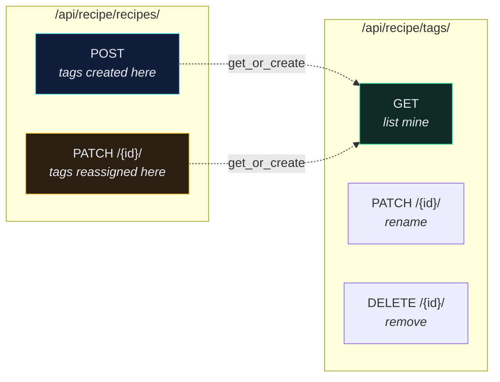
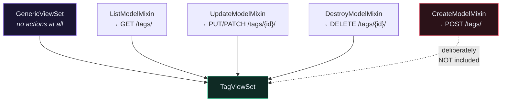
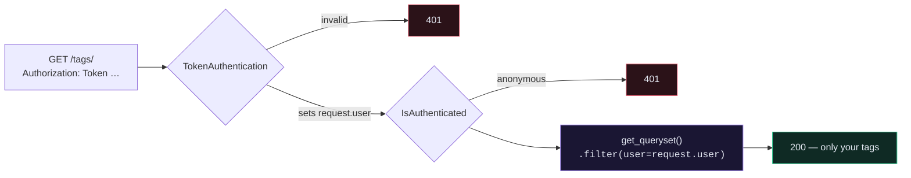

# 🏷️ Tag API — Design and Endpoints

> Tags are the first thing in this project that isn't a plain CRUD resource. You never `POST /tags/` — tags are born inside recipes.

---

## 🎯 Core Concept

A **tag** is a user-owned label on a recipe: *vegan*, *dessert*, *quick*. Two facts drive every design decision that follows:

1. **Tags belong to a user, not to the world.** Your "vegan" and my "vegan" are different rows.
2. **Tags are created as a side effect of writing a recipe**, not through their own create endpoint.

---

## 🗺️ The endpoints



| Method   | Endpoint       | Purpose                       |
| -------- | -------------- | ----------------------------- |
| `GET`    | `/tags/`       | list the caller's tags, A→Z   |
| `PATCH`  | `/tags/{id}/`  | rename a tag                  |
| `DELETE` | `/tags/{id}/`  | delete a tag                  |
| ~~POST~~ | ~~`/tags/`~~   | **deliberately absent**       |

---

## 🤔 Why there is no `POST /tags/`

Imagine the mobile app. The user types a recipe title, a time, a price, and types "vegan" into a tag field. If tags needed their own create call, the client would have to:

```text
1. POST /tags/          {"name": "vegan"}      → but does it already exist? 409? lookup first?
2. GET  /tags/?name=vegan                       → race condition if two requests land together
3. POST /recipes/       {"tags": [7]}
```

Three round trips, a race condition, and the client has to know about tag identity. Instead:

```text
1. POST /recipes/  {"title": "…", "tags": [{"name": "vegan"}]}
```

One call. The server does `get_or_create` and the client never learns a tag ID it didn't ask for. This is **nested writing**, and it is the whole subject of [[Nested Serialization]].

> [!INFO] The general principle
> Design endpoints around **what the user is doing**, not around your table layout. The user is writing a recipe. They are not managing a tag taxonomy.

---

## 🧩 Why `ListModelMixin` + `Update` + `Destroy` and not `ModelViewSet`

`ModelViewSet` gives you all five actions. You only want three. So you compose:

```python
# app/recipe/views.py
class TagViewSet(mixins.DestroyModelMixin,
                 mixins.UpdateModelMixin,
                 mixins.ListModelMixin,
                 viewsets.GenericViewSet):
    """Manage tags in the database."""
    serializer_class = serializers.TagSerializer
    queryset = Tag.objects.all()
    authentication_classes = [TokenAuthentication]
    permission_classes = [IsAuthenticated]

    def get_queryset(self):
        return self.queryset.filter(user=self.request.user).order_by("-name")
```



**Mixin order matters for MRO but not for behaviour here** — what matters is that `GenericViewSet` comes *last*. It's the base; the mixins layer actions on top of it.

> [!TIP] Not offering an action is a feature
> An endpoint that doesn't exist can't be misused, can't create duplicates, and doesn't need tests. Removing `CreateModelMixin` is a design decision, not an omission.

---

## 🔒 The ownership rule

Every request goes through the same two filters:



> [!CAUTION] The bug this prevents
> If `get_queryset()` returned `Tag.objects.all()`, then `PATCH /tags/12/` would let any authenticated user rename **anyone's** tag. Filtering the queryset means tag 12 simply doesn't exist for you — DRF returns `404`, not `403`, which is also the better answer because it doesn't confirm the row exists.

---

## 📦 What you'll build, in order

| Note | You write |
| --- | --- |
| [[2.Writing the Tag Model and Listing Tags]] | the `Tag` model, `TagSerializer`, `TagViewSet`, and the list test |
| [[3.Write tests for creating tags Follow Along]] | tests for creating tags through a recipe |
| [[4.Implementing Tag Creation]] | `_get_or_create_tags()` on `RecipeSerializer` |
| [[5.test for Updating Recipe Tags via API]] | tests for `PATCH`-ing tags onto an existing recipe |
| [[6.Implement update recipe tags feature Follow Along]] | the `update()` override |

---

## 🧠 Check yourself

> [!QUESTION]
> 1. A client wants to create a tag without attaching it to a recipe. What do you tell them, and why?
> 2. Why does `GenericViewSet` go last in the class definition?
> 3. Why is `404` a better response than `403` when you PATCH someone else's tag?

---

## 🔗 Related

- [[2.Writing the Tag Model and Listing Tags]]
- [[Nested Serialization]]
- [[Tags Section — Detailed Summary]]
- [[2.APIView vs ViewSet]]
- [[Refactoring]] — where `TagViewSet` and `IngredientViewSet` merge
