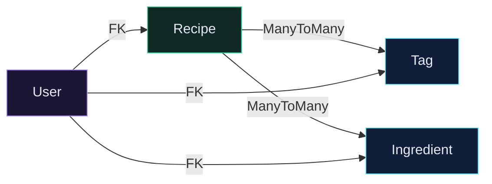
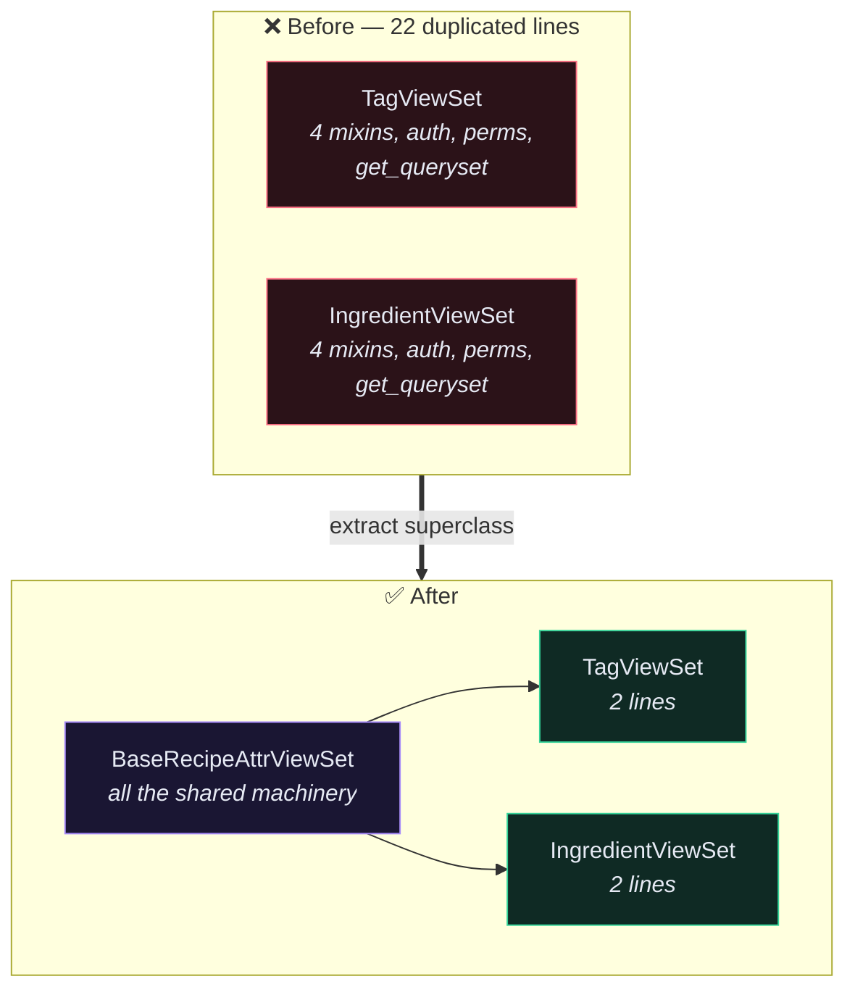

# 🥕 Ingredient API — Design and Full Walkthrough

> This section teaches almost no new DRF. That is the lesson: you already know how to build it, and now you find out what to do with the duplication.

---

## 🎯 Core Concept

An **ingredient** is a user-owned name attached to recipes — structurally identical to a [[1.Tag API — Design and Endpoints|Tag]]:

| | Tag | Ingredient |
| --- | --- | --- |
| Fields | `id`, `name`, `user` | `id`, `name`, `user` |
| Endpoints | list, update, destroy | list, update, destroy |
| Created via | nested write on recipe | nested write on recipe |
| Scoped by | `user` | `user` |
| Ordered by | `-name` | `-name` |

Same shape, different noun. Build it, then delete half of it.

---

## 🗺️ Where it sits

![[data-model-erd.svg]]



---

## 🔬 Step 1 — Model test, then model

```python
# app/core/tests/test_models.py
def test_create_ingredient(self):
    """Test creating an ingredient is successful."""
    user = create_user()
    ingredient = models.Ingredient.objects.create(user=user, name="Ingredient1")

    self.assertEqual(str(ingredient), ingredient.name)
```

```python
# app/core/models.py
class Ingredient(models.Model):
    """Ingredient for recipes."""
    name = models.CharField(max_length=255)
    user = models.ForeignKey(
        settings.AUTH_USER_MODEL,
        on_delete=models.CASCADE,
    )

    def __str__(self):
        return self.name
```

```bash
docker compose run --rm app sh -c "python manage.py makemigrations"
```

---

## 🔬 Step 2 — API tests

```python
# app/recipe/tests/test_ingredients_api.py
INGREDIENTS_URL = reverse("recipe:ingredient-list")


def detail_url(ingredient_id):
    return reverse("recipe:ingredient-detail", args=[ingredient_id])


class PrivateIngredientsApiTests(TestCase):

    def setUp(self):
        self.user = create_user()
        self.client = APIClient()
        self.client.force_authenticate(self.user)

    def test_retrieve_ingredients(self):
        """Test retrieving a list of ingredients."""
        Ingredient.objects.create(user=self.user, name="Kale")
        Ingredient.objects.create(user=self.user, name="Vanilla")

        res = self.client.get(INGREDIENTS_URL)

        ingredients = Ingredient.objects.all().order_by("-name")
        serializer = IngredientSerializer(ingredients, many=True)
        self.assertEqual(res.status_code, status.HTTP_200_OK)
        self.assertEqual(res.data, serializer.data)

    def test_ingredients_limited_to_user(self):
        """Test list of ingredients is limited to authenticated user."""
        user2 = create_user(email="user2@example.com")
        Ingredient.objects.create(user=user2, name="Salt")
        ingredient = Ingredient.objects.create(user=self.user, name="Pepper")

        res = self.client.get(INGREDIENTS_URL)

        self.assertEqual(len(res.data), 1)
        self.assertEqual(res.data[0]["name"], ingredient.name)
        self.assertEqual(res.data[0]["id"], ingredient.id)

    def test_update_ingredient(self):
        """Test updating an ingredient."""
        ingredient = Ingredient.objects.create(user=self.user, name="Cilantro")

        payload = {"name": "Coriander"}
        res = self.client.patch(detail_url(ingredient.id), payload)

        self.assertEqual(res.status_code, status.HTTP_200_OK)
        ingredient.refresh_from_db()
        self.assertEqual(ingredient.name, payload["name"])

    def test_delete_ingredient(self):
        """Test deleting an ingredient."""
        ingredient = Ingredient.objects.create(user=self.user, name="Lettuce")

        res = self.client.delete(detail_url(ingredient.id))

        self.assertEqual(res.status_code, status.HTTP_204_NO_CONTENT)
        self.assertFalse(
            Ingredient.objects.filter(user=self.user).exists()
        )
```

> [!TIP] `refresh_from_db()` is not optional
> `ingredient` is a Python object holding a snapshot of a row. The `PATCH` changed the **row**, not your object. Without `refresh_from_db()` the assertion compares the old value and fails, and you spend twenty minutes convinced the view is broken.

---

## 🛠️ Step 3 — Serializer and viewset (the copy-paste version)

```python
# app/recipe/serializers.py
class IngredientSerializer(serializers.ModelSerializer):
    """Serializer for ingredients."""

    class Meta:
        model = Ingredient
        fields = ["id", "name"]
        read_only_fields = ["id"]
```

```python
# app/recipe/views.py
class IngredientViewSet(mixins.DestroyModelMixin,
                        mixins.UpdateModelMixin,
                        mixins.ListModelMixin,
                        viewsets.GenericViewSet):
    """Manage ingredients in the database."""
    serializer_class = serializers.IngredientSerializer
    queryset = Ingredient.objects.all()
    authentication_classes = [TokenAuthentication]
    permission_classes = [IsAuthenticated]

    def get_queryset(self):
        return self.queryset.filter(user=self.request.user).order_by("-name")
```

```python
# app/recipe/urls.py
router.register("ingredients", views.IngredientViewSet)
```

Run the tests. Green.

Now look at `views.py`. `TagViewSet` and `IngredientViewSet` differ by **two lines**.

---

## ♻️ Step 4 — The refactor



```python
# app/recipe/views.py
class BaseRecipeAttrViewSet(mixins.DestroyModelMixin,
                            mixins.UpdateModelMixin,
                            mixins.ListModelMixin,
                            viewsets.GenericViewSet):
    """Base viewset for recipe attributes."""
    authentication_classes = [TokenAuthentication]
    permission_classes = [IsAuthenticated]

    def get_queryset(self):
        """Filter queryset to authenticated user."""
        return self.queryset.filter(user=self.request.user).order_by("-name")


class TagViewSet(BaseRecipeAttrViewSet):
    """Manage tags in the database."""
    serializer_class = serializers.TagSerializer
    queryset = Tag.objects.all()


class IngredientViewSet(BaseRecipeAttrViewSet):
    """Manage ingredients in the database."""
    serializer_class = serializers.IngredientSerializer
    queryset = Ingredient.objects.all()
```

Run the tests again. **Still green — and you didn't touch a single test.**

That is the actual point of this section. A refactor that changes structure without changing behaviour is only safe because the tests exist. Without them, this edit is a gamble.

> [!INFO] Why `self.queryset` works in the base class
> `get_queryset()` reads `self.queryset`, which Python resolves on the *instance's* class. `TagViewSet` sets it to tags, `IngredientViewSet` to ingredients. The base class never needs to know which.

---

## 🎯 When *not* to extract a base class

Two similar classes is the threshold where extraction is tempting and often wrong. Extract when:

- ✅ they're the same **because of a shared concept** ("recipe attribute owned by a user"), and
- ✅ a future change would need to be made in both places

Don't extract when:

- ❌ they merely look alike today by coincidence
- ❌ the base class would need `if isinstance(...)` or flags to serve both
- ❌ you'd have to read the base class to understand either subclass

Here it's justified: "user-owned recipe attribute" is a real concept, and when you add filtering in [[🧱 Filtering Tags & Ingredients]] you change **one** method instead of two.

---

## ⚠️ Gotchas

- **`AttributeError: 'TagViewSet' object has no attribute 'queryset'`** → you removed `queryset` from the subclass. The base class needs it; only the *shared* parts move up.
- **Router raises `Basename argument not specified`** → same cause.
- **`DELETE` returns 200 instead of 204** → you overrode `destroy()` and returned a `Response` with data. Let `DestroyModelMixin` do it.
- **`test_update_ingredient` fails with the old name** → missing `refresh_from_db()`.

---

## 🧠 Check yourself

> [!QUESTION]
> 1. Why did the refactor require zero test changes, and why does that matter?
> 2. `get_queryset()` lives in the base class but returns different rows per subclass. How?
> 3. Name one case where two near-identical viewsets should **not** share a base class.

---

## 🔗 Related

- [[Refactoring]]
- [[Ingredient API]]
- [[Create Ingredients Feature — Implementation Notes]]
- [[1.Tag API — Design and Endpoints]]
- [[🧱 Filtering Tags & Ingredients]]
