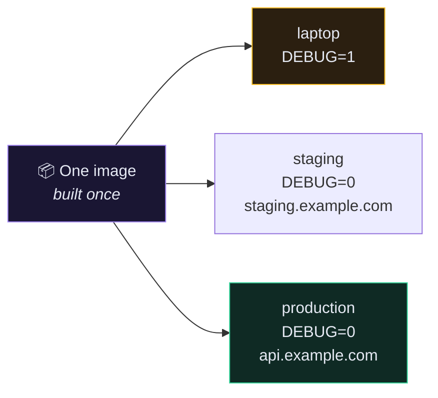
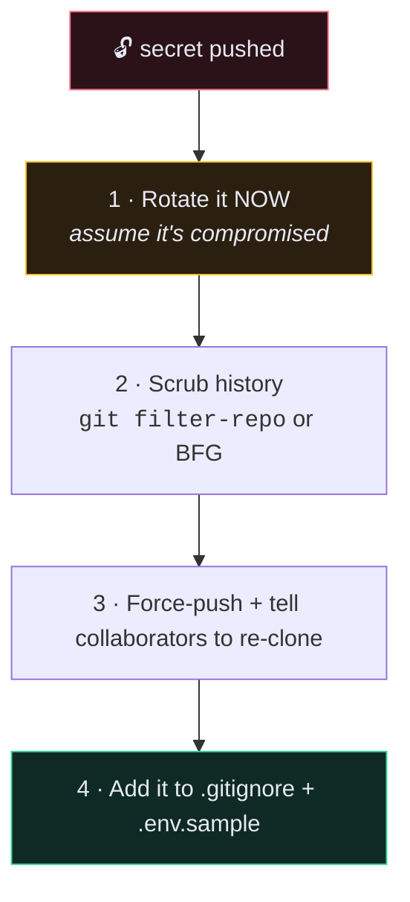

# 🔑 Environment Variables and Secrets

> The same image must run on your laptop, in CI, on staging and in production. The only thing that changes is the environment.

---

## 🎯 Core Concept

This is **factor III of the Twelve-Factor App**: *store config in the environment.*

Config is anything that differs between deployments — credentials, hostnames, feature flags. Code is everything else. If you can't open-source your repo tomorrow without changing a line, you have config in your code.



---

## 🛠️ Implementation

### `settings.py` — read from the environment, with safe defaults

```python
# app/app/settings.py
import os

SECRET_KEY = os.environ.get("SECRET_KEY", "changeme")

DEBUG = bool(int(os.environ.get("DEBUG", 0)))

ALLOWED_HOSTS = []
ALLOWED_HOSTS.extend(
    filter(
        None,
        os.environ.get("ALLOWED_HOSTS", "").split(","),
    )
)

DATABASES = {
    "default": {
        "ENGINE": "django.db.backends.postgresql",
        "HOST": os.environ.get("DB_HOST"),
        "NAME": os.environ.get("DB_NAME"),
        "USER": os.environ.get("DB_USER"),
        "PASSWORD": os.environ.get("DB_PASS"),
    }
}
```

### Why `bool(int(...))` and not `bool(...)`

```python
bool("0")            # True   ← every non-empty string is truthy
bool(int("0"))       # False  ✅
```

`os.environ` always gives you strings. `DEBUG=0` would otherwise turn debug **on** in production — a real, documented way people have leaked their entire settings module.

### Why the `filter(None, ...)`

```python
"".split(",")                     # ['']  ← one empty host, which matches nothing
filter(None, "".split(","))       # []    ✅ genuinely empty
"a.com,b.com".split(",")          # ['a.com', 'b.com'] ✅
```

---

## 📄 The `.env` file

```bash
# .env  —  NEVER commit this
DB_NAME=recipedb
DB_USER=recipeuser
DB_PASS=<generated>
SECRET_KEY=<generated>
ALLOWED_HOSTS=api.example.com,127.0.0.1
DEBUG=0
```

Docker Compose reads `.env` from the working directory automatically and substitutes `${VAR}` in the compose file.

### `.env.sample` — this one **is** committed

```bash
# .env.sample  —  copy to .env and fill in
DB_NAME=recipedb
DB_USER=recipeuser
DB_PASS=
SECRET_KEY=
ALLOWED_HOSTS=127.0.0.1
DEBUG=0
```

Now a new developer knows exactly which variables exist without you having to remember to tell them.

### `.gitignore`

```gitignore
.env
*.env
!.env.sample
```

---

## 🔐 Generating a real `SECRET_KEY`

```bash
python -c "from django.core.management.utils import get_random_secret_key; print(get_random_secret_key())"
```

> [!CAUTION] What `SECRET_KEY` actually protects
> It signs session cookies, password-reset tokens, and any `signing.dumps()` payload. Leak it and an attacker can forge a session cookie for **any** user, including a superuser. Rotating it invalidates every session and every outstanding password-reset link — which is the correct thing to do the moment you suspect exposure.

---

## 🚨 If you already committed a secret

Removing it in a later commit does nothing. It is still in the history, and GitHub's history is cloned by bots within minutes of a push.



**Step 1 is the only one that actually protects you.** Steps 2–4 are cleanup. Rotate first, scrub second.

---

## 📊 Where secrets live, by scale

| Setting | Good enough for | Weakness |
| --- | --- | --- |
| `.env` file on the server | one server, small team | anyone with shell access reads it in plaintext |
| GitHub Actions **Secrets** | CI/CD pipelines | scoped to CI only |
| Docker **Secrets** / Swarm | multi-node Docker | Swarm-specific |
| **AWS Secrets Manager** · GCP Secret Manager · Vault | production, teams, compliance | costs money, more setup |

Start with `.env`. Move up when you have more than one server or more than one person.

---

## ⚠️ Gotchas

> [!WARNING] Compose `env_file` vs `environment`
> `environment:` passes variables to the container. `env_file:` also does — but variables in the compose file's **own** `${...}` substitutions come from the shell / root `.env` only. Mixing them up produces empty values with no error message. When something is mysteriously blank, run `docker compose -f docker-compose-deploy.yml config` to see the fully substituted file.

- **`django.db.utils.OperationalError: could not translate host name "None"`** → `DB_HOST` isn't set. The `.env` file isn't where compose is looking.
- **Everything 400s in production** → `ALLOWED_HOSTS` is empty or missing your domain.
- **Sessions log everyone out after each deploy** → you're regenerating `SECRET_KEY` on every start. Set it once, keep it.
- **`DEBUG` is on in production** → you used `bool(os.environ.get("DEBUG"))`.

---

## ✅ Checklist before any deploy

- [ ] `.env` is in `.gitignore` and `git log --all -- .env` returns nothing
- [ ] `SECRET_KEY` is generated, unique to this environment, and 50+ chars
- [ ] `DEBUG=0`
- [ ] `ALLOWED_HOSTS` contains your real domain and nothing wildcarded
- [ ] `DB_PASS` is not the same as staging's
- [ ] `.env.sample` documents every variable the app reads

---

## 🧠 Check yourself

> [!QUESTION]
> 1. Why is `bool(int(os.environ.get("DEBUG", 0)))` written that way?
> 2. Your `SECRET_KEY` leaked. What is the first thing you do, and why is scrubbing git history not it?
> 3. Why commit `.env.sample` at all?

---

## 🔗 Related

- [[1.From Dev Compose to Production]]
- [[5.Deploying to a Server]]
- [[10.Security Checklist]]
- [[5.Configure settings.py for PostgreSQL]]
