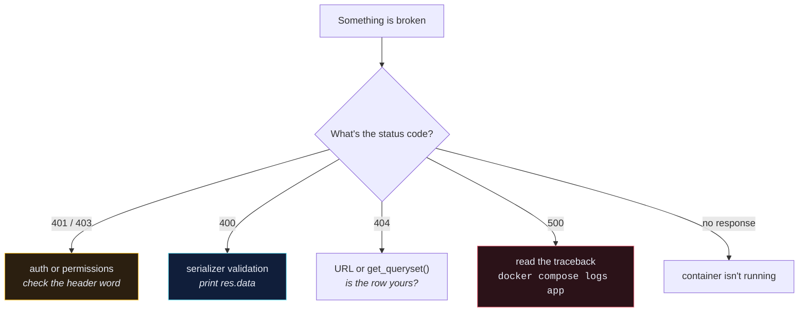

# 🔧 Errors You Will Actually Hit

> Searchable by the error text, because that's how you'll arrive here. `Ctrl+F` the message.

---

## 🐳 Docker & Compose

### `no configuration file provided: not found`
You're not in the project directory, or the file is named `docker-compose.yaml` and you typed `.yml`.

### `port is already allocated`
Something already owns :8000.
```bash
docker ps
```
Stop it, or change the host side of the mapping: `"8001:8000"`.

### `service "app" is not running` / container exits immediately
The container's command crashed. The logs are still there:
```bash
docker compose logs app
```

### Code changes don't take effect
- **Dev:** the volume mount is missing or wrong — check `./app:/app`.
- **Prod:** correct behaviour, there is no mount. Rebuild the image.

### Build is extremely slow every time
Your `COPY ./app /app` is above the `RUN pip install`. Every code change invalidates the dependency layer. Copy `requirements.txt` and install **before** copying the app.

---

## 🗄️ Database

### `django.db.utils.OperationalError: could not connect to server`
Postgres isn't ready yet. This is exactly the race [[8.Create wait_for_db|wait_for_db]] exists for. `depends_on` waits for the container to *start*, not for Postgres to *accept connections*.

### `could not translate host name "None" to address`
`DB_HOST` is unset. Compose isn't finding your `.env`, or the variable is misspelled.

### `relation "core_recipe" does not exist`
Migrations weren't applied.
```bash
docker compose run --rm app sh -c "python manage.py migrate"
```

### `You are trying to add a non-nullable field without a default`
You added a required field to a table with existing rows. Options, in order of preference:
1. `null=True` on the field (best if the data really is optional)
2. `default=...` on the field
3. Pick option 1 in the interactive prompt and supply a one-off default
4. Delete the migration, delete the volume, start over — **dev only**

### `InconsistentMigrationHistory` after adding a custom user model
You ran `migrate` before setting `AUTH_USER_MODEL`. Django already created the default `auth.User` tables.
```bash
docker volume rm <project>_dev-db-data
```
Then migrate again. This is why the custom user model must be the very first thing you do.

---

## 🔐 Auth & Permissions

### `401 Unauthorized` with a token you *know* is valid
```http
Authorization: Bearer 9c1f...    ❌  that's JWT syntax
Authorization: Token 9c1f...     ✅  DRF TokenAuthentication
```
The single most common DRF mistake. There is no space issue, no encoding issue — the word is `Token`.

### `403 Forbidden: CSRF Failed`
You're hitting a `SessionAuthentication` endpoint from a non-browser client. Either send the CSRF token, or use `TokenAuthentication` — which is exempt.

### Every request returns `401`, even `/api/user/create/`
`DEFAULT_PERMISSION_CLASSES` is globally `IsAuthenticated` and the create view doesn't override it. Registration must be public.

### An authenticated user can see another user's data
`get_queryset()` is missing `.filter(user=self.request.user)`, or you set the `queryset` class attribute and never wrote the method. Write the `test_x_limited_to_user` test; it catches this permanently.

---

## 🧩 Serializers

### `Got AttributeError when attempting to get a value for field 'x'`
The field name in `Meta.fields` doesn't exist on the model, and isn't a property or a `SerializerMethodField`.

### `{"non_field_errors": ["Invalid data. Expected a dictionary, but got list."]}`
You passed `many=True` data to a serializer instantiated without `many=True` — or vice versa.

### `IntegrityError: null value in column "user_id" violates not-null constraint`
The serializer's `create()` never set `user`. In a ViewSet that's `perform_create`:
```python
def perform_create(self, serializer):
    serializer.save(user=self.request.user)
```

### `This field is required` on a field you're definitely sending
- Sending JSON but no `Content-Type: application/json` header
- Sending `form-data` where the serializer expects nested JSON
- The field is `read_only=True`, so DRF ignores your value and then complains it's missing

### Password comes back in the response
Missing `extra_kwargs`:
```python
extra_kwargs = {"password": {"write_only": True, "min_length": 5}}
```

### Nested writes raise `The .create() method does not support writable nested fields by default`
Expected. You must write `create()` yourself — that's [[Nested Serialization]].

---

## 🔗 URLs & Routing

### `NoReverseMatch: 'recipe' is not a registered namespace`
Missing `app_name = "recipe"` in the app's `urls.py`. The error never mentions `app_name`, which is why this one costs an hour.

### `basename argument not specified, and could not automatically determine the name from the viewset`
The viewset has no `queryset` class attribute. Add it even when `get_queryset()` does the real work — or pass `basename=` to `register()`.

### `404` on a URL you can see in the router
Trailing slash. `/api/recipe/recipes` ≠ `/api/recipe/recipes/`. `APPEND_SLASH` only redirects `GET`.

---

## 🖼️ Static & Media

### `/admin/` loads with no styling
`collectstatic` didn't run, or nginx and the app aren't sharing the static volume. See [[3.nginx as a Reverse Proxy]].

### `413 Request Entity Too Large` uploading an image
nginx's `client_max_body_size` defaults to 1M.

### Uploaded images 404 after a container rebuild
`MEDIA_ROOT` isn't on a named volume — the files died with the container.

### `cannot import name '_imaging' from 'PIL'`
Pillow was installed without its C dependencies. On Alpine you need `jpeg-dev` and `zlib-dev`.

---

## 🧪 Tests

### `AssertionError` comparing a field you just updated
Missing `refresh_from_db()`. Your Python object is a stale snapshot of the row.

### Test list order differs from view order
Your test's `order_by()` must match the view's. Postgres gives no guaranteed order without one.

### Tests pass locally, fail in CI
Almost always ordering-dependence, a leaked fixture, or a timezone assumption. Reproduce it:
```bash
docker compose run --rm app sh -c "python manage.py test --shuffle"
```

### `DatabaseError: database "test_xyz" already exists`
A previous run died mid-test.
```bash
docker compose run --rm app sh -c "python manage.py test --keepdb"
```
…or drop the test database.

---

## 🧹 flake8

### `E501 line too long`
Break the line. Do not raise the limit.

### `F401 imported but unused`
Delete the import.

### flake8 fails on migrations and `settings.py`
Expected — they're generated or long by nature. Exclude them:
```ini
# app/.flake8
[flake8]
exclude =
    migrations,
    __pycache__,
    manage.py,
    settings.py
```

---

## 🧭 The general method

When you have no idea:



And the one move that beats all of the above — **print the response body**:

```python
res = self.client.post(URL, payload)
print(res.status_code, res.data)
```

DRF tells you exactly what's wrong. Most debugging time is spent guessing at something the framework already said out loud.

---

## 🔗 Related

- [[1.Django Refresher - Projects, Apps and the Five Files]]
- [[Debugging Decision Tree]]
- [[2.Common Bugs and Fixes]]
- [[4.Common Django Test Issues]]
- [[1.HTTP Status Codes]]
