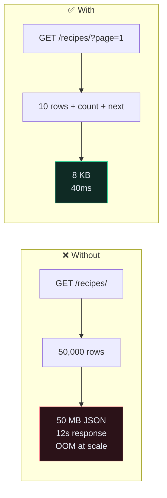
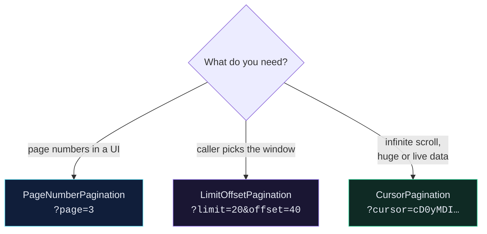

# 📄 Pagination

> `GET /recipes/` with no pagination is a `SELECT *` with your API in front of it. It works beautifully until the day it takes the site down.

---

## 🎯 Core Concept

Pagination splits a list response into pages. Without it, the response size grows linearly with your database — and so does memory, serialization time, and transfer time.



---

## 🛠️ Global setup

```python
# app/app/settings.py
REST_FRAMEWORK = {
    "DEFAULT_AUTHENTICATION_CLASSES": [
        "rest_framework.authentication.TokenAuthentication",
    ],
    "DEFAULT_PAGINATION_CLASS": "rest_framework.pagination.PageNumberPagination",
    "PAGE_SIZE": 10,
}
```

> [!WARNING] `DEFAULT_PAGINATION_CLASS` alone does nothing
> You must set **`PAGE_SIZE` too.** With the class set and no page size, DRF silently returns everything unpaginated. This catches people constantly.

Response shape changes from a bare list to an envelope:

```json
{
  "count": 1043,
  "next": "http://api.example.com/api/recipe/recipes/?page=3",
  "previous": "http://api.example.com/api/recipe/recipes/?page=1",
  "results": [ … 10 recipes … ]
}
```

> [!CAUTION] This is a breaking change
> Every client doing `for recipe in response` now iterates the four envelope keys. If you have live clients, ship this behind [[12.Versioning an API|a version]] — or at minimum, announce it.

---

## 🔀 The three styles



| | `PageNumberPagination` | `LimitOffsetPagination` | `CursorPagination` |
| --- | --- | --- | --- |
| Query | `?page=3` | `?limit=20&offset=40` | `?cursor=…` |
| Jump to page 500 | ✅ | ✅ | ❌ |
| Total count | ✅ | ✅ | ❌ (by design) |
| Deep pages stay fast | ❌ | ❌ | ✅ |
| Stable when rows are inserted | ❌ | ❌ | ✅ |
| Requires a unique ordering | no | no | **yes** |

### Why deep pages get slow

`?page=5000` becomes `LIMIT 10 OFFSET 49990`. Postgres must **fetch and discard 49,990 rows** to give you ten. The cost grows with the page number. Cursor pagination instead does `WHERE created_at < <cursor> LIMIT 10`, which uses an index and costs the same on page 1 and page 5000.

### The duplicate-row problem

With offset pagination on live data:

```text
t=0   client reads page 1 (rows 1-10)
t=1   someone creates a new recipe → it sorts to position 1
t=2   client reads page 2 (offset 10) → old row 10 appears AGAIN
```

The user sees a duplicate and never sees one other row. Cursor pagination is immune because it pages by *value*, not by *position*.

---

## 🎛️ Letting clients choose the page size

```python
# app/core/pagination.py
from rest_framework.pagination import PageNumberPagination


class StandardPagination(PageNumberPagination):
    page_size = 10
    page_size_query_param = "page_size"
    max_page_size = 100
```

```python
# app/recipe/views.py
class RecipeViewSet(viewsets.ModelViewSet):
    pagination_class = StandardPagination
```

`GET /recipes/?page_size=50` now works. `?page_size=100000` is clamped to 100.

> [!CAUTION] `max_page_size` is not optional
> Without it, `?page_size=999999` is an unauthenticated denial-of-service you built yourself.

---

## 🌊 Cursor pagination, correctly

```python
# app/core/pagination.py
from rest_framework.pagination import CursorPagination


class RecipeCursorPagination(CursorPagination):
    page_size = 20
    ordering = "-id"          # must be unique and immutable
    cursor_query_param = "cursor"
```

`ordering` must be **unique** (ties make the cursor ambiguous and rows get skipped) and **immutable** (if the value changes, the cursor points nowhere). `-id` and `-created_at` are good. `-name` and `-price` are not.

Add the matching index, or you've moved the problem rather than solved it:

```python
class Recipe(models.Model):
    ...
    class Meta:
        indexes = [models.Index(fields=["-id"])]
```

---

## 🚫 Turning it off for one endpoint

```python
class TagViewSet(BaseRecipeAttrViewSet):
    pagination_class = None
```

Legitimate when the list is *bounded by design* — a user's own tags, a fixed set of countries. Never legitimate on anything a user can add to without limit.

---

## ⚠️ Gotchas

- **Pagination set but responses are still bare lists** → `PAGE_SIZE` missing.
- **Frontend breaks after enabling it** → the envelope. Expected; coordinate the change.
- **Cursor pagination returns `Invalid cursor`** → your `ordering` field isn't unique.
- **`count` query is slow on huge tables** → `SELECT COUNT(*)` is a full scan in Postgres. Either move to cursor pagination or override `get_paginated_response` to drop the count.
- **Filtering + pagination gives odd results** → filter *then* paginate. DRF does this correctly by default; overriding `list()` badly is how it goes wrong.

---

## 🧠 Check yourself

> [!QUESTION]
> 1. Why is `?page=5000` slow even with a perfect index?
> 2. What exactly goes wrong if `CursorPagination.ordering` isn't unique?
> 3. Why is enabling pagination a breaking API change?

---

## 🔗 Related

- [[4.The N+1 Problem]]
- [[12.Versioning an API]]
- [[3.Caching]]
- [[🧩 Filtering Recipes by Tags & Ingredients (with API Documentation)]]
