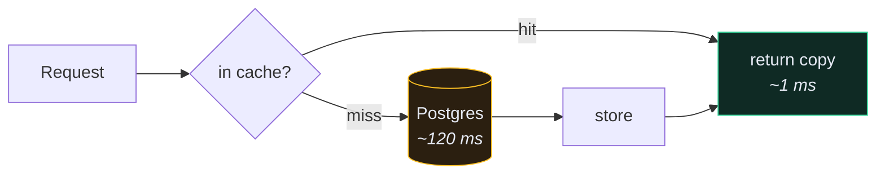
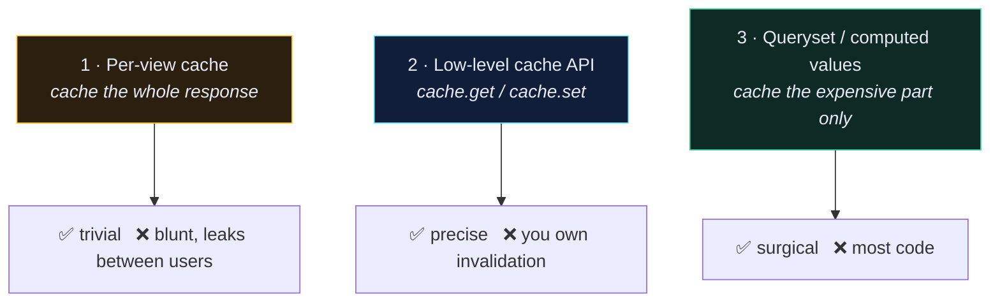

# ⚡ Caching

> Caching is the last optimisation you should reach for, not the first. Fix [[4.The N+1 Problem|N+1]] and add indexes before you cache anything — otherwise you're caching a slow query instead of fixing it.

---

## 🎯 Core Concept

Store the result of expensive work; serve it from memory next time. The entire difficulty is knowing when the stored copy became a lie.



---

## 🛠️ Setup

```python
# app/app/settings.py
CACHES = {
    "default": {
        "BACKEND": "django.core.cache.backends.redis.RedisCache",
        "LOCATION": os.environ.get("REDIS_URL", "redis://redis:6379/1"),
        "TIMEOUT": 300,
    }
}
```

| Backend | Use when |
| --- | --- |
| `RedisCache` | anything real — shared across workers and containers |
| `LocMemCache` | tests and single-process dev only |
| `DatabaseCache` | no Redis available; slower than the query you're avoiding, usually |
| `DummyCache` | development, when you want caching code to run but never hit |

> [!WARNING] Same trap as throttling
> `LocMemCache` is per-process. With four uWSGI workers you have four independent caches, four different answers, and a 25% hit rate. See [[2.Throttling and Rate Limiting]].

---

## 🎚️ The three levels



### Level 1 — per-view

```python
# app/recipe/views.py
from django.utils.decorators import method_decorator
from django.views.decorators.cache import cache_page
from django.views.decorators.vary import vary_on_headers


class RecipeViewSet(viewsets.ModelViewSet):

    @method_decorator(cache_page(60 * 5))
    @method_decorator(vary_on_headers("Authorization"))
    def list(self, request, *args, **kwargs):
        return super().list(request, *args, **kwargs)
```

> [!CAUTION] `vary_on_headers("Authorization")` is load-bearing
> Without it, the first user's recipe list is served to **every** user. This is a real, shipped, reported class of bug — a per-user response cached under a URL-only key. If a response depends on who is asking, the cache key must include who is asking.

Per-view caching is honestly a poor fit for a per-user API. It shines on genuinely public, identical-for-everyone endpoints.

### Level 2 — the low-level API

```python
from django.core.cache import cache


def get_user_recipe_stats(user):
    key = f"recipe_stats:{user.id}"
    stats = cache.get(key)

    if stats is None:
        stats = {
            "total": Recipe.objects.filter(user=user).count(),
            "avg_time": Recipe.objects.filter(user=user).aggregate(
                Avg("time_minutes")
            )["time_minutes__avg"],
        }
        cache.set(key, stats, timeout=600)

    return stats
```

The pattern is always: **key → get → miss → compute → set → return.**

Key discipline matters more than anything else here:

```python
f"recipe_stats:{user.id}"                    # ✅ namespaced, scoped, predictable
f"stats"                                     # ❌ collides across users
f"recipe_stats:{user.id}:v2"                 # ✅ bump v2 → v3 to invalidate everything
```

---

## 🔥 Invalidation

> *"There are only two hard things in computer science: cache invalidation and naming things."* — Phil Karlton

Three strategies, in increasing order of correctness and effort:

### 1. TTL — just let it expire

```python
cache.set(key, value, timeout=300)
```

Simple, always eventually correct, and stale for up to 300 seconds. **Correct choice for most things.** If five minutes of staleness is acceptable, stop here.

### 2. Explicit deletion on write

```python
# app/recipe/views.py
def perform_create(self, serializer):
    serializer.save(user=self.request.user)
    cache.delete(f"recipe_stats:{self.request.user.id}")


def perform_update(self, serializer):
    serializer.save()
    cache.delete(f"recipe_stats:{self.request.user.id}")
```

Correct, but you must remember it at **every** write path — including the admin, management commands, and the shell. Miss one and you have a stale cache with no expiry.

### 3. Signal-based invalidation

```python
# app/core/signals.py
from django.db.models.signals import post_save, post_delete
from django.dispatch import receiver


@receiver([post_save, post_delete], sender=Recipe)
def invalidate_recipe_cache(sender, instance, **kwargs):
    cache.delete(f"recipe_stats:{instance.user_id}")
```

Catches every ORM write regardless of where it came from. The tradeoff is the usual one with [[7.Signals|signals]] — the invalidation is now invisible from the code that triggers it.

> [!TIP] The version-key escape hatch
> Instead of deleting keys, embed a version you can bump:
> ```python
> version = cache.get(f"recipes_version:{user.id}", 1)
> key = f"recipe_list:{user.id}:v{version}"
> # on write:
> cache.incr(f"recipes_version:{user.id}")
> ```
> One `incr` invalidates every derived key at once. Old entries expire on their own. This scales far better than tracking every key you wrote.

---

## 🌐 HTTP caching — the cache you don't run

Sometimes the best cache is the client's.

```python
from django.utils.decorators import method_decorator
from django.views.decorators.http import condition


class RecipeViewSet(viewsets.ModelViewSet):

    def retrieve(self, request, *args, **kwargs):
        response = super().retrieve(request, *args, **kwargs)
        response["Cache-Control"] = "private, max-age=60"
        return response
```

- `private` → CDNs and proxies must not store it; only the end user's browser may
- `max-age=60` → don't even ask again for 60 seconds

`ETag` + `If-None-Match` goes further: the request still reaches you, but a `304 Not Modified` skips serialization and sends no body.

> [!CAUTION] Never `public` on authenticated responses
> `Cache-Control: public` on a per-user response invites a shared proxy to serve one user's data to another. `private` or `no-store` for anything behind auth.

---

## 🎯 What's actually worth caching

| Good candidate | Why |
| --- | --- |
| Expensive aggregates (`COUNT`, `AVG` over many rows) | costly to compute, rarely changes |
| Reference data (countries, categories, tag lists) | changes monthly, read constantly |
| Third-party API responses | slow, rate-limited, costs money |
| Rendered docs / schema | fully deterministic |

| Bad candidate | Why |
| --- | --- |
| A simple indexed lookup by PK | already sub-millisecond; the cache round trip may be slower |
| Anything written more often than read | you'll invalidate more than you serve |
| Data where staleness is a correctness bug | balances, stock levels, permissions |
| A slow query you haven't tried to fix | you've hidden the problem, not solved it |

---

## ⚠️ Gotchas

- **Users see each other's data** → missing `vary_on_headers("Authorization")` or an unscoped cache key. Treat this as a security incident.
- **Cache never hits** → different key each call (timestamp in the key), or per-process `LocMemCache`.
- **Tests behave strangely** → set `CACHES` to `DummyCache` in test settings, or `cache.clear()` in `setUp`.
- **`cache.incr` raises `ValueError`** → the key doesn't exist. `incr` doesn't create; `cache.set(key, 1)` first.
- **Redis memory keeps growing** → no `maxmemory-policy`. Set `allkeys-lru` so Redis evicts rather than OOMs.

---

## 🧠 Check yourself

> [!QUESTION]
> 1. Why is caching the *wrong* first move on a slow list endpoint?
> 2. What exactly goes wrong without `vary_on_headers("Authorization")`?
> 3. Why does a version key scale better than deleting individual keys?

---

## 🔗 Related

- [[4.The N+1 Problem]]
- [[2.Throttling and Rate Limiting]]
- [[7.Signals]]
- [[11.Logging and Observability]]
