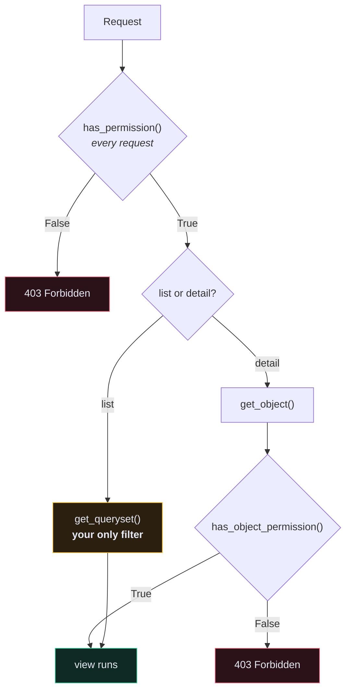

# 🛡️ Custom Permissions

> Authentication asks *who are you*. Permissions ask *are you allowed*. Confusing the two is how APIs leak data.

---

## 🎯 Core Concept

A DRF permission class implements one or both of:

```python
from rest_framework import permissions


class MyPermission(permissions.BasePermission):

    def has_permission(self, request, view):
        """Called for EVERY request, before the view runs.
        Has no object yet."""
        return True

    def has_object_permission(self, request, view, obj):
        """Called only for a single object, via get_object().
        NOT called for list views."""
        return True
```



> [!CAUTION] The one thing everyone gets wrong
> **`has_object_permission()` is never called on a list endpoint.** DRF has no single object to check. If your only protection is object-level, `GET /recipes/` returns **every recipe in the database**.
>
> List protection comes from `get_queryset()`. Always. This is why every viewset in this project filters by `self.request.user`.

---

## 🧰 The built-ins

| Class | Allows |
| --- | --- |
| `AllowAny` | everyone — the default if you set nothing |
| `IsAuthenticated` | any logged-in user |
| `IsAdminUser` | `user.is_staff` |
| `IsAuthenticatedOrReadOnly` | anyone may `GET`; only authenticated may write |
| `DjangoModelPermissions` | maps to Django's `add`/`change`/`delete` model perms |

Set a safe global default and opt out deliberately:

```python
# app/app/settings.py
REST_FRAMEWORK = {
    "DEFAULT_PERMISSION_CLASSES": [
        "rest_framework.permissions.IsAuthenticated",
    ],
}
```

```python
# app/user/views.py — registration must be public
class CreateUserView(generics.CreateAPIView):
    serializer_class = UserSerializer
    permission_classes = [permissions.AllowAny]
```

**Fail closed.** A new endpoint you forget to configure should be locked, not open.

---

## 🛠️ Writing your own

### `IsOwner` — the workhorse

```python
# app/core/permissions.py
from rest_framework import permissions


class IsOwner(permissions.BasePermission):
    """Object-level permission: only the owner may access."""

    message = "You do not have permission to access this object."

    def has_object_permission(self, request, view, obj):
        return obj.user == request.user
```

### `IsOwnerOrReadOnly`

```python
class IsOwnerOrReadOnly(permissions.BasePermission):
    """Anyone may read; only the owner may write."""

    def has_object_permission(self, request, view, obj):
        if request.method in permissions.SAFE_METHODS:
            return True
        return obj.user == request.user
```

`SAFE_METHODS` is `("GET", "HEAD", "OPTIONS")` — the methods that don't change state.

### Role-based

```python
class IsStaffOrOwner(permissions.BasePermission):

    def has_permission(self, request, view):
        return bool(request.user and request.user.is_authenticated)

    def has_object_permission(self, request, view, obj):
        if request.user.is_staff:
            return True
        return obj.user == request.user
```

### Combining them

DRF supports boolean composition:

```python
permission_classes = [IsAuthenticated & (IsOwner | IsAdminUser)]
```

| Operator | Meaning |
| --- | --- |
| `&` | both must pass |
| `|` | either may pass |
| `~` | negation |
| a plain list | implicit `AND` between every entry |

---

## 🎯 Per-action permissions in a ViewSet

```python
# app/recipe/views.py
class RecipeViewSet(viewsets.ModelViewSet):
    serializer_class = serializers.RecipeDetailSerializer
    queryset = Recipe.objects.all()

    def get_permissions(self):
        if self.action in ("list", "retrieve"):
            return [permissions.IsAuthenticated()]
        return [permissions.IsAuthenticated(), IsOwner()]

    def get_queryset(self):
        return self.queryset.filter(user=self.request.user).order_by("-id")
```

> [!WARNING] `get_permissions()` returns **instances**, not classes
> `[IsOwner]` (class) fails at runtime with a confusing error. `[IsOwner()]` (instance) is correct. The class attribute `permission_classes` wants classes; the method wants instances. Yes, this is inconsistent.

---

## 🔢 403 vs 404 — which should you return?

| Situation | DRF returns | Right? |
| --- | --- | --- |
| No credentials, endpoint requires auth | `401` | ✅ |
| Valid token, permission denied | `403` | ✅ |
| Valid token, row filtered out of `get_queryset()` | `404` | ✅ **and better** |

A `403` on someone else's object confirms that object exists. On a resource with sequential IDs, an attacker can enumerate: `403` means "exists, not yours", `404` means "doesn't exist". They've just mapped your database.

Filtering in `get_queryset()` gives `404` for both cases and leaks nothing. **Prefer queryset filtering over object permissions where you can**, and use `IsOwner` as defence in depth.

---

## 🧪 Testing permissions

Permission tests are the ones worth writing most and skipped most:

```python
# app/recipe/tests/test_recipe_api.py
def test_cannot_read_other_users_recipe(self):
    """Test another user's recipe is not accessible."""
    other = create_user(email="other@example.com")
    recipe = create_recipe(user=other)

    res = self.client.get(detail_url(recipe.id))

    self.assertEqual(res.status_code, status.HTTP_404_NOT_FOUND)


def test_cannot_update_other_users_recipe(self):
    """Test updating another user's recipe fails."""
    other = create_user(email="other@example.com")
    recipe = create_recipe(user=other)

    res = self.client.patch(detail_url(recipe.id), {"title": "Hacked"})

    self.assertEqual(res.status_code, status.HTTP_404_NOT_FOUND)
    recipe.refresh_from_db()
    self.assertNotEqual(recipe.title, "Hacked")


def test_cannot_delete_other_users_recipe(self):
    """Test deleting another user's recipe fails."""
    other = create_user(email="other@example.com")
    recipe = create_recipe(user=other)

    res = self.client.delete(detail_url(recipe.id))

    self.assertEqual(res.status_code, status.HTTP_404_NOT_FOUND)
    self.assertTrue(Recipe.objects.filter(id=recipe.id).exists())
```

Write one of each — read, update, delete — for **every** owned resource. This is the test suite that stops your API from becoming a news story.

---

## ⚠️ Gotchas

- **List endpoint returns everything** → `has_object_permission` doesn't apply to lists. Filter the queryset.
- **`TypeError: 'IsOwner' object is not callable`** → returned a class where an instance was needed in `get_permissions()`.
- **Permission passes but data is wrong** → you're checking `obj.user == request.user` on a model whose `user` is a *different* relation (e.g. `obj.recipe.user`).
- **`403` on a public endpoint** → global `IsAuthenticated` default; add `AllowAny` explicitly.
- **`AnonymousUser` comparisons** → `obj.user == request.user` where `request.user` is `AnonymousUser` is `False`, which is safe. But `request.user.id` raises. Always gate on `request.user.is_authenticated` first.

---

## 🧠 Check yourself

> [!QUESTION]
> 1. Why does an object-level permission not protect a list endpoint?
> 2. Why is `404` a better answer than `403` for another user's object?
> 3. What's the difference between the value `permission_classes` wants and what `get_permissions()` returns?

---

## 🔗 Related

- [[4.Authentication in Django REST Framework]]
- [[6.Token vs JWT vs Session]]
- [[10.Security Checklist]]
- [[2.Throttling and Rate Limiting]]
