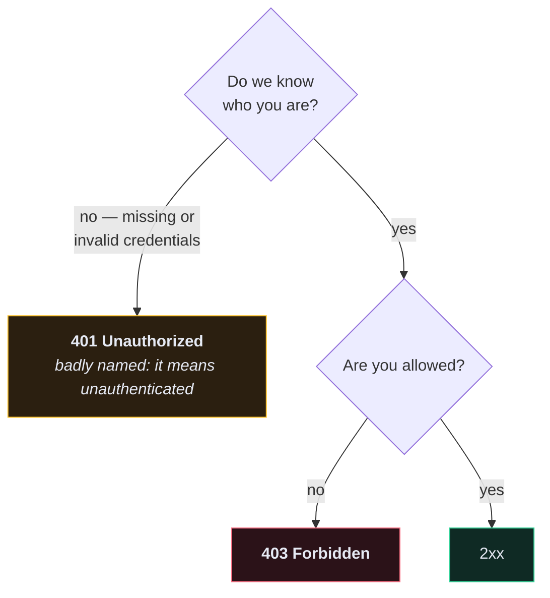

# 🔢 HTTP Status Codes

> Always use the constant, never the integer. `status.HTTP_204_NO_CONTENT` says what it means; `204` makes the reader look it up.

```python
from rest_framework import status

return Response(data, status=status.HTTP_201_CREATED)
```

---

## ✅ 2xx — it worked

| Code | Constant | Return it when |
| --- | --- | --- |
| **200** | `HTTP_200_OK` | `GET`, `PUT`, `PATCH` succeeded and there's a body |
| **201** | `HTTP_201_CREATED` | `POST` created a resource — include it in the body and a `Location` header |
| **202** | `HTTP_202_ACCEPTED` | you queued the work; it isn't done yet ([[9.Background Jobs with Celery|Celery]]) |
| **204** | `HTTP_204_NO_CONTENT` | `DELETE` succeeded — **body must be empty** |

> [!WARNING] `204` means *no content*
> Returning a body with 204 is a protocol violation. Some HTTP clients will hang or error on it. If you want to say something, use 200.

---

## ↩️ 3xx — go somewhere else

| Code | Constant | Meaning |
| --- | --- | --- |
| **301** | `HTTP_301_MOVED_PERMANENTLY` | the URL changed forever — browsers cache this aggressively |
| **302** | `HTTP_302_FOUND` | temporary redirect |
| **304** | `HTTP_304_NOT_MODIFIED` | client's cached copy is still valid (`ETag` / `If-None-Match`) |
| **307/308** | — | like 302/301 but the method is preserved (a `POST` stays a `POST`) |

---

## ❌ 4xx — the client did something wrong

| Code | Constant | Return it when | DRF raises it via |
| --- | --- | --- | --- |
| **400** | `HTTP_400_BAD_REQUEST` | validation failed, body is malformed | `ValidationError` / `serializer.is_valid(raise_exception=True)` |
| **401** | `HTTP_401_UNAUTHORIZED` | **no or invalid credentials** | `NotAuthenticated`, `AuthenticationFailed` |
| **403** | `HTTP_403_FORBIDDEN` | **valid credentials, not allowed** | `PermissionDenied` |
| **404** | `HTTP_404_NOT_FOUND` | no such resource — or it's not yours | `NotFound`, `get_object_or_404` |
| **405** | `HTTP_405_METHOD_NOT_ALLOWED` | endpoint exists, this verb doesn't | `MethodNotAllowed` |
| **409** | `HTTP_409_CONFLICT` | the request conflicts with current state (duplicate, version clash) | — |
| **415** | `HTTP_415_UNSUPPORTED_MEDIA_TYPE` | wrong `Content-Type` | `UnsupportedMediaType` |
| **422** | `HTTP_422_UNPROCESSABLE_ENTITY` | syntactically fine, semantically wrong — **DRF uses 400 for this** | — |
| **429** | `HTTP_429_TOO_MANY_REQUESTS` | throttled | `Throttled` |

### 401 vs 403 — the distinction people get wrong



**401 = "I don't know you."** Retrying with credentials might work.
**403 = "I know you, and no."** Retrying will not help.

> [!TIP] Prefer 404 over 403 for other people's objects
> A `403` confirms the object exists. Filtering it out of `get_queryset()` gives a `404` and leaks nothing. See [[5.Custom Permissions]].

---

## 💥 5xx — you did something wrong

| Code | Constant | Meaning |
| --- | --- | --- |
| **500** | `HTTP_500_INTERNAL_SERVER_ERROR` | unhandled exception — **always a bug** |
| **502** | `HTTP_502_BAD_GATEWAY` | nginx is up, uWSGI isn't answering |
| **503** | `HTTP_503_SERVICE_UNAVAILABLE` | temporarily down — send `Retry-After` |
| **504** | `HTTP_504_GATEWAY_TIMEOUT` | upstream took too long |

**Never return 5xx for a client mistake.** A 500 means *you* have something to fix; polluting that signal makes your error dashboard useless.

---

## 🗺️ This API's codes

| Endpoint | Method | Success | Failures |
| --- | --- | --- | --- |
| `/api/user/create/` | POST | `201` | `400` duplicate email / weak password |
| `/api/user/token/` | POST | `200` | `400` bad credentials, `429` throttled |
| `/api/user/me/` | GET | `200` | `401` no token |
| `/api/user/me/` | PATCH | `200` | `400` validation, `401` |
| `/api/recipe/recipes/` | GET | `200` | `401` |
| `/api/recipe/recipes/` | POST | `201` | `400`, `401` |
| `/api/recipe/recipes/{id}/` | GET | `200` | `401`, `404` not found **or not yours** |
| `/api/recipe/recipes/{id}/` | PATCH | `200` | `400`, `401`, `404` |
| `/api/recipe/recipes/{id}/` | DELETE | `204` | `401`, `404` |
| `/api/recipe/recipes/{id}/upload-image/` | POST | `200` | `400` bad image, `413` too large |
| `/api/recipe/tags/` | GET | `200` | `401` |
| `/api/recipe/tags/{id}/` | DELETE | `204` | `401`, `404` |

---

## 📋 Consistent error bodies

DRF's defaults:

```json
{ "detail": "Authentication credentials were not provided." }
```

```json
{ "email": ["user with this email already exists."], "password": ["This field is required."] }
```

Two different shapes. If clients need one shape, normalise it in a [[11.Logging and Observability|custom exception handler]]:

```python
def custom_exception_handler(exc, context):
    response = exception_handler(exc, context)

    if response is not None and not isinstance(response.data, dict):
        response.data = {"detail": response.data}

    return response
```

---

## 🧠 Quick recall

> [!QUESTION]
> 1. `204` vs `200` on a successful `DELETE` — which, and why?
> 2. A user with a valid token requests someone else's recipe. Best code?
> 3. Which 4xx means "try again with credentials" and which means "don't bother"?

---

## 🔗 Related

- [[5.Custom Permissions]]
- [[2.Errors You Will Actually Hit]]
- [[0.Reference Index]]
