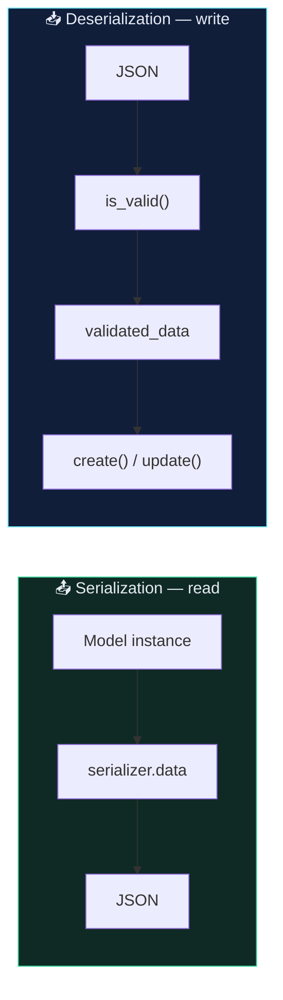
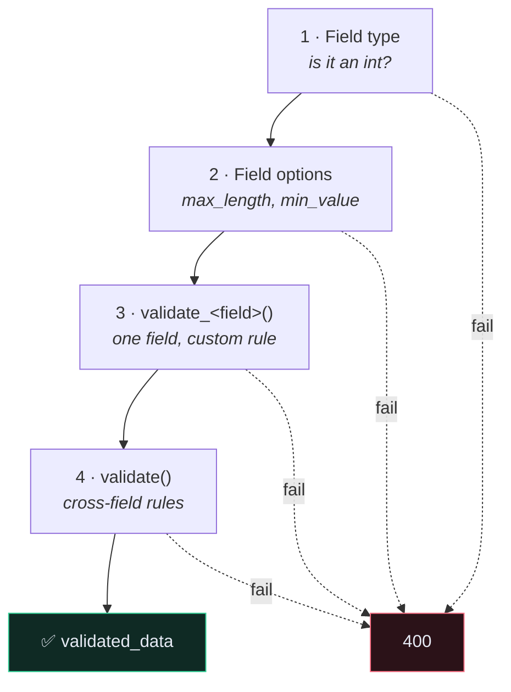

# 🧬 Serializer Field Matrix

> Serializers do two jobs: **model → JSON** (read) and **JSON → validated model** (write). Most confusion comes from forgetting a given option only affects one direction.

---

## 📥📤 The two directions



---

## 🔤 Field types

| Field | Python | JSON | Notes |
| --- | --- | --- | --- |
| `CharField` | `str` | string | `max_length`, `min_length`, `trim_whitespace=True` |
| `EmailField` | `str` | string | validates format |
| `URLField` | `str` | string | validates format |
| `SlugField` | `str` | string | letters, numbers, `-`, `_` |
| `UUIDField` | `UUID` | string | `format="hex_verbose"` |
| `IntegerField` | `int` | number | `max_value`, `min_value` |
| `FloatField` | `float` | number | |
| `DecimalField` | `Decimal` | string by default | `max_digits`, `decimal_places` — **use for money** |
| `BooleanField` | `bool` | boolean | |
| `DateField` | `date` | `"2026-08-16"` | |
| `DateTimeField` | `datetime` | ISO 8601 | timezone-aware if `USE_TZ` |
| `DurationField` | `timedelta` | `"1 02:03:04"` | |
| `ChoiceField` | any | any | `choices=[…]` |
| `MultipleChoiceField` | `set` | array | |
| `FileField` | file | URL on read | needs `MEDIA_URL` |
| `ImageField` | file | URL on read | needs Pillow |
| `ListField` | `list` | array | `child=serializers.IntegerField()` |
| `DictField` | `dict` | object | |
| `JSONField` | any | any | passthrough |
| `SerializerMethodField` | anything | anything | **read-only always** |
| `HiddenField` | — | absent | `default=CurrentUserDefault()` |
| `ReadOnlyField` | anything | anything | write is ignored |

> [!WARNING] `DecimalField` serializes as a string
> `"price": "5.50"`, not `5.50` — deliberately, to avoid float rounding. To get a number:
> ```python
> COERCE_DECIMAL_TO_STRING = False   # in REST_FRAMEWORK settings
> ```
> Do this knowingly; it's a [[12.Versioning an API|breaking change]] for existing clients.

---

## ⚙️ Field options

| Option | Affects | Meaning |
| --- | --- | --- |
| `read_only=True` | write | never accepted from the client |
| `write_only=True` | read | never returned to the client — **passwords** |
| `required=False` | write | may be omitted |
| `allow_null=True` | write | `null` is a valid value |
| `allow_blank=True` | write | `""` is valid (`CharField` only) |
| `default=…` | write | used when omitted; implies `required=False` |
| `source="other"` | both | map a differently-named model attribute |
| `validators=[…]` | write | extra validators |
| `error_messages={…}` | write | override messages |
| `label` / `help_text` | docs | shows in browsable API + OpenAPI |

### `allow_null` vs `allow_blank` vs `required`

```python
description = serializers.CharField(
    required=False,      # key may be absent entirely
    allow_blank=True,    # "description": ""     is OK
    allow_null=True,     # "description": null   is OK
)
```

Three distinct cases. `required=False` alone still rejects `""` and `null`.

---

## 🧪 Validation — the four hooks, in order



```python
class RecipeSerializer(serializers.ModelSerializer):

    def validate_title(self, value):
        """Single field. Receives and returns the value."""
        if len(value.strip()) < 3:
            raise serializers.ValidationError("Title must be at least 3 characters.")
        return value.strip()

    def validate(self, attrs):
        """Cross-field. Receives and returns the whole dict."""
        if attrs.get("time_minutes", 0) > 1440:
            raise serializers.ValidationError(
                {"time_minutes": "A recipe cannot take more than a day."}
            )
        return attrs
```

> [!WARNING] `validate_<field>` must **return** the value
> Forgetting `return value` silently sets the field to `None`. No error, no warning — just a null in your database.

> [!TIP] Raise with a dict to attach the error to a field
> `raise ValidationError("message")` → `{"non_field_errors": ["message"]}`
> `raise ValidationError({"field": "message"})` → `{"field": ["message"]}`
> The second is far more useful to a frontend.

---

## 🏗️ `Meta` options

```python
class RecipeSerializer(serializers.ModelSerializer):

    class Meta:
        model = Recipe
        fields = ["id", "title", "time_minutes", "price", "link", "tags"]
        read_only_fields = ["id"]
        extra_kwargs = {
            "price": {"min_value": 0},
            "link": {"required": False},
        }
```

| Option | Effect |
| --- | --- |
| `fields` | explicit allow-list — **always use this** |
| `exclude` | everything except these — fragile; new model fields leak automatically |
| `read_only_fields` | shorthand instead of declaring each field |
| `extra_kwargs` | per-field options without redeclaring the field |
| `depth = 1` | auto-nest related objects **read-only**; convenient, imprecise |
| `validators` | serializer-level validators (e.g. `UniqueTogetherValidator`) |

> [!CAUTION] `fields = "__all__"` is a security bug waiting to happen
> It exposes every current column *and every column you add in future*. Add `is_premium` to the model and it ships in the API the same day. See [[10.Security Checklist]].

---

## 🔗 Relational fields

| Field | Read output | Writable |
| --- | --- | --- |
| `PrimaryKeyRelatedField` | `3` | ✅ |
| `StringRelatedField` | `"Vegan"` (`__str__`) | ❌ |
| `SlugRelatedField(slug_field="name")` | `"vegan"` | ✅ |
| `HyperlinkedRelatedField` | `"http://…/tags/3/"` | ✅ |
| Nested serializer | `{"id": 3, "name": "Vegan"}` | ❌ **by default** |

```python
# read-only nested — the default and the safe one
tags = TagSerializer(many=True, read_only=True)

# writable nested — you must write create()/update() yourself
tags = TagSerializer(many=True, required=False)
```

Nested writes are the subject of [[Nested Serialization]] — DRF refuses to guess your intent, so you implement it:

```python
def create(self, validated_data):
    tags = validated_data.pop("tags", [])
    recipe = Recipe.objects.create(**validated_data)
    auth_user = self.context["request"].user
    for tag in tags:
        tag_obj, _ = Tag.objects.get_or_create(user=auth_user, **tag)
        recipe.tags.add(tag_obj)
    return recipe
```

---

## 🎭 Common recipes

**Hide the password**
```python
extra_kwargs = {"password": {"write_only": True, "min_length": 5}}
```

**Set the owner without exposing the field**
```python
user = serializers.HiddenField(default=serializers.CurrentUserDefault())
```

**A computed, read-only field**
```python
tag_count = serializers.SerializerMethodField()

def get_tag_count(self, obj):
    return obj.tags.count()      # ⚠️ N+1 unless prefetched — see [[4.The N+1 Problem]]
```

**Rename a field in the API without touching the model**
```python
source_url = serializers.CharField(source="link", required=False)
```

**Different serializer per action**
```python
def get_serializer_class(self):
    if self.action == "list":
        return serializers.RecipeSerializer
    elif self.action == "upload_image":
        return serializers.RecipeImageSerializer
    return serializers.RecipeDetailSerializer
```

---

## ⚠️ Gotchas

- **`Got AttributeError when attempting to get a value for field 'x'`** → `x` isn't on the model and isn't a `SerializerMethodField`.
- **Field silently `None`** → `validate_<field>` didn't `return`.
- **`read_only` field "is required"** → you also marked it `required=True`. Mutually exclusive.
- **`.create()` does not support writable nested fields** → expected; write `create()`.
- **`self.context["request"]` is `KeyError`** → the serializer was instantiated manually without `context={"request": request}`.
- **`many=True` returns a `ListSerializer`, not your class** → override `many_init` if you need custom list behaviour.

---

## 🔗 Related

- [[Nested Serialization]]
- [[7.Model Field Reference]]
- [[4.The N+1 Problem]]
- [[10.Security Checklist]]
