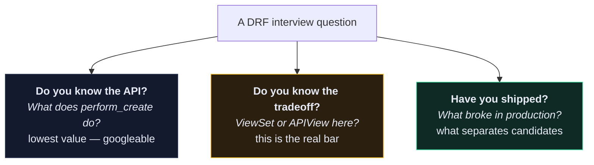

# 🎤 Interview Index

> The gap between *knowing* DRF and *being able to talk about* DRF is real, and it's the gap interviews measure.

---

| Note | For |
| --- | --- |
| [[1.DRF Interview Questions]] | the questions, with answers you can actually say out loud |
| [[2.Common Bugs and Fixes]] | war stories — the "tell me about a bug you fixed" material |
| [[3.Architecture Decision Records]] | how to justify a choice, and how to write it down |
| [[Debugging Decision Tree]] | the systematic method, useful in a live-coding round |

---

## 🎯 What they're really testing

Most candidates prepare for the first row. The offer usually comes from the third.

---

## 🗣️ How to answer well

**Structure every answer the same way:**

1. **Direct answer, one sentence.** Don't warm up.
2. **The reason.** Why it works that way.
3. **The tradeoff.** What it costs.
4. **A concrete instance.** "In the recipe API I…"

> *"`get_queryset()` — because object-level permissions don't run on list endpoints. The tradeoff is that unauthorized rows return 404 rather than 403, which is actually better since 403 confirms the object exists. In the recipe API every viewset filters by `request.user` for exactly that reason."*

Four sentences. Answers the question, shows you understand the mechanism, shows you've thought about the tradeoff, and grounds it in something you built.

---

## 🚩 What sinks answers

| Anti-pattern | Say this instead |
| --- | --- |
| "It's a best practice" | name the specific failure it prevents |
| "I'd use JWT because it's modern" | "I'd use token auth unless I needed X, because…" |
| "I've never hit that" | "I haven't, but I'd expect the failure to look like…" |
| Reciting docs verbatim | describe when you'd *not* use it |
| Pretending to know | "I don't know — here's how I'd find out" |

> [!TIP] "I don't know" is a strong answer when it's followed by a method
> *"I haven't used `CursorPagination` in production. I know it pages by value rather than offset, so deep pages stay fast — I'd verify the ordering field is unique and immutable before adopting it."* That reads as senior. Bluffing reads as junior.

---

## 📋 The ten things to have ready

Be able to speak for two minutes on each, without notes:

1. Why a **custom user model on day one** — [[1.Custom User Model in Django]]
2. The **request lifecycle** and where each error code comes from — [[2.Errors You Will Actually Hit]]
3. **`get_queryset()` vs object permissions** for list endpoints — [[5.Custom Permissions]]
4. **N+1** — what it is, how you'd detect it, how you'd fix it — [[4.The N+1 Problem]]
5. **Token vs JWT** — and why "it's stateless" cuts both ways — [[6.Token vs JWT vs Session]]
6. **Nested writes** — why DRF refuses to guess — [[Nested Serialization]]
7. **TDD** — a specific bug your test caught — [[Test Driven Development]]
8. Why **`runserver` isn't production** — [[2.uWSGI and the Production Dockerfile]]
9. **`transaction.atomic` + `on_commit`** — the Celery race — [[8.Transactions]]
10. One **thing you got wrong** and what you changed — [[2.Common Bugs and Fixes]]

---

## 🎓 The project as a portfolio

When they ask what you've built, don't say "a recipe API from a course". Say what the system *does*:

> *"A Dockerised Django REST API — custom user model with token auth, 19 endpoints across recipes, tags and ingredients with nested writes, image upload, filtering, and a full test suite running in GitHub Actions on every push, with flake8. Deployed behind nginx and uWSGI. I've since added pagination, throttling on the auth endpoints, and fixed an N+1 on the list endpoint that was running 200 queries per request."*

That last clause is the one that lands. It says you went past the tutorial.

---

## 🔗 Related

- [[1.DRF Interview Questions]]
- [[DRF Mastery Roadmap]]
- [[0.Production Readiness Checklist]]
