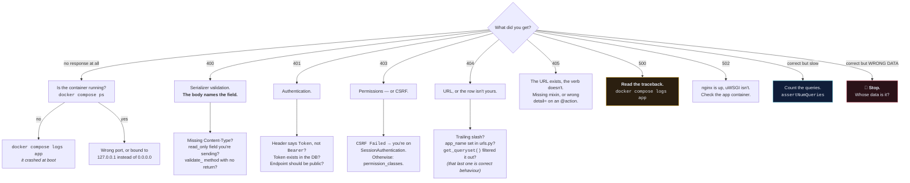
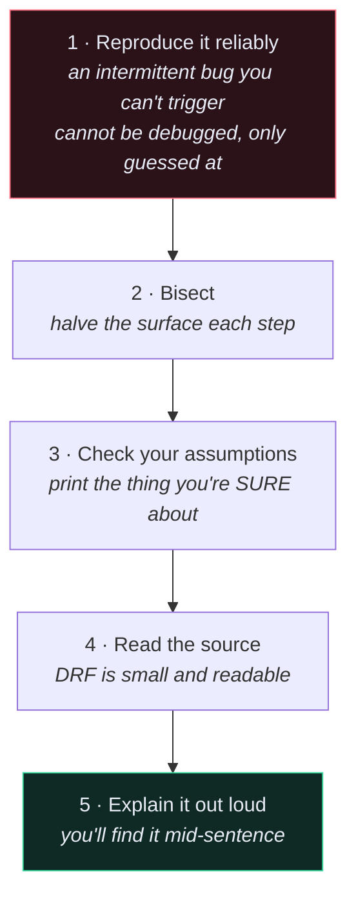

# 🌳 Debugging Decision Tree

> Start at the top. Don't guess — the framework has already told you what's wrong, usually in the response body you didn't print.

---

## 🎯 The first move, always

```python
res = self.client.post(URL, payload)
print(res.status_code, res.data)
```

```bash
docker compose logs -f app
```

Most debugging time is spent theorising about something DRF said out loud. **Read the response body. Read the logs.** Then start here.

---

## 🧭 The tree



---

## 🔍 By symptom

### `400 Bad Request`

The response body tells you the field and the reason. If it looks wrong anyway:

| Check | |
| --- | --- |
| `Content-Type: application/json` sent? | otherwise the body is parsed as form data |
| Nested payload in a test? | needs `format="json"` |
| Field marked `read_only`? | DRF ignores your value, then reports it missing |
| `validate_<field>` returns the value? | falling off the end returns `None` |
| Sending `user` in the body? | it should come from the token instead |

### `401 Unauthorized`

```http
Authorization: Token 9c1f...     ✅
Authorization: Bearer 9c1f...    ❌ this is the answer 80% of the time
```

Then: does the token exist in `authtoken_token`? Should this endpoint be `AllowAny` (registration, login)?

### `403 Forbidden`

- Body says `CSRF Failed` → you're hitting a `SessionAuthentication` endpoint from a non-browser client. Use token auth.
- Otherwise → a permission class returned `False`. Print `request.user` and `request.user.is_authenticated`.

### `404 Not Found`

```text
/api/recipe/recipes     ❌
/api/recipe/recipes/    ✅
```

Then `app_name = "recipe"` in `urls.py`, then — **is the row actually yours?** `get_queryset()` filtering out someone else's object *should* produce a 404. That's not a bug.

### `500 Internal Server Error`

There is a traceback. Read it.

```bash
docker compose logs --tail=100 app
```

If you see nothing at all, `ENV PYTHONUNBUFFERED 1` is missing from the Dockerfile and Python is buffering stdout.

### Correct response, slow

```python
with self.assertNumQueries(4):
    self.client.get(RECIPES_URL)
```

If the count scales with the number of rows, it's [[4.The N+1 Problem|N+1]]. If it's a constant few queries and still slow, you're missing an index on whatever you filter and order by.

### Correct shape, wrong data 🚨

**Treat this as a security incident until proven otherwise.**

```python
def get_queryset(self):
    return self.queryset.filter(user=self.request.user)
```

Missing that line means every authenticated user sees every row. Verify with a second user before you do anything else.

---

## 🐳 Environment problems

| Symptom | Cause | Command |
| --- | --- | --- |
| Code changes ignored | no volume mount (dev) / correct (prod) | check `docker-compose.yml` |
| `connection refused` to db | Postgres not ready | `docker compose ps` · [[8.Create wait_for_db\|wait_for_db]] |
| Env var empty | compose can't find `.env` | `docker compose config` |
| `/admin/` has no CSS | `collectstatic` / volume | `exec app sh -c "ls /vol/web/static"` |
| Container exits instantly | crash at boot | `docker compose logs app` |
| Everything 400s in prod | `ALLOWED_HOSTS` | check `.env` |

---

## 🧪 When the test is the thing that's wrong

| Symptom | Cause |
| --- | --- |
| "Ran 0 tests" | missing `tests/__init__.py` |
| Passes alone, fails in the suite | shared state — prove it with `--shuffle` |
| Assertion sees the old value | missing `refresh_from_db()` |
| List order mismatch | test and view must use the same `order_by` |
| Mock has no effect | patched the definition site, not the usage site |
| `on_commit` never runs | `TestCase` rolls back — use `captureOnCommitCallbacks(execute=True)` |

---

## 🪜 When you're properly stuck



**Bisecting is the highest-value habit.** Does the serializer work in the shell?

```python
from recipe.serializers import RecipeSerializer
s = RecipeSerializer(data={"title": "x", "time_minutes": 5, "price": "5.00"})
s.is_valid()
print(s.errors)
```

If yes, the bug is in the view. If no, you've halved the search space in ten seconds.

**Checking assumptions** means printing the thing you're most certain about. The bug is nearly always there — that's why you didn't look.

---

## 🔬 The tools

```python
print(Recipe.objects.filter(user=user).query)      # the actual SQL
```

```python
import pdb; pdb.set_trace()                        # drop into a debugger
```

```python
with self.assertNumQueries(3): ...                 # count queries
```

```bash
docker compose run --rm app sh -c "python manage.py shell"
```

```bash
docker compose config                              # substituted compose file
```

```bash
docker compose run --rm app sh -c "python manage.py check --deploy"
```

---

## 🔗 Related

- [[2.Errors You Will Actually Hit]]
- [[2.Common Bugs and Fixes]]
- [[1.HTTP Status Codes]]
- [[5.Testing Patterns]]
