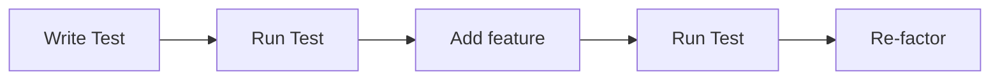

#### Unit Tests
-  Code which tests code
	- Sets up conditions/inputs
	- Runs a piece of code
	- Checks outputs with "assertions"
- Many benefits
	- Ensures code runs as expected
	- Catches bugs
	- Improves reliability
	- Provides confidence

---

#### What is TDD
- Development practice

---

  #### Why use TDD 
- Better understanding of code
- Make changes with confidence
- Reduces bugs
 