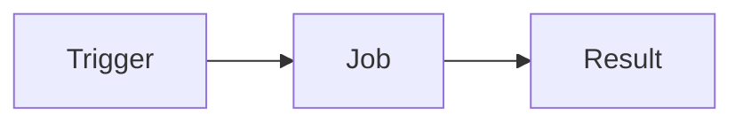

- Automation tool
- Similar to Travis-CI, GitLab CI/CD, Jenkins
- Run jobs when code changes

### Common uses
- Deployment
- Code linting
- Unit tests

### How it works

- Trigger: Every think happens  project in GitHub
- Job: is activate when push Trigger to GitHub
- Result: success or fail of job