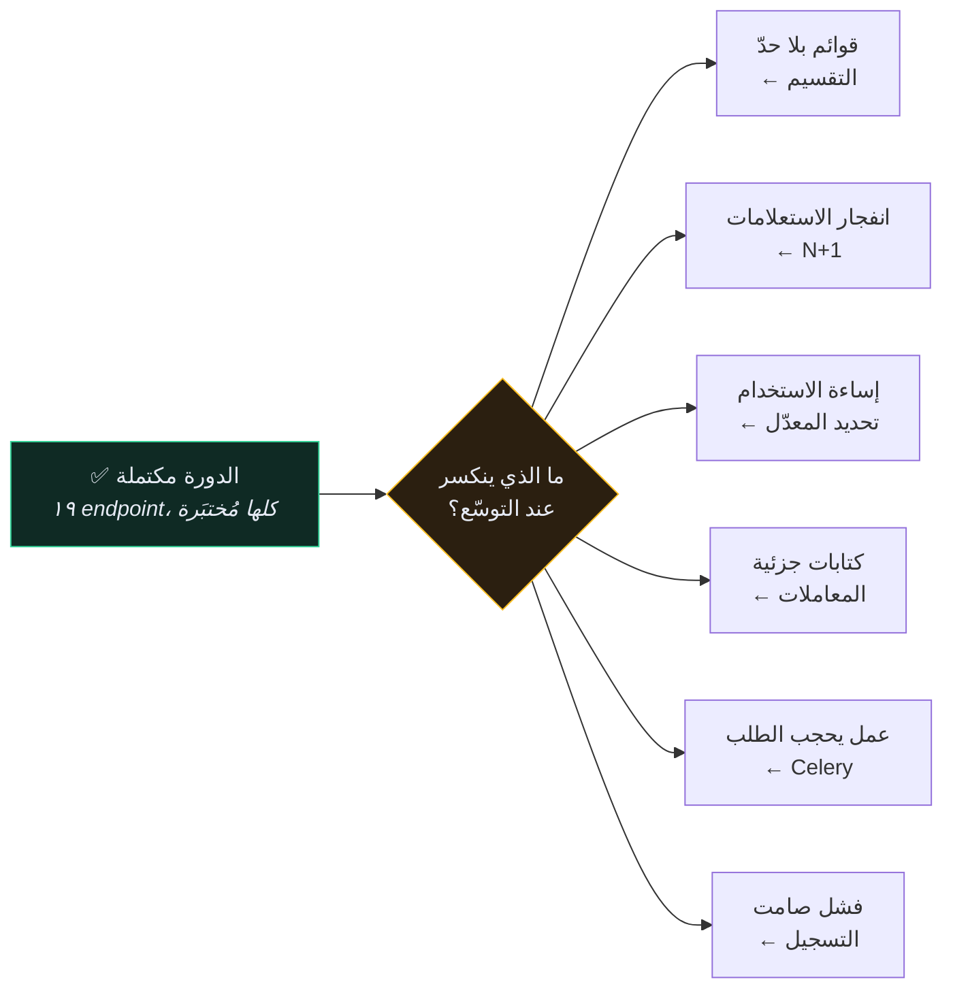
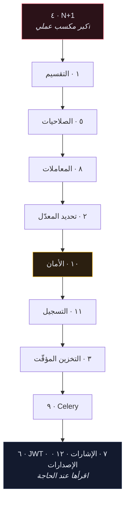

# 🎖️ قائمة جاهزية الإنتاج

> الدورة تُعلّمك بناء الـ API. هذا القسم يُعلّمك إبقاءه حيًّا.
>
> كل بند هنا شيء **لا بأس به عند عشرة مستخدمين وقاتل عند عشرة آلاف**.
>
> 🇬🇧 النسخة الإنجليزية: [[EN/19.Production DRF/0.Production Readiness Checklist|Production Readiness Checklist]]

> [!INFO] مكتوب على أساس Django 6.1
> إن كنت تُحدِّث مشروعك، ابدأ بـ [[1.الجديد في Django 6.1]] — فهو يُغيّر إجابتَي بندين أدناه (`fetch_mode` لمشكلة N+1، و`MAILERS` للبريد)، ويُسقط إصدارات Python و PostgreSQL التي تُثبّتها الدورة.

---

## 🚦 الفجوة

---

## 🔴 قبل أي حركة مرور حقيقية

| | البند | الملاحظة |
| --- | --- | --- |
| ☐ | كل نقطة نهاية قائمة مُقسَّمة إلى صفحات | [[1.التقسيم إلى صفحات]] |
| ☐ | لا وجود لمشكلة N+1 في نقاط نهاية القوائم | [[4.مشكلة N+1]] |
| ☐ | `DEBUG=False`، `SECRET_KEY` من البيئة، `ALLOWED_HOSTS` مضبوط | [[10.قائمة تدقيق الأمان]] |
| ☐ | HTTPS في كل مكان، ورايات الكوكيز الآمنة مفعّلة | [[10.قائمة تدقيق الأمان]] |
| ☐ | كل كتابة تمسّ جدولين أو أكثر داخل معاملة | [[8.المعاملات]] |
| ☐ | طلب غير مُصادَق على نقطة خاصّة يُعيد `401` | [[5.الصلاحيات المخصّصة]] |
| ☐ | المستخدم «أ» لا يستطيع قراءة صفوف المستخدم «ب» | [[5.الصلاحيات المخصّصة]] |
| ☐ | نسخ احتياطية موجودة **وجُرِّب استرجاعها مرة** | [[EN/17.Deployment/6.Post-Deploy Checklist\|EN]] |

## 🟡 قبل أن يصبح لديك مستخدمون يهتمّون

| | البند | الملاحظة |
| --- | --- | --- |
| ☐ | تحديد معدّل على نقاط المصادقة وعلى الزوّار المجهولين | [[2.تحديد المعدّل]] |
| ☐ | الأخطاء تصلك أنت، لا ملفّ سجلّ فقط | [[11.التسجيل والمراقبة]] |
| ☐ | العمل البطيء أو الخارجي خارج مسار الطلب | [[9.المهامّ الخلفية مع Celery]] |
| ☐ | سجلّات مُهيكَلة مع مُعرِّف طلب | [[11.التسجيل والمراقبة]] |
| ☐ | مراقبة توفّر على نقطة نهاية حقيقية | [[11.التسجيل والمراقبة]] |
| ☐ | فهرس على كل حقل تُرشِّح أو ترتّب به | [[4.مشكلة N+1]] |

## 🟢 حين يفرض شكل المشكلة ذلك

| | البند | الملاحظة |
| --- | --- | --- |
| ☐ | تخزين مؤقّت على نقاط القراءة المُكلفة | [[3.التخزين المؤقّت]] |
| ☐ | استراتيجية إصدارات قبل أول تغيير كاسر | [[12.إصدارات الـ API]] |
| ☐ | JWT بدل التوكن — **فقط** إن استطعت تبرير السبب | [[6.Token مقابل JWT مقابل Session]] |
| ☐ | مراجعة الإشارات: هل تُساعد أم تُخفي؟ | [[7.الإشارات]] |

---

## 📖 اقرأ بهذا الترتيب

**N+1 أولًا** لأنه التغيير الوحيد ذو الأثر الأكبر والأسهل قياسًا على أي Django API عامل — عادةً ١٠ إلى ٥٠ ضعفًا على نقطة نهاية قائمة، مقابل أربعة أسطر.

---

## 🎯 نقلة الذهنية

| تفكير الدورة | تفكير الإنتاج |
| --- | --- |
| «هل يُعيد البيانات الصحيحة؟» | «كم استعلامًا كلّف ذلك؟» |
| «الاختبار ينجح» | «ماذا يحدث عند الصفّ رقم ١٠٬٠٠٠؟» |
| «المسار السعيد يعمل» | «ماذا يفعل عميل خبيث بهذا؟» |
| «يعمل على جهازي» | «ماذا أرى حين ينكسر الساعة الثالثة فجرًا؟» |
| «سأُضيفه لاحقًا» | «كم يُكلّف إضافته لاحقًا؟» |

---

## 🔗 روابط ذات صلة

- [[الصفحة الرئيسية]] · [[0.فهرس المرجع]] · [[0.فهرس المفاهيم]]
