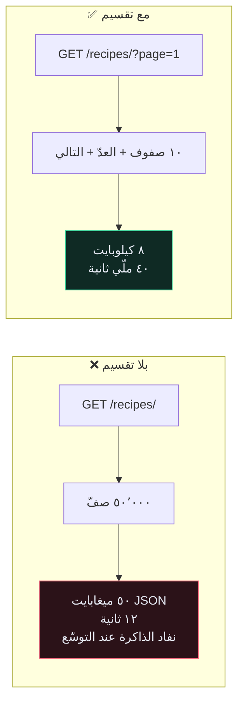
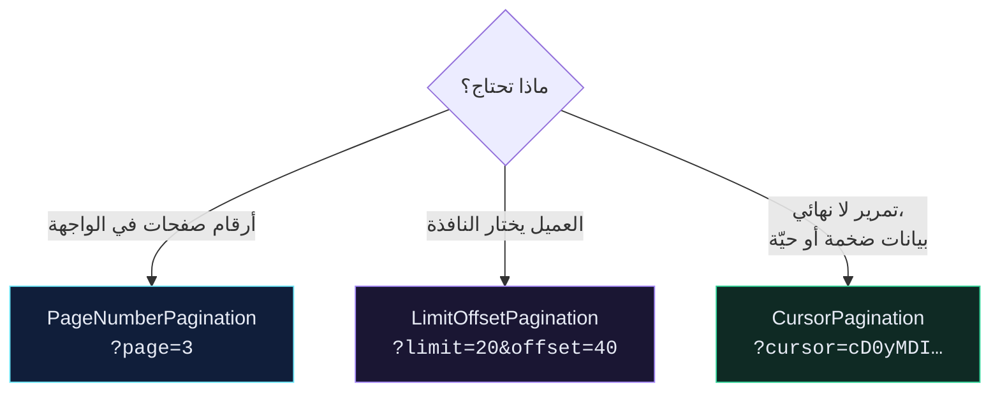

# 📄 التقسيم إلى صفحات — Pagination

> `GET /recipes/` بلا تقسيم هو `SELECT *` وأمامه API. يعمل بشكل رائع حتى اليوم الذي يُسقط فيه الموقع.
>
> 🇬🇧 النسخة الإنجليزية: [[EN/19.Production DRF/1.Pagination|Pagination]]

---

## 🎯 الفكرة

التقسيم يُجزّئ استجابة القائمة إلى صفحات. بدونه ينمو حجم الاستجابة **خطّيًا مع قاعدة بياناتك** — ومعه تنمو الذاكرة وزمن التسلسل وزمن النقل.



---

## 🛠️ الإعداد العامّ

```python
# app/app/settings.py
REST_FRAMEWORK = {
    "DEFAULT_PAGINATION_CLASS": "rest_framework.pagination.PageNumberPagination",
    "PAGE_SIZE": 10,
}
```

> [!WARNING] `DEFAULT_PAGINATION_CLASS` وحدها لا تفعل شيئًا
> **يجب ضبط `PAGE_SIZE` أيضًا.** مع الصنف وبلا حجم صفحة، يُعيد DRF كل شيء بصمت وكأن التقسيم غير مُفعَّل. هذا يوقع الناس باستمرار.

يتغيّر شكل الاستجابة من قائمة مجرّدة إلى غلاف:

```json
{
  "count": 1043,
  "next": "http://api.example.com/api/recipe/recipes/?page=3",
  "previous": "http://api.example.com/api/recipe/recipes/?page=1",
  "results": [ … ١٠ وصفات … ]
}
```

> [!CAUTION] هذا تغيير كاسر للتوافق
> كل عميل يكتب `for recipe in response` صار يُكرِّر على مفاتيح الغلاف الأربعة. إن كان لديك عملاء يعملون، أطلِقه خلف [[12.إصدارات الـ API|إصدار]] — أو أعلن عنه على الأقلّ.

---

## 🔀 الأنماط الثلاثة



| | `PageNumber` | `LimitOffset` | `Cursor` |
| --- | --- | --- | --- |
| القفز إلى الصفحة ٥٠٠ | ✅ | ✅ | ❌ |
| العدد الإجمالي | ✅ | ✅ | ❌ (بالتصميم) |
| الصفحات البعيدة تبقى سريعة | ❌ | ❌ | ✅ |
| ثابت عند إدراج صفوف | ❌ | ❌ | ✅ |
| يتطلّب ترتيبًا فريدًا | لا | لا | **نعم** |

### لماذا تبطؤ الصفحات البعيدة؟

`?page=5000` يصير `LIMIT 10 OFFSET 49990`. على PostgreSQL أن **يجلب ٤٩٬٩٩٠ صفًّا ويرميها** ليمنحك عشرة. التكلفة تنمو مع رقم الصفحة.

التقسيم بالمؤشّر يفعل `WHERE created_at < <cursor> LIMIT 10` بدلًا من ذلك — يستخدم فهرسًا، وتكلفته على الصفحة ٥٠٠٠ كتكلفته على الصفحة ١.

### مشكلة الصفوف المكرّرة

مع التقسيم بالإزاحة على بيانات حيّة:

```text
اللحظة ٠   العميل يقرأ الصفحة ١ (الصفوف ١–١٠)
اللحظة ١   شخص يُنشئ وصفة جديدة ← تُرتَّب في الموضع ١
اللحظة ٢   العميل يقرأ الصفحة ٢ (إزاحة ١٠) ← الصفّ ١٠ القديم يظهر **مجدّدًا**
```

يرى المستخدم تكرارًا، ولا يرى صفًّا آخر أبدًا. التقسيم بالمؤشّر محصّن لأنه يُقسّم **بالقيمة** لا بالموضع.

---

## 🎛️ السماح للعميل باختيار الحجم

```python
# app/core/pagination.py
from rest_framework.pagination import PageNumberPagination


class StandardPagination(PageNumberPagination):
    page_size = 10
    page_size_query_param = "page_size"
    max_page_size = 100
```

```python
class RecipeViewSet(viewsets.ModelViewSet):
    pagination_class = StandardPagination
```

الآن `?page_size=50` يعمل، و`?page_size=100000` يُقيَّد إلى ١٠٠.

> [!CAUTION] `max_page_size` ليس اختياريًا
> بدونه يكون `?page_size=999999` هجوم حجب خدمة **بنيته أنت بيدك**، ومتاحًا لأي زائر.

---

## 🌊 التقسيم بالمؤشّر، بشكل صحيح

```python
class RecipeCursorPagination(CursorPagination):
    page_size = 20
    ordering = "-id"          # يجب أن يكون فريدًا وغير متغيّر
```

`ordering` يجب أن يكون **فريدًا** (التساوي يجعل المؤشّر ملتبسًا فتُفقَد صفوف) و**غير متغيّر** (إن تغيّرت القيمة أشار المؤشّر إلى لا شيء). `-id` و`-created_at` جيّدان. `-name` و`-price` ليسا كذلك.

أضِف الفهرس المقابل، وإلّا تكون قد نقلت المشكلة لا حللتها.

---

## 🚫 تعطيله لنقطة نهاية واحدة

```python
class TagViewSet(BaseRecipeAttrViewSet):
    pagination_class = None
```

مشروع حين تكون القائمة **محدودة بالتصميم** — وسوم مستخدم واحد، قائمة دول ثابتة. غير مشروع إطلاقًا لأي شيء يستطيع المستخدم أن يُضيف إليه بلا حدّ.

---

## ⚠️ أخطاء شائعة

- **التقسيم مضبوط والاستجابات ما زالت قوائم مجرّدة** ← ينقص `PAGE_SIZE`.
- **الواجهة انكسرت بعد التفعيل** ← الغلاف. متوقّع؛ نسّق التغيير.
- **`Invalid cursor`** ← حقل `ordering` ليس فريدًا.
- **استعلام `count` بطيء على جدول ضخم** ← `SELECT COUNT(*)` مسح كامل في PostgreSQL. انتقل إلى المؤشّر، أو أسقِط العدّ.

---

## 🧠 اختبر نفسك

> [!QUESTION]
> ١. لماذا `?page=5000` بطيء حتى مع فهرس مثالي؟
> ٢. ما الذي يحدث بالضبط إن لم يكن `CursorPagination.ordering` فريدًا؟
> ٣. لماذا يُعدّ تفعيل التقسيم تغييرًا كاسرًا للـ API؟

---

## 🔗 روابط ذات صلة

- [[4.مشكلة N+1]] · [[12.إصدارات الـ API]] · [[3.التخزين المؤقّت]]
- [[0.قائمة جاهزية الإنتاج]]
