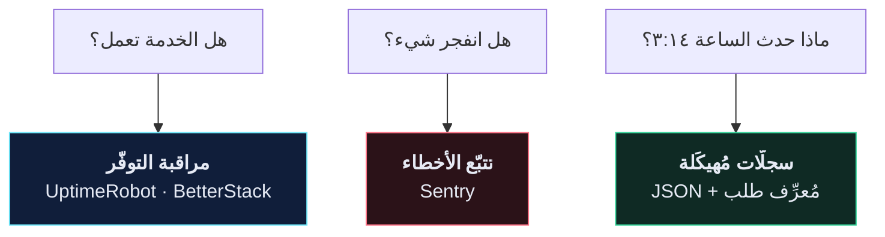

# 🔭 التسجيل والمراقبة

> السؤال ليس «هل انكسر؟» بل «هل سأعرف، وهل سأستطيع معرفة ما حدث؟»
>
> 🇬🇧 النسخة الإنجليزية: [[EN/19.Production DRF/11.Logging and Observability|Logging and Observability]]

---

## 🎯 ثلاثة أسئلة مختلفة



`print()` لا يُجيب عن أيٍّ منها.

---

## 🖨️ لماذا ليس `print()`؟

| | `print()` | `logging` |
| --- | --- | --- |
| مستويات الخطورة | ❌ | ✅ من DEBUG إلى CRITICAL |
| الإطفاء في الإنتاج بلا تعديل كود | ❌ | ✅ |
| طابع زمني، وحدة، رقم سطر | ❌ | ✅ |
| التوجيه إلى ملف أو Sentry أو stdout | ❌ | ✅ |
| مُهيكَل (قابل للتحليل آليًا) | ❌ | ✅ |

```python
import logging
logger = logging.getLogger(__name__)

logger.info("recipe created", extra={"user_id": user.id, "recipe_id": recipe.id})
```

استخدام `__name__` يمنحك مُسجِّلًا باسم الوحدة (`recipe.views`)، فتستطيع رفع أو خفض التفصيل لكل تطبيق دون لمس الكود.

---

## 🛠️ الإعداد

```python
LOGGING = {
    "version": 1,
    "disable_existing_loggers": False,
    "formatters": {
        "verbose": {
            "format": "{levelname} {asctime} {name} {module}:{lineno} {message}",
            "style": "{",
        },
    },
    "handlers": {
        "console": {
            "class": "logging.StreamHandler",
            "formatter": "verbose",
        },
    },
    "root": {"handlers": ["console"], "level": "INFO"},
    "loggers": {
        "django.db.backends": {
            "handlers": ["console"],
            "level": "DEBUG" if DEBUG else "WARNING",   # كل استعلام SQL — للتطوير فقط
            "propagate": False,
        },
    },
}
```

> [!TIP] سجّل إلى stdout لا إلى ملف
> في الحاويات، **stdout هو السجلّ**. Docker يلتقطه، وكل منصّة استضافة تقرأه من هناك. الكتابة إلى `/var/log/app.log` داخل حاوية تعني أن السجلّات تموت مع الحاوية ولا يقرأها أحد أبدًا.

---

## 📊 المستويات، ومتى تستخدمها

| المستوى | لـ | يوقظ أحدًا؟ |
| --- | --- | --- |
| `DEBUG` | قيم المتغيّرات أثناء التطوير | لا — مُطفَأ في الإنتاج |
| `INFO` | أحداث طبيعية مهمّة: تسجيل مستخدم، طلب جديد | لا |
| `WARNING` | تعافينا من شيء غريب: نجحت إعادة المحاولة | لا |
| `ERROR` | فشل طلب؛ مستخدم متضرّر | **نعم** |
| `CRITICAL` | الخدمة متدهورة أو متوقّفة | **نعم، الآن** |

> [!WARNING] إرهاق التنبيهات سببٌ حقيقي للأعطال
> إن انطلق `ERROR` أربعين مرة يوميًا لأشياء لا يتصرّف أحد بناءً عليها، سيكتم الجميع القناة — ثم يفوتهم التنبيه الذي كان يهمّ. كل ما تُسجّله بمستوى `ERROR` ينبغي أن يكون شيئًا يريد إنسانٌ إصلاحه.

---

## 🧵 مُعرِّفات الطلبات — أعلى إضافة قيمةً

بدونها، سجلّ الإنتاج أسطرٌ متشابكة من عشرات الطلبات المتزامنة. معها، تستطيع سحب رحلة مستخدم واحد بالضبط.

```python
# app/core/middleware.py
import uuid
from contextvars import ContextVar

request_id_var: ContextVar[str] = ContextVar("request_id", default="-")


class RequestIDMiddleware:
    def __init__(self, get_response):
        self.get_response = get_response

    def __call__(self, request):
        rid = request.headers.get("X-Request-ID") or uuid.uuid4().hex[:12]
        request_id_var.set(rid)
        request.request_id = rid

        response = self.get_response(request)
        response["X-Request-ID"] = rid
        return response
```

ضعه **أولًا** في `MIDDLEWARE`. أعِد المُعرِّف في ترويسة الاستجابة أيضًا — فيستطيع مستخدم أن يلصق مُعرِّف طلبه الفاشل في تذكرة دعم، فتجده أنت فورًا.

---

## 🚨 تتبّع الأخطاء مع Sentry

السجلّات تُخبرك بما حدث **إن ذهبت تبحث**. Sentry يُخبرك **دون أن تبحث**.

```python
import sentry_sdk
from sentry_sdk.integrations.django import DjangoIntegration

if SENTRY_DSN and not DEBUG:
    sentry_sdk.init(
        dsn=SENTRY_DSN,
        integrations=[DjangoIntegration()],
        traces_sample_rate=0.1,
        send_default_pii=False,
        release=os.environ.get("GIT_SHA", "unknown"),
    )
```

مقابل عشرة أسطر تحصل على: أثر تتبّع كامل بالمتغيّرات المحلّية، والطلب المُسبِّب، وعدد المستخدمين المتضرّرين، وهل الخطأ جديد أم ارتداد، **وأي إصدار أدخله**.

> [!CAUTION] `send_default_pii=False`
> مع تفعيل PII يلتقط Sentry الكوكيز والترويسات — بما فيها ترويسة `Authorization`. أي: توكن مصادقة حيّ داخل خدمة طرف ثالث. أبقِها مُطفأة وأضِف ما تحتاجه فقط:
> ```python
> sentry_sdk.set_user({"id": request.user.id})
> ```

`release=GIT_SHA` هو الخيار المُهمَل الذي يستحقّ الانتباه: يُخبرك Sentry عندها **أيّ نشرٍ** أدخل الخطأ.

---

## 🧩 مُعالِج استثناءات يُسجّل

```python
# app/core/exceptions.py
def custom_exception_handler(exc, context):
    response = exception_handler(exc, context)

    if response is not None:
        request = context.get("request")
        logger.warning(
            "api_error",
            extra={
                "status_code": response.status_code,
                "path": getattr(request, "path", None),
                "user_id": getattr(getattr(request, "user", None), "id", None),
            },
        )

    return response
```

الآن كل خطأ 4xx مرئي. **ارتفاع مفاجئ في 401 يعني أن أحدهم يستكشفك؛ وارتفاع في 400 يعني أن عميلًا نشر إصدارًا معطوبًا.** لا يظهر أيٌّ منهما في رؤية تقتصر على 500.

---

## 🩺 نقطة نهاية للصحّة

```python
@api_view(["GET"])
@permission_classes([AllowAny])
def health_check(request):
    try:
        connection.ensure_connection()
        db_ok = True
    except Exception:
        db_ok = False

    return Response(
        {"status": "ok" if db_ok else "degraded", "database": db_ok},
        status=200 if db_ok else 503,
    )
```

وجّه مراقب التوفّر إلى `/api/health/` لا إلى `/`. استجابة `200` من صفحة رئيسية لا تصل إلى قاعدة البيانات هي **كذبة**.

---

## 🔒 لا تُسجّل هذه أبدًا

- كلمات المرور، ولو مُجزّأة
- التوكنات ومُعرِّفات الجلسات ومفاتيح الـ API
- أرقام البطاقات كاملة
- بيانات شخصية تتجاوز حاجتك — السجلّات بيانات شخصية أيضًا

```python
logger.info(f"login attempt: {request.data}")                    # ❌ تحتوي كلمة المرور
logger.info("login attempt", extra={"email": request.data.get("email")})   # ✅
```

---

## ⚠️ أخطاء شائعة

- **لا سجلّات إطلاقًا في Docker** ← ينقص `ENV PYTHONUNBUFFERED 1`. بايثون يحجز الإخراج فلا ترى شيئًا.
- **`disable_existing_loggers: True`** ← يُسكِت مُسجِّلات Django نفسها. أبقِها `False`.
- **`django.db.backends` بمستوى DEBUG في الإنتاج** ← كل استعلام SQL مُسجَّل، بحجم هائل وكلفة أداء حقيقية، ومعه معاملات الاستعلام.
- **حصّة Sentry تنفد في يوم** ← خطأ واحد صاخب يتكرّر آلاف المرّات. أصلِحه أو رشِّحه بـ `before_send`.

---

## 🧠 اختبر نفسك

> [!QUESTION]
> ١. لماذا تُسجّل إلى stdout بدل ملف داخل حاوية؟
> ٢. ما الذي يمنحك إيّاه مُعرِّف الطلب ولا يمنحك إيّاه الطابع الزمني؟
> ٣. لماذا `send_default_pii=True` خطير مع مصادقة التوكن؟

---

## 🔗 روابط ذات صلة

- [[10.قائمة تدقيق الأمان]] · [[9.المهامّ الخلفية مع Celery]]
- [[EN/21.Interview and Real World/Debugging Decision Tree|شجرة قرارات التصحيح]] 🇬🇧
- [[0.قائمة جاهزية الإنتاج]]
