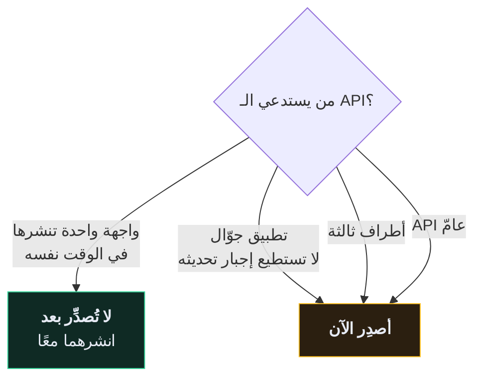
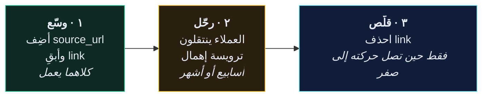

# 🔢 إصدارات الـ API

> تحتاج استراتيجية إصدارات في اليوم الذي **يسبق** أول تغيير كاسر، لا الذي يليه.
>
> 🇬🇧 النسخة الإنجليزية: [[EN/19.Production DRF/12.Versioning an API|Versioning an API]]

---

## 🎯 السؤال الوحيد المهمّ

**هل تستطيع نشر تغيير وأنت واثق أن لا عميلًا قائمًا سينكسر؟**

بمجرّد أن يصير الجواب لا — لأن هناك تطبيق جوّال في المتجر، أو شريكًا تكامل معك الشهر الماضي، أو مستخدمًا كتب سكربتًا — تحتاج إصدارات.



> [!TIP] للإصدار المُبكّر ثمن أيضًا
> `/api/v1/` في مشروع له واجهة واحدة تنشرها بالتزامن لا يشتري شيئًا، ويُضيف مقطع مسار ستحمله إلى الأبد. أطلِق `/api/`، وأضِف الإصدارات حين يظهر عميل حقيقي خارج سيطرتك.

---

## 🔀 ما الذي يُعدّ كاسرًا؟

| التغيير | كاسر؟ |
| --- | --- |
| إضافة نقطة نهاية جديدة | ❌ آمن |
| إضافة حقل **اختياري** إلى الاستجابة | ❌ آمن |
| إضافة حقل طلب **اختياري** | ❌ آمن |
| حذف حقل من الاستجابة | ✅ **كاسر** |
| إعادة تسمية حقل | ✅ **كاسر** |
| تغيير النوع (`"5"` ← `5`) | ✅ **كاسر** |
| جعل حقل اختياري إلزاميًا | ✅ **كاسر** |
| تغيير رمز الحالة | ✅ **كاسر** |
| **إضافة التقسيم إلى صفحات** | ✅ **كاسر** — راجع [[1.التقسيم إلى صفحات]] |
| تشديد التحقّق | ✅ **كاسر** — حمولات كانت تعمل صارت `400` |
| تغيير الترتيب الافتراضي | ⚠️ كاسر عمليًا في الغالب |

القاعدة: **الإضافة آمنة، والحذف والتغيير ليسا كذلك.**

---

## 🛣️ الاستراتيجيات

```python
REST_FRAMEWORK = {
    "DEFAULT_VERSIONING_CLASS": "rest_framework.versioning.URLPathVersioning",
    "DEFAULT_VERSION": "v1",
    "ALLOWED_VERSIONS": ["v1", "v2"],
}
```

| الصنف | الشكل | الحكم |
| --- | --- | --- |
| `URLPathVersioning` | `/api/v1/recipes/` | ✅ **الخيار الافتراضي** — مرئي، قابل للتخزين، سهل التصحيح |
| `NamespaceVersioning` | الشكل نفسه عبر نطاقات URLconf | ✅ جيّد حين تتباعد الإصدارات كثيرًا |
| `AcceptHeaderVersioning` | `Accept: …; version=1.0` | ⚠️ «الأنقى» REST، والأصعب في `curl`، ويكسر التخزين الساذج |
| `QueryParameterVersioning` | `?version=1` | ⚠️ يسهل نسيانه |
| `HostNameVersioning` | `v1.api.example.com` | ⚠️ يحتاج DNS وشهادات لكل إصدار |

**اختر إصدار المسار** ما لم يكن لديك سبب محدّد لغير ذلك. مسارٌ تستطيع لصقه في متصفّح وسطرُ سجلٍّ تقرؤه بنظرة أثمن من نقاء البروتوكول.

---

## 🛠️ خدمة إصدارين من عرض واحد

نادرًا ما تحتاج قاعدة كود موازية. عادةً يختلف مُسلسِل واحد فقط.

```python
class RecipeViewSet(viewsets.ModelViewSet):

    def get_serializer_class(self):
        if self.request.version == "v2":
            return serializers.RecipeV2Serializer
        return serializers.RecipeSerializer
```

```python
class RecipeSerializer(serializers.ModelSerializer):
    """v1 — يبقى ثابتًا للعملاء القائمين."""

    class Meta:
        model = Recipe
        fields = ["id", "title", "time_minutes", "price", "link"]


class RecipeV2Serializer(serializers.ModelSerializer):
    """v2 — link صار source_url، والمدّة صارت مُهيكَلة."""
    source_url = serializers.CharField(source="link", required=False)
    duration = serializers.SerializerMethodField()

    class Meta:
        model = Recipe
        fields = ["id", "title", "duration", "price", "source_url"]

    def get_duration(self, obj):
        return {"minutes": obj.time_minutes}
```

**نموذج واحد، عرض واحد، مُسلسِلان.** قاعدة البيانات لا تعلم بوجود إصدارات إطلاقًا — وهذا هو المقصود. **الإصدار شأن عرضٍ لا شأن تخزين.**

---

## 🌉 نمط: وسّع ← رحّل ← قلّص

التقنية التي تسمح لك بتغيير كل شيء تقريبًا دون إصدار جديد:



الجزء الحاسم هو **معيار الخروج** من الخطوة ٢: تحذف الحقل القديم حين تُظهر السجلّات أن لا أحد يقرؤه، لا حين يقول التقويم ذلك.

---

## 📢 الإهمال، بشكل صحيح

```python
class DeprecationMiddleware:
    def __call__(self, request):
        response = self.get_response(request)

        if request.path.startswith("/api/v1/"):
            response["Deprecation"] = "true"
            response["Sunset"] = "Sat, 01 Nov 2026 00:00:00 GMT"
            response["Link"] = '</api/v2/>; rel="successor-version"'

        return response
```

`Deprecation` و`Sunset` ترويستان قياسيّتان (RFC 8594). بعض مكتبات العملاء تُظهرهما تلقائيًا، وهما يمنحانك سجلًّا صادقًا لموعد إعلانك عن التغيير.

| الخطوة | التوقيت |
| --- | --- |
| إعلان في التوثيق وسجلّ التغييرات | اليوم ٠ |
| ترويستا `Deprecation` و`Sunset` تعملان | اليوم ٠ |
| مراسلة المتكاملين المعروفين | اليوم ٠ واليوم ٩٠ |
| تسجيل كل استخدام للإصدار القديم | باستمرار |
| الحذف | حين يقترب الاستخدام من الصفر **و**يمرّ موعد الغروب |

---

## 🎯 النصيحة الصادقة

1. **لا تُصدِّر حتى تُضطرّ.** واجهة واحدة تنشرها بالتزامن لا تحتاج ذلك.
2. **فضّل التغييرات الإضافية إلى الأبد.** نمط وسّع–رحّل–قلّص يتجنّب معظم الإصدارات أصلًا.
3. **حين تُضطرّ، استخدم مسار الـ URL.** ممل ومرئي وسهل التصحيح.
4. **ادعم إصدارين على الأكثر في وقت واحد.** الثالث هو حيث تتجاوز كلفةُ الصيانة الفائدةَ.
5. **احذف الإصدارات القديمة.** إصدار لا تحذفه أبدًا هو إصدار تصونه إلى الأبد.

---

## 🧠 اختبر نفسك

> [!QUESTION]
> ١. لماذا يُعدّ تفعيل التقسيم إلى صفحات تغييرًا كاسرًا؟
> ٢. ما الذي يسمح لك نمط «وسّع–رحّل–قلّص» بتجنّبه؟
> ٣. ما معيار الخروج الفعلي لحذف حقل مُهمَل؟

---

## 🔗 روابط ذات صلة

- [[1.التقسيم إلى صفحات]] · [[تصميم REST API]]
- [[EN/22.Django Core/1.What's New in Django 6.1|الجديد في Django 6.1]] · [[0.قائمة جاهزية الإنتاج]]
