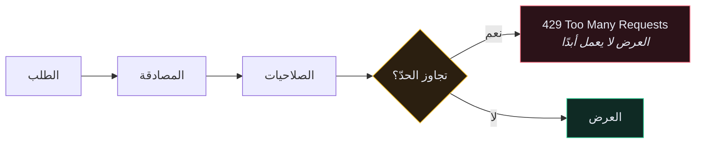
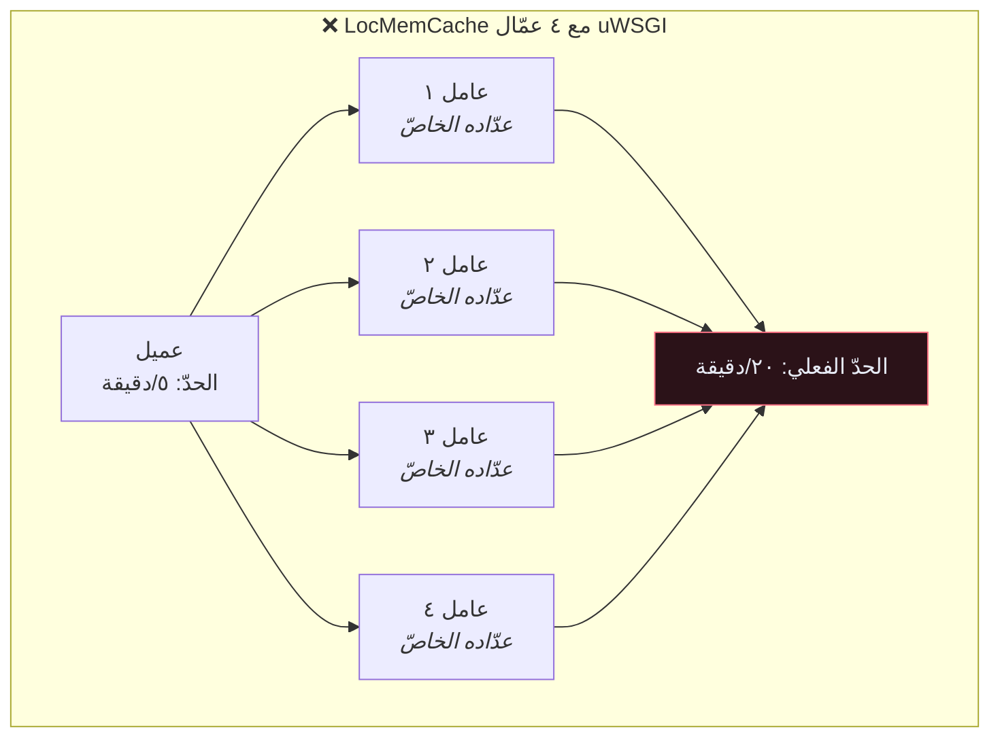

# 🚦 تحديد المعدّل — Throttling

> نقطة `/api/user/token/` عندك **ستتعرّض** لهجوم تخمين. ليس «قد تتعرّض» — بل ستتعرّض، من ماسحات آلية، خلال أيام من ظهور النطاق.
>
> 🇬🇧 النسخة الإنجليزية: [[EN/19.Production DRF/2.Throttling and Rate Limiting|Throttling and Rate Limiting]]

---

## 🎯 الفكرة

تحديد المعدّل يُقيّد عدد الطلبات المسموح بها في نافذة زمنية. عند التجاوز يُعيد DRF `429` مع ترويسة `Retry-After` — والأهمّ أنه **لا يمسّ قاعدة بياناتك ولا عرضك إطلاقًا**.



يعمل **بعد** المصادقة (ليُميّز المستخدمين) و**قبل** العرض (فلا تُكلّفك إساءة الاستخدام شيئًا).

---

## 🛠️ الإعداد الأساسي

```python
REST_FRAMEWORK = {
    "DEFAULT_THROTTLE_CLASSES": [
        "rest_framework.throttling.AnonRateThrottle",
        "rest_framework.throttling.UserRateThrottle",
    ],
    "DEFAULT_THROTTLE_RATES": {
        "anon": "100/hour",
        "user": "1000/hour",
    },
}
```

| الصنف | يُميّز العملاء بـ | ينطبق على |
| --- | --- | --- |
| `AnonRateThrottle` | عنوان IP | الطلبات غير المُصادَقة فقط |
| `UserRateThrottle` | مُعرِّف المستخدم | الطلبات المُصادَقة فقط |
| `ScopedRateThrottle` | نطاق `throttle_scope` في العرض | العروض التي تختاره |

صيغة المعدّل `<عدد>/<فترة>` والفترة `second` أو `minute` أو `hour` أو `day` — والحرف الأول وحده يهمّ، فـ `100/h` تعمل.

---

## 🎯 نقطة النهاية التي تحتاج هذا فعلًا

حدّ عامّ بمئة طلب في الساعة **لا يوقف** هجوم كلمات المرور: مئة تخمين في الساعة، عبر شبكة أجهزة، إلى الأبد. نقطة تسجيل الدخول تحتاج ميزانيّتها الخاصّة، وأضيق بكثير.

```python
"DEFAULT_THROTTLE_RATES": {
    "anon": "100/hour",
    "user": "1000/hour",
    "login": "5/minute",       # ← هذه هي المهمّة
    "register": "10/hour",
}
```

```python
# app/user/views.py
from rest_framework.throttling import ScopedRateThrottle


class CreateTokenView(ObtainAuthToken):
    serializer_class = AuthTokenSerializer
    renderer_classes = api_settings.DEFAULT_RENDERER_CLASSES
    throttle_classes = [ScopedRateThrottle]
    throttle_scope = "login"
```

> [!CAUTION] لا تكتفِ بالتحديد حسب IP في تسجيل الدخول
> `AnonRateThrottle` يعتمد على العنوان. مهاجم يملك مجموعة وكلاء يحصل على ميزانيّة جديدة مع كل عنوان. الدفاع الأقوى هو التحديد **حسب البريد المُرسَل** أيضًا، فلا يُهاجَم حساب واحد من ألف عنوان:
> ```python
> class LoginThrottle(SimpleRateThrottle):
>     scope = "login"
>
>     def get_cache_key(self, request, view):
>         email = request.data.get("email", "")
>         return self.cache_format % {"scope": self.scope, "ident": email.lower()}
> ```
> استخدم الاثنين: تحديد الـ IP يوقف الماسحات الصاخبة، وتحديد البريد يوقف الهجوم المُوجَّه.

---

## 🗄️ التحديد يحتاج ذاكرة مؤقّتة مشتركة

يُخزّن DRF طوابع الطلبات في ذاكرة Django المؤقّتة. والافتراضي هو **ذاكرة محلّية لكل عملية**:



مع أربعة عمّال يصبح حدّك «٥ في الدقيقة» في الواقع **٢٠ في الدقيقة** — ويُصفَّر كلما أُعيد تشغيل عامل.

```python
CACHES = {
    "default": {
        "BACKEND": "django.core.cache.backends.redis.RedisCache",
        "LOCATION": os.environ.get("REDIS_URL", "redis://redis:6379/1"),
    }
}
```

> [!WARNING] التحديد بلا ذاكرة مشتركة تمثيلٌ لا أكثر
> سيمرّ من اختباراتك، ويبدو صحيحًا في مراجعة الكود، **ولن يعمل في الإنتاج**. هذه أشهر طريقة يفشل بها تحديد المعدّل في DRF بصمت — لأن مجموعة الاختبارات تعمل في عملية واحدة.

---

## 📡 ما يراه العميل

```http
HTTP/1.1 429 Too Many Requests
Retry-After: 47

{"detail": "Request was throttled. Expected available in 47 seconds."}
```

العميل حسن السلوك يقرأ `Retry-After` ويتراجع. وثّق ذلك في مخطّط OpenAPI ليعرف كاتبو العملاء بوجوده.

---

## 🧪 اختباره

```python
from django.core.cache import cache


class ThrottleTests(TestCase):

    def setUp(self):
        self.client = APIClient()
        cache.clear()          # ← حالة التحديد تعيش في الذاكرة المؤقّتة

    def tearDown(self):
        cache.clear()

    def test_login_is_throttled(self):
        payload = {"email": "a@example.com", "password": "wrong"}

        for _ in range(5):
            self.client.post(TOKEN_URL, payload)

        res = self.client.post(TOKEN_URL, payload)

        self.assertEqual(res.status_code, status.HTTP_429_TOO_MANY_REQUESTS)
```

`cache.clear()` في `setUp` **و**`tearDown` إلزامي. بدونه تتسرّب العدّادات بين الاختبارات فتحصل على إخفاقات تعتمد على ترتيب التشغيل.

---

## 🚫 ما ليس تحديد المعدّل

| التهديد | يُساعد؟ |
| --- | --- |
| تخمين كلمات المرور | ✅ الاستخدام الأساسي |
| كشط بياناتك كاملة | ✅ يُبطّئه كثيرًا |
| حلقة إعادة محاولة في عميل معطوب | ✅ |
| **هجوم حجب خدمة حجمي** | ❌ الطلب يصل إلى خادمك. تلك مهمّة Cloudflare أو موازن الحِمل |
| **التفويض** | ❌ مهاجم محدود المعدّل بتوكن صالح ما زال مهاجمًا. راجع [[5.الصلاحيات المخصّصة]] |

---

## ⚠️ أخطاء شائعة

- **التحديد لا يُطبَّق إطلاقًا** ← `throttle_classes` مضبوطة واسم النطاق غير موجود في `DEFAULT_THROTTLE_RATES`.
- **الجميع مُقيَّد دفعة واحدة خلف وكيل** ← كل الطلبات تحمل عنوان الوكيل. اضبط `NUM_PROXIES` أو تأكّد من صحّة `X-Forwarded-For`.
- **الاختبارات متذبذبة** ← ينقص `cache.clear()`.
- **الحدود تُصفَّر عند النشر** ← ذاكرة داخل العملية. استخدم Redis.
- **عملاء الجوّال الشرعيّون يصطدمون بالحدّ** ← فترات الاستطلاع مع إعادات المحاولة تتراكم أسرع ممّا تظنّ. سجّل الـ 429 قبل أن تُشدّد الحدود.

---

## 🧠 اختبر نفسك

> [!QUESTION]
> ١. لماذا لا يحمي التحديد حسب IP نقطةَ تسجيل الدخول حماية كاملة؟
> ٢. ما الحدّ الفعلي مع `5/min` وأربعة عمّال uWSGI على `LocMemCache`؟
> ٣. لماذا يعمل التحديد **بعد** المصادقة لا قبلها؟

---

## 🔗 روابط ذات صلة

- [[5.الصلاحيات المخصّصة]] · [[10.قائمة تدقيق الأمان]] · [[3.التخزين المؤقّت]]
- [[0.قائمة جاهزية الإنتاج]]
