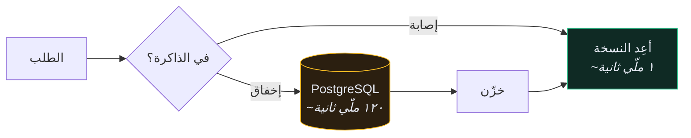
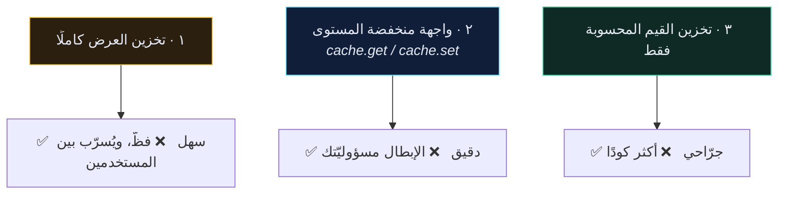

# ⚡ التخزين المؤقّت — Caching

> التخزين المؤقّت آخر تحسين تلجأ إليه لا أوّله. أصلِح [[4.مشكلة N+1|N+1]] وأضِف الفهارس أولًا — وإلّا فأنت تُخزّن استعلامًا بطيئًا بدل إصلاحه.
>
> 🇬🇧 النسخة الإنجليزية: [[EN/19.Production DRF/3.Caching|Caching]]

---

## 🎯 الفكرة

خزّن نتيجة عمل مُكلف، واخدمها من الذاكرة في المرة التالية. **الصعوبة كلها في معرفة متى صارت النسخة المخزّنة كذبة.**



---

## 🛠️ الإعداد

```python
CACHES = {
    "default": {
        "BACKEND": "django.core.cache.backends.redis.RedisCache",
        "LOCATION": os.environ.get("REDIS_URL", "redis://redis:6379/1"),
        "TIMEOUT": 300,
    }
}
```

| الخلفيّة | متى |
| --- | --- |
| `RedisCache` | أي شيء حقيقي — مشتركة بين العمّال والحاويات |
| `LocMemCache` | الاختبارات والتطوير بعملية واحدة فقط |
| `DummyCache` | التطوير، حين تريد تشغيل كود التخزين دون تخزين فعلي |

> [!WARNING] الفخّ نفسه في تحديد المعدّل
> `LocMemCache` لكل عملية. مع أربعة عمّال uWSGI لديك أربع ذاكرات مستقلّة، ونسبة إصابة ٢٥٪، وإجابات مختلفة حسب العامل الذي ردّ.

---

## 🎚️ المستويات الثلاثة



### المستوى ١ — تخزين العرض

```python
from django.utils.decorators import method_decorator
from django.views.decorators.cache import cache_page
from django.views.decorators.vary import vary_on_headers


class RecipeViewSet(viewsets.ModelViewSet):

    @method_decorator(cache_page(60 * 5))
    @method_decorator(vary_on_headers("Authorization"))
    def list(self, request, *args, **kwargs):
        return super().list(request, *args, **kwargs)
```

> [!CAUTION] `vary_on_headers("Authorization")` حامل للحِمل
> مفتاح التخزين الافتراضي يُبنى من **المسار وحده**. بدون التمييز حسب ترويسة المصادقة، تُخدَم قائمة وصفات أول مستخدم **لكل** مستخدم.
> هذه فئة أخطاء حقيقية شُحنت وأُبلغ عنها في أنظمة إنتاج. عامِل غياب `Vary` على استجابة مُصادَقة مُخزَّنة كحادث أمني، لا كمشكلة أداء.

تخزين العرض ضعيف الملاءمة لـ API لكل مستخدم. يتألّق على نقاط النهاية العامّة المتطابقة للجميع.

### المستوى ٢ — الواجهة منخفضة المستوى

```python
from django.core.cache import cache


def get_user_recipe_stats(user):
    key = f"recipe_stats:{user.id}"
    stats = cache.get(key)

    if stats is None:
        stats = {
            "total": Recipe.objects.filter(user=user).count(),
            "avg_time": Recipe.objects.filter(user=user).aggregate(
                Avg("time_minutes")
            )["time_minutes__avg"],
        }
        cache.set(key, stats, timeout=600)

    return stats
```

النمط دائمًا: **مفتاح ← اجلب ← إخفاق ← احسب ← خزّن ← أعِد.**

انضباط المفاتيح أهمّ من أي شيء آخر هنا:

```python
f"recipe_stats:{user.id}"        # ✅ ذو نطاق، متوقّع
f"stats"                         # ❌ يتصادم بين المستخدمين
f"recipe_stats:{user.id}:v2"     # ✅ ارفع v2 إلى v3 لإبطال كل شيء
```

---

## 🔥 الإبطال

> *«في علوم الحاسوب مشكلتان صعبتان فقط: إبطال الذاكرة المؤقّتة، وتسمية الأشياء.»*

ثلاث استراتيجيات، بترتيب تصاعدي في الصحّة والجهد:

### ١. TTL — دعها تنتهي وحدها

```python
cache.set(key, value, timeout=300)
```

بسيط، وصحيح دائمًا في النهاية، وقديم بما لا يزيد عن ٣٠٠ ثانية. **هذا الخيار الصحيح لمعظم الحالات.** إن كان تأخّر خمس دقائق مقبولًا، توقّف هنا.

### ٢. الحذف الصريح عند الكتابة

```python
def perform_create(self, serializer):
    serializer.save(user=self.request.user)
    cache.delete(f"recipe_stats:{self.request.user.id}")
```

صحيح، لكن عليك تذكّره في **كل** مسار كتابة — بما في ذلك لوحة الإدارة والأوامر الإدارية وجلسة الـ shell. تفوّتك واحدة فيبقى لديك تخزين قديم بلا انتهاء.

### ٣. الإبطال عبر الإشارات

```python
@receiver([post_save, post_delete], sender=Recipe)
def invalidate_recipe_cache(sender, instance, **kwargs):
    cache.delete(f"recipe_stats:{instance.user_id}")
```

يلتقط كل كتابة عبر الـ ORM أيًّا كان مصدرها. والمقايضة هي المعتادة مع [[7.الإشارات|الإشارات]] — صار الإبطال غير مرئي من الكود الذي يُطلقه.

> [!TIP] مفتاح الإصدار — مخرج الطوارئ
> بدل حذف المفاتيح، ضمّنها إصدارًا ترفعه:
> ```python
> version = cache.get(f"recipes_version:{user.id}", 1)
> key = f"recipe_list:{user.id}:v{version}"
> # عند الكتابة:
> cache.incr(f"recipes_version:{user.id}")
> ```
> `incr` واحدة تُبطل كل المفاتيح المشتقّة دفعة واحدة، والقديمة تنتهي وحدها. يتوسّع أفضل بكثير من تتبّع كل مفتاح كتبته.

---

## 🎯 ما يستحقّ التخزين فعلًا

| مرشّح جيّد | لماذا |
| --- | --- |
| التجميعات المُكلفة (`COUNT`، `AVG` على صفوف كثيرة) | مُكلفة الحساب، نادرة التغيّر |
| البيانات المرجعية (الدول، التصنيفات) | تتغيّر شهريًا، وتُقرأ باستمرار |
| استجابات واجهات الطرف الثالث | بطيئة، محدودة المعدّل، وتُكلّف مالًا |

| مرشّح سيّئ | لماذا |
| --- | --- |
| بحث بسيط بالمفتاح الأساسي | أسرع من ملّي ثانية أصلًا؛ رحلة الذاكرة قد تكون أبطأ |
| بيانات تُكتَب أكثر ممّا تُقرَأ | ستُبطِل أكثر ممّا تخدم |
| بيانات القِدَم فيها خطأ في الصحّة | الأرصدة، المخزون، الصلاحيات |
| استعلام بطيء لم تُحاول إصلاحه | أخفيت المشكلة ولم تحلّها |

---

## ⚠️ أخطاء شائعة

- **المستخدمون يرون بيانات بعضهم** ← ينقص `vary_on_headers("Authorization")` أو المفتاح بلا نطاق. **عامِلها كحادث أمني.**
- **لا إصابات إطلاقًا** ← مفتاح مختلف في كل استدعاء (طابع زمني داخله)، أو `LocMemCache` لكل عملية.
- **`cache.incr` يرمي `ValueError`** ← المفتاح غير موجود. `incr` لا تُنشئ؛ استخدم `cache.set(key, 1)` أولًا.
- **ذاكرة Redis تنمو بلا حدّ** ← لا سياسة إخلاء. اضبط `maxmemory-policy allkeys-lru`.
- **الاختبارات تتصرّف بغرابة** ← اضبط `DummyCache` في إعدادات الاختبار، أو `cache.clear()` في `setUp`.

---

## 🧠 اختبر نفسك

> [!QUESTION]
> ١. لماذا التخزين المؤقّت هو الخطوة **الخاطئة** أولًا على نقطة نهاية قائمة بطيئة؟
> ٢. ما الذي يحدث بالضبط بدون `vary_on_headers("Authorization")`؟
> ٣. لماذا يتوسّع مفتاح الإصدار أفضل من حذف المفاتيح فرادى؟

---

## 🔗 روابط ذات صلة

- [[4.مشكلة N+1]] · [[2.تحديد المعدّل]] · [[7.الإشارات]]
- [[0.قائمة جاهزية الإنتاج]]
