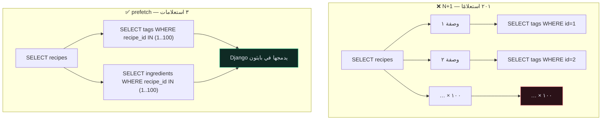
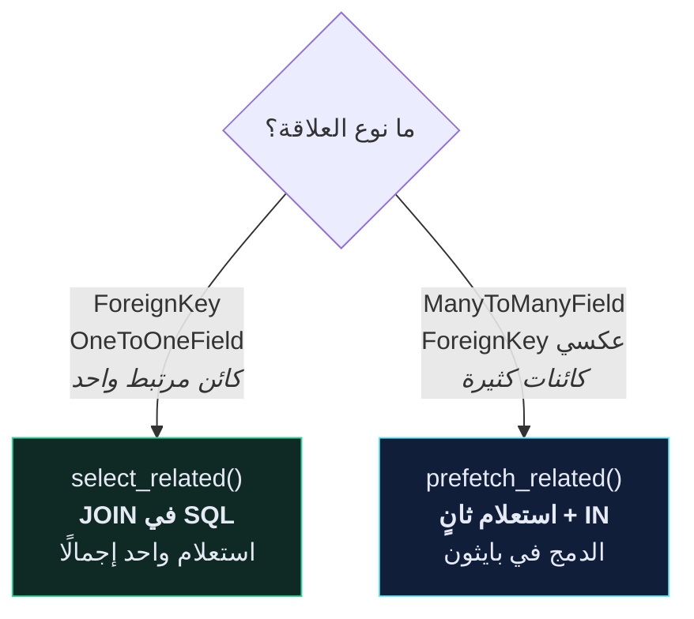

# 🐌 مشكلة N+1

> أعلى أربعة أسطر قيمةً ستُضيفها إلى Django API على الإطلاق. عادةً ١٠ إلى ٥٠ ضعفًا على نقطة نهاية قائمة.
>
> 🇬🇧 النسخة الإنجليزية: [[EN/19.Production DRF/4.The N+1 Problem|The N+1 Problem]]

---

## 🎯 المشكلة

الـ ORM في Django **كسول**. الوصول إلى كائن مرتبط يُطلق استعلامًا — وداخل حلقة، يعني ذلك استعلامًا لكل صفّ.

```python
# app/recipe/serializers.py
class RecipeSerializer(serializers.ModelSerializer):
    tags = TagSerializer(many=True, required=False)
    ingredients = IngredientSerializer(many=True, required=False)
```

تسلسل ١٠٠ وصفة:

```text
استعلام ١     SELECT * FROM core_recipe WHERE user_id = 7
١٠٠ استعلام   SELECT * FROM core_recipe_tags WHERE recipe_id = ?
١٠٠ استعلام   SELECT * FROM core_recipe_ingredients WHERE recipe_id = ?
─────────────────────────────────────────────────────────────
٢٠١ استعلامًا لطلب HTTP واحد
```

هذه هي **N+1** — استعلام للقائمة، و N للبيانات المرتبطة. كلٌّ منها سريع؛ لكن مئتَي رحلة ذهاب وإياب ليست كذلك.



---

## 🛠️ الحلّ

```python
# app/recipe/views.py
class RecipeViewSet(viewsets.ModelViewSet):
    queryset = Recipe.objects.all()

    def get_queryset(self):
        return (
            self.queryset
            .filter(user=self.request.user)
            .select_related("user")                    # ← ForeignKey / OneToOne
            .prefetch_related("tags", "ingredients")   # ← ManyToMany / عكسية
            .order_by("-id")
        )
```

٢٠١ استعلامًا ← **٣**.

---

## ⭐ Django 6.1: `fetch_mode()`

منذ أغسطس ٢٠٢٦ صارت هناك أداة ثالثة، وهي تُغيّر شكل المشكلة.

```python
from django.db import models

Recipe.objects.fetch_mode(models.FETCH_PEERS)   # تفاعلي: حمّل للجميع عند أول وصول
Recipe.objects.fetch_mode(models.FETCH_RAISE)   # صارم: ارفض التحميل الكسول
```

| الوضع | عند لمس علاقة غير محمّلة |
| --- | --- |
| `FETCH_ONE` | استعلام لهذا الكائن فقط *(الافتراضي — مصدر المشكلة)* |
| `FETCH_PEERS` | استعلام واحد يغطّي كل كائنات المجموعة |
| `FETCH_RAISE` | يرمي `FieldFetchBlocked` |

**`select_related`/`prefetch_related` يتطلّبان أن تتنبّأ** بالعلاقات التي سيلمسها المُسلسِل. أمّا `FETCH_PEERS` **فيتفاعل** مع ما يُلمَس فعلًا — فلا يستطيع تعديلٌ في المُسلسِل أن يُعيد المشكلة بصمت.

### التركيبة التي تستحقّ التبنّي

```python
def get_queryset(self):
    return (
        self.queryset
        .filter(user=self.request.user)
        .select_related("user")                     # صريح: أعرف أنني أحتاجه
        .prefetch_related("tags", "ingredients")    # صريح: وهذه أيضًا
        .fetch_mode(models.FETCH_PEERS)             # شبكة أمان لما نسيته
        .order_by("-id")
    )
```

أبقِ الاستدعاءات الصريحة: استعلام `JOIN` تعرف أنك تحتاجه أرخص من رحلة ثانية تفاعلية.

> [!TIP] `FETCH_RAISE` في إعدادات الاختبار يُحوّل N+1 إلى فشل بناء
> بدل انتظار أن ينتبه أحدهم إلى نقطة نهاية بطيئة، اجعل التحميل الكسول العرضي **خطأً صريحًا** في الـ CI. الفكرة نفسها وراء `assertNumQueries`، لكنها تصطاد الحالة التي لم تكتب لها اختبارًا.

> [!WARNING] `select_related()` بلا معاملات مهجورة في 6.1
> ```python
> Recipe.objects.select_related()                 # ❌ تُحذَف في Django 7.0
> Recipe.objects.select_related("user")           # ✅
> ```

---

## 🔀 أيّهما أستخدم؟



| | `select_related` | `prefetch_related` |
| --- | --- | --- |
| يعمل على | FK، OneToOne (**أمامية**) | M2M، FK عكسي، **و** FK |
| الآلية | `JOIN` | استعلام منفصل + `WHERE id IN (…)` |
| استعلامات مُضافة | ٠ | واحد لكل علاقة |
| الدمج يحدث في | قاعدة البيانات | بايثون |

**لماذا لا يصلح JOIN للـ M2M؟** ربط وصفة بخمسة وسوم يُعيد خمسة صفوف لكل وصفة. ١٠٠ وصفة × ٥ وسوم = ٥٠٠ صفّ لإعادة بناء ١٠٠ كائن. هذا التضخّم أسوأ من استعلام ثانٍ.

---

## 🔍 كيف ترى المشكلة فعلًا؟

### في اختبار — الأداة التي تُنهي الجدال

```python
def test_recipe_list_query_count(self):
    """نقطة نهاية القائمة لا تُوسّع الاستعلامات مع عدد الصفوف."""
    for i in range(10):
        recipe = create_recipe(user=self.user)
        recipe.tags.add(Tag.objects.create(user=self.user, name=f"tag{i}"))

    with self.assertNumQueries(4):
        self.client.get(RECIPES_URL)
```

`assertNumQueries` يُحوّل «أظنّه سريعًا» إلى اختبار **يفشل حين يُعيد أحدهم المشكلة**. أضف واحدًا لكل نقطة نهاية قائمة تهمّك.

### في الطرفية

```python
print(Recipe.objects.filter(user=user).query)
```

### في المتصفّح

`django-debug-toolbar` يعرض عدد الاستعلامات والمكرّر منها. **للتطوير فقط** — فهو يكشف إعداداتك.

---

## 🎯 مكاسب أخرى في الـ ORM

**`only()` — لا تجلب أعمدة لا تُسلسِلها**
```python
Recipe.objects.only("id", "title", "price", "time_minutes")
```

**`annotate()` — عُدَّ في قاعدة البيانات لا في بايثون**
```python
from django.db.models import Count

# ❌ استعلام COUNT لكل وصفة
for r in recipes:
    print(r.tags.count())

# ✅ استعلام واحد
Recipe.objects.annotate(tag_count=Count("tags"))
```

**فهرس على ما تُرشِّح وترتّب به**
```python
class Meta:
    indexes = [models.Index(fields=["user", "-id"])]
```

`.filter(user=…).order_by("-id")` هو **الاستعلام** الذي يُنفّذه هذا الـ API. فهرس مركّب عليه بالضبط شبه مجاني، ويهمّ أكثر من أي تحسين على مستوى بايثون.

---

## ⚠️ أخطاء شائعة

> [!WARNING] `select_related` على مفتاح يقبل `NULL` قد يُغيّر صفوفك
> يُولّد `INNER JOIN`، فيُسقط الصفوف التي مفتاحها `NULL`. Django ذكيّ بما يكفي عادةً ليستخدم `LEFT OUTER JOIN`، لكن حين تُسلسِل `.filter()` على النموذج المرتبط قد تفقد صفوفًا. تحقّق من العدد قبل وبعد.

- **`prefetch_related` لم يُفِد** ← استدعيت `.filter()` أو `.order_by()` على مدير العلاقة **داخل الحلقة**، فأهدرت التحميل المسبق. استخدم `Prefetch(...)`.
- **`select_related` على M2M يرمي خطأً** ← `FieldError`. الـ M2M تحتاج `prefetch_related`.
- **عدد الاستعلامات ما زال ينمو** ← شيء في المُسلسِل يلمس علاقة لم تُحمّلها. `SerializerMethodField` هو المتّهم المعتاد.
- **التحميل المسبق جعله أبطأ** ← حمّلت علاقة لا يقرأها المُسلسِل. كل `prefetch` يُكلّف استعلامًا.

> [!TIP] حسّن نقطة نهاية القائمة، لا التفصيل
> `GET /recipes/1/` يُسلسِل كائنًا واحدًا — لا وجود لـ N+1 هناك أصلًا. كل المكسب في القوائم.

---

## 🧠 اختبر نفسك

> [!QUESTION]
> ١. لماذا لا يستطيع `select_related` التعامل مع `ManyToManyField`؟
> ٢. أضفت `prefetch_related("tags")` ولم يتغيّر عدد الاستعلامات. ما السبب الأرجح؟
> ٣. لماذا `assertNumQueries` أقيَم من قياس زمن لمرّة واحدة؟

---

## 🔗 روابط ذات صلة

- [[مجموعات الاستعلام QuerySet]] · [[4.كتاب طبخ الـ ORM]]
- [[1.التقسيم إلى صفحات]] · [[3.التخزين المؤقّت]]
- [[0.قائمة جاهزية الإنتاج]]
