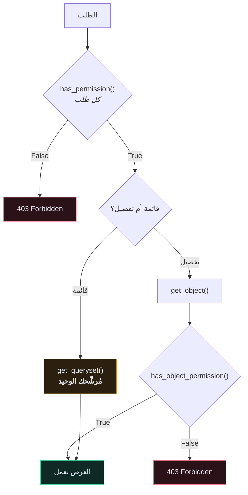

# 🛡️ الصلاحيات المخصّصة

> المصادقة تسأل **من أنت**. الصلاحيات تسأل **هل يُسمح لك**. الخلط بينهما هو كيف تُسرّب الـ APIs بياناتها.
>
> 🇬🇧 النسخة الإنجليزية: [[EN/19.Production DRF/5.Custom Permissions|Custom Permissions]]

---

## 🎯 الدالّتان

```python
from rest_framework import permissions


class MyPermission(permissions.BasePermission):

    def has_permission(self, request, view):
        """تُستدعى مع كل طلب، قبل تشغيل العرض. لا يوجد كائن بعد."""
        return True

    def has_object_permission(self, request, view, obj):
        """تُستدعى لكائن واحد فقط، عبر get_object().
        ❌ لا تُستدعى في نقاط نهاية القوائم."""
        return True
```



> [!CAUTION] الشيء الذي يخطئ فيه الجميع
> **`has_object_permission()` لا تُستدعى إطلاقًا في نقطة نهاية قائمة.** لا يملك DRF كائنًا واحدًا ليفحصه. فإن كانت حمايتك الوحيدة على مستوى الكائن، فإن `GET /recipes/` يُعيد **كل وصفة في قاعدة البيانات**.
>
> حماية القوائم تأتي من `get_queryset()`. دائمًا. ولهذا يُرشِّح كل ViewSet في هذا المشروع حسب `self.request.user`.

---

## 🧰 الأصناف الجاهزة

| الصنف | يسمح لـ |
| --- | --- |
| `AllowAny` | الجميع — الافتراضي إن لم تضبط شيئًا |
| `IsAuthenticated` | أي مستخدم مسجّل |
| `IsAdminUser` | `user.is_staff` |
| `IsAuthenticatedOrReadOnly` | القراءة للجميع، الكتابة للمسجّلين |

اضبط افتراضيًا آمنًا واستثنِ عن قصد — **افشل مُغلقًا**:

```python
REST_FRAMEWORK = {
    "DEFAULT_PERMISSION_CLASSES": ["rest_framework.permissions.IsAuthenticated"],
}
```

```python
# التسجيل يجب أن يكون عامًّا
class CreateUserView(generics.CreateAPIView):
    serializer_class = UserSerializer
    permission_classes = [permissions.AllowAny]
```

نقطة نهاية جديدة تنسى ضبطها ينبغي أن تكون **مُقفَلة** لا مفتوحة.

---

## 🛠️ كتابة صنفك

```python
# app/core/permissions.py
class IsOwner(permissions.BasePermission):
    """صلاحية على مستوى الكائن: المالك فقط."""

    message = "You do not have permission to access this object."

    def has_object_permission(self, request, view, obj):
        return obj.user == request.user


class IsOwnerOrReadOnly(permissions.BasePermission):
    """القراءة للجميع، الكتابة للمالك."""

    def has_object_permission(self, request, view, obj):
        if request.method in permissions.SAFE_METHODS:
            return True
        return obj.user == request.user
```

`SAFE_METHODS` هي `("GET", "HEAD", "OPTIONS")`.

### التركيب المنطقي

```python
permission_classes = [IsAuthenticated & (IsOwner | IsAdminUser)]
```

| المُعامل | المعنى |
| --- | --- |
| `&` | كلاهما يجب أن ينجح |
| `\|` | يكفي أحدهما |
| `~` | النفي |
| قائمة عادية | `AND` ضمني بين كل عنصر |

---

## 🎯 صلاحيات حسب العملية

```python
class RecipeViewSet(viewsets.ModelViewSet):

    def get_permissions(self):
        if self.action in ("list", "retrieve"):
            return [permissions.IsAuthenticated()]
        return [permissions.IsAuthenticated(), IsOwner()]

    def get_queryset(self):
        return self.queryset.filter(user=self.request.user).order_by("-id")
```

> [!WARNING] `get_permissions()` تُعيد **كائنات** لا أصنافًا
> `[IsOwner]` (صنف) يفشل وقت التشغيل برسالة مُربكة. `[IsOwner()]` (كائن) صحيح.
> بينما خاصيّة `permission_classes` تريد **أصنافًا**. نعم، هذا تناقض في التصميم، ونعم ستقع فيه مرة.

---

## 🔢 `403` أم `404`؟

| الحالة | DRF يُعيد | صحيح؟ |
| --- | --- | --- |
| بلا بيانات اعتماد، والنقطة تتطلّب مصادقة | `401` | ✅ |
| توكن صالح، الصلاحية مرفوضة | `403` | ✅ |
| توكن صالح، الصفّ مُرشَّح خارج `get_queryset()` | `404` | ✅ **وأفضل** |

الردّ بـ `403` على كائن يخصّ غيرك **يؤكّد وجوده**. على مورد بمُعرِّفات متسلسلة، يستطيع المهاجم أن يعدّها: `403` تعني «موجود وليس لك»، و`404` تعني «غير موجود». بذلك يكون قد رسم خريطة قاعدة بياناتك من رموز الحالة وحدها.

الترشيح في `get_queryset()` يُعطي `404` في الحالتين ولا يُسرّب شيئًا.

**فضّل ترشيح مجموعة الاستعلام على صلاحيات الكائن حيثما أمكن**، واستخدم `IsOwner` دفاعًا في العمق.

---

## 🧪 اختبارات الصلاحيات

هذه أجدر الاختبارات بالكتابة وأكثرها إهمالًا:

```python
def test_cannot_read_other_users_recipe(self):
    other = create_user(email="other@example.com")
    recipe = create_recipe(user=other)

    res = self.client.get(detail_url(recipe.id))

    self.assertEqual(res.status_code, status.HTTP_404_NOT_FOUND)


def test_cannot_update_other_users_recipe(self):
    other = create_user(email="other@example.com")
    recipe = create_recipe(user=other)

    res = self.client.patch(detail_url(recipe.id), {"title": "مُخترَق"})

    self.assertEqual(res.status_code, status.HTTP_404_NOT_FOUND)
    recipe.refresh_from_db()
    self.assertNotEqual(recipe.title, "مُخترَق")


def test_cannot_delete_other_users_recipe(self):
    other = create_user(email="other@example.com")
    recipe = create_recipe(user=other)

    res = self.client.delete(detail_url(recipe.id))

    self.assertEqual(res.status_code, status.HTTP_404_NOT_FOUND)
    self.assertTrue(Recipe.objects.filter(id=recipe.id).exists())
```

اكتب واحدًا من كلٍّ — قراءة وتعديل وحذف — **لكل مورد مملوك**. هذه هي مجموعة الاختبارات التي تمنع الـ API من أن يصبح خبرًا صحفيًا.

---

## ⚠️ أخطاء شائعة

- **نقطة نهاية القائمة تُعيد كل شيء** ← صلاحية الكائن لا تنطبق على القوائم. رشِّح المجموعة.
- **`TypeError: 'IsOwner' object is not callable`** ← أعدت صنفًا حيث يُنتظَر كائن.
- **الصلاحية تمرّ والبيانات خاطئة** ← تفحص `obj.user` بينما العلاقة الفعلية `obj.recipe.user`.
- **`403` على نقطة عامّة** ← الافتراضي العالمي `IsAuthenticated`؛ أضِف `AllowAny`.
- **`request.user.id` يرمي خطأ** ← مستخدم مجهول. تحقّق من `is_authenticated` أولًا.

---

## 🧠 اختبر نفسك

> [!QUESTION]
> ١. لماذا لا تحمي صلاحية على مستوى الكائن نقطةَ نهاية قائمة؟
> ٢. لماذا `404` جواب أفضل من `403` لكائن يخصّ غيرك؟
> ٣. ما الفرق بين ما تريده `permission_classes` وما تُعيده `get_permissions()`؟

---

## 🔗 روابط ذات صلة

- [[الصلاحيات]] · [[مصادقة التوكن]] · [[10.قائمة تدقيق الأمان]]
- [[0.قائمة جاهزية الإنتاج]]
