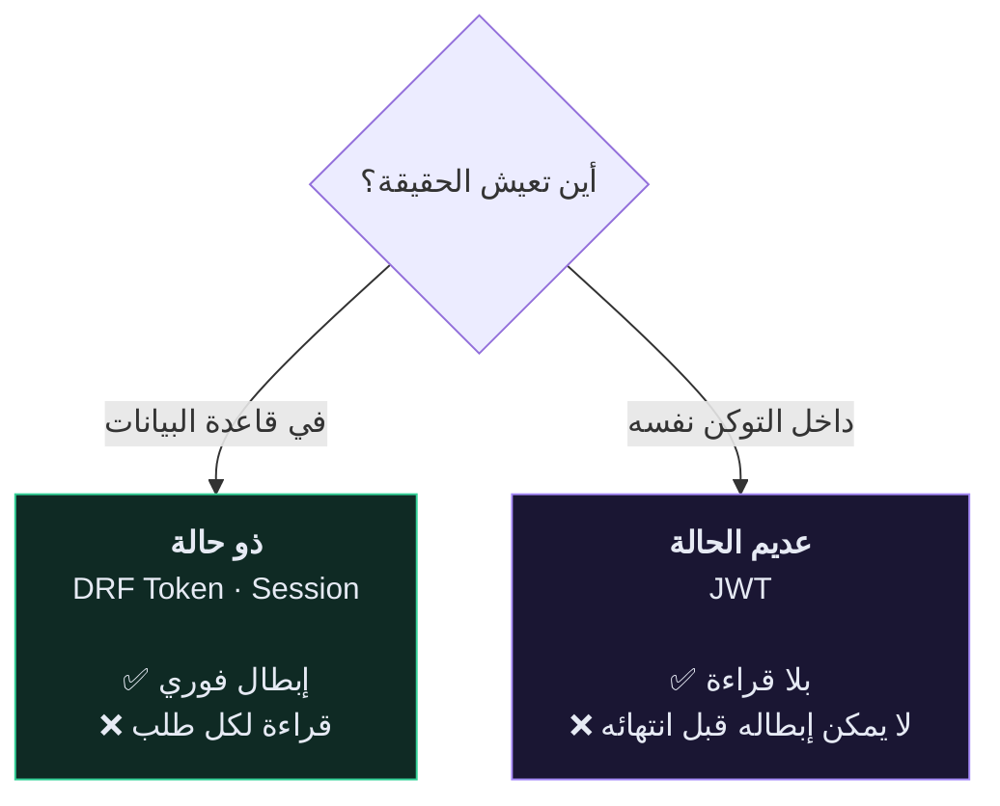
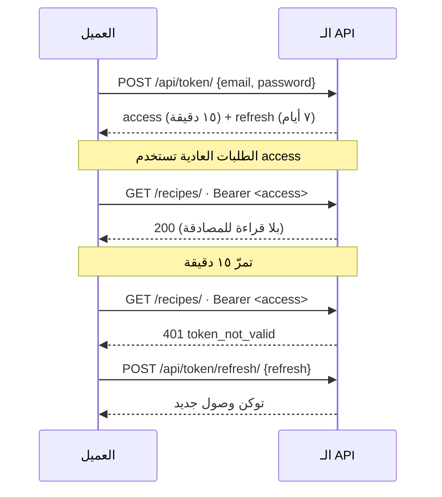
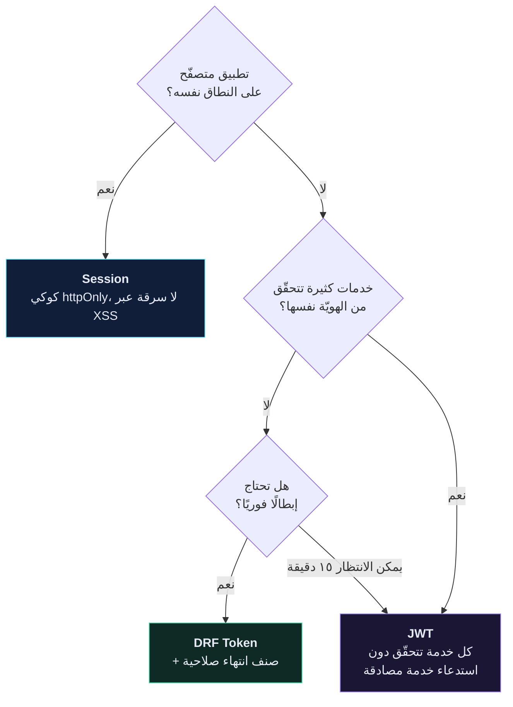

# 🔑 Token مقابل JWT مقابل Session

> معظم الناس يختارون JWT لأنه يبدو عصريًا، ثم يكتشفون أنهم بادلوا قراءةً من قاعدة البيانات بمشكلة إبطالٍ لا حلّ لها.
>
> 🇬🇧 النسخة الإنجليزية: [[EN/19.Production DRF/6.Token vs JWT vs Session|Token vs JWT vs Session]]

---

## 🎯 التمييز الوحيد المهمّ



كل ما عدا ذلك تفاصيل. **ذو حالة = قابل للإبطال. عديم الحالة = سريع. ولا يمكنك الحصول على الاثنين** دون إعادة إدخال الحالة (قائمة حظر) — وعندها تكون قد أعدت بناء المصادقة ذات الحالة بخطوات إضافية.

---

## 📊 المقارنة

| | **DRF Token** | **JWT** | **Session** |
| --- | --- | --- | --- |
| أين تعيش الحالة | جدول `authtoken_token` | داخل التوكن | مخزن الجلسات |
| النقل | `Authorization: Token …` | `Authorization: Bearer …` | كوكي `sessionid` |
| قراءة قاعدة بيانات لكل طلب | ١ | ٠ | ١ |
| ينتهي افتراضيًا | ❌ أبدًا | ✅ دقائق | ✅ أسبوعان |
| إبطال فوري | ✅ احذف الصفّ | ❌ انتظر الانتهاء | ✅ احذف الجلسة |
| يحمل ادّعاءات (دور، مستأجر) | ❌ | ✅ | ❌ |
| يعمل عبر النطاقات | ✅ | ✅ | ⚠️ معاناة CORS والكوكيز |
| مُعرَّض لـ CSRF | ❌ | ❌ | ✅ يحتاج حماية |
| اعتماديّة إضافية | لا — مُضمَّن | `djangorestframework-simplejwt` | لا — مُضمَّن |

---

## 🪙 DRF Token — ما بنيتَه

![[token-auth-flow.svg]]

**الضعف الصادق:** التوكن الافتراضي لا ينتهي أبدًا. أصلِحه بصنف مصادقة مخصّص — راجع [[مصادقة التوكن]]. ذلك الصنف وحده يُزيل الحجّة الأساسية ضدّ توكنات DRF.

---

## 🎫 JWT — ما تشتريه فعلًا

الـ JWT ثلاثة مقاطع base64: `header.payload.signature`.

```json
{ "token_type": "access", "exp": 1755360000, "user_id": 42, "role": "chef" }
```

يتحقّق الخادم من التوقيع ويثق بالمحتوى — **بلا قراءة من قاعدة البيانات**. هذه قيمته كاملةً.

```python
SIMPLE_JWT = {
    "ACCESS_TOKEN_LIFETIME": timedelta(minutes=15),
    "REFRESH_TOKEN_LIFETIME": timedelta(days=7),
    "ROTATE_REFRESH_TOKENS": True,
    "BLACKLIST_AFTER_ROTATION": True,
}
```

### رقصة التوكنَين



العمر القصير **هو** قصّة الإبطال: لا تستطيع إبطاله، فتجعله يموت بسرعة من تلقاء نفسه.

> [!CAUTION] مشكلات JWT الحقيقية
> ١. **لا تستطيع تسجيل خروج أحد.** حذف التوكن من جهة العميل هو كل ما لديك. توكن مسروق يعمل حتى `exp`.
> ٢. **قائمة الحظر تُعيد قاعدة البيانات.** `BLACKLIST_AFTER_ROTATION` يحتاج جدولًا وقراءة — الشيء ذاته الذي اخترت JWT لتجنّبه.
> ٣. **`localStorage` قابل للقراءة عبر XSS.** أي سكربت مُحقَن يسرق التوكن. الكوكيز `httpOnly` أأمن لكنها تُعيد CSRF.
> ٤. **الادّعاءات تتقادم.** اخفض رتبة مستخدم ويبقى توكنه يقول `"role": "chef"` حتى ينتهي.

---

## 🍪 Session — ما زال الجواب الصحيح أحيانًا

الأفضل حين يستهلك الـ API متصفّحٌ على **النطاق نفسه**: كوكي `httpOnly` `Secure` `SameSite=Lax` هو فعلًا الخيار الأكثر مقاومةً لـ XSS المتاح — لا تستطيع JavaScript قراءته إطلاقًا — والمتصفّح يُديره نيابةً عنك.

وهو أيضًا ما يجعل لوحة إدارة Django والـ API القابل للتصفّح يعملان، ولهذا تُبقيه الدورة مفعّلًا إلى جانب مصادقة التوكن أثناء التطوير.

> [!WARNING] `SessionAuthentication` يفرض CSRF
> الطرق غير الآمنة تتطلّب ترويسة `X-CSRFToken`. عميل غير متصفّح يصطدم بنقطة نهاية بمصادقة جلسة يحصل على `403 CSRF Failed` — وهي رسالة تبدو خطأ صلاحيات وليست كذلك.

---

## 🧭 الاختيار



**الافتراضي الصادق لهذا الـ API ولمعظم غيره: DRF Token مع صنف انتهاء صلاحية.**

قراءة واحدة بمفتاح أساسي مُفهرَس لكل طلب تُكلّف أقلّ بكثير من ملّي ثانية. أنت على الأرجح لست عند الحجم الذي يجعل ذلك عنق الزجاجة — وإن وصلت إليه، فـ[[3.التخزين المؤقّت|خزّن قراءة التوكن مؤقّتًا]] قبل أن تُعيد هندسة مصادقتك.

اختر JWT حين تستطيع تسمية المشكلة المحدّدة التي يحلّها لك. «إنه المعيار» ليست تلك المشكلة.

---

## 🔒 التخزين، أيًّا كان اختيارك

| العميل | خزّنه في | لا تخزّنه أبدًا في |
| --- | --- | --- |
| iOS | Keychain | `UserDefaults` |
| Android | EncryptedSharedPreferences | `SharedPreferences` |
| تطبيق ويب أحادي الصفحة | كوكي `httpOnly` `Secure` `SameSite` | `localStorage` |
| سطر الأوامر | متغيّر بيئة أو مخزن مفاتيح النظام | ملف إعدادات مرفوع |

---

## 🧠 اختبر نفسك

> [!QUESTION]
> ١. لماذا تُقوّض إضافةُ قائمة حظر لـ JWT السببَ الذي اخترته لأجله؟
> ٢. سُحبت صلاحيات مسؤول من مستخدم. كم يبقى قادرًا على التصرّف كمسؤول في كل نظام؟
> ٣. لماذا يحصل عميل غير متصفّح على `403 CSRF Failed` من نقطة نهاية بمصادقة جلسة؟

---

## 🔗 روابط ذات صلة

- [[مصادقة التوكن]] · [[ترويسة Authorization]] · [[5.الصلاحيات المخصّصة]]
- [[0.قائمة جاهزية الإنتاج]]
