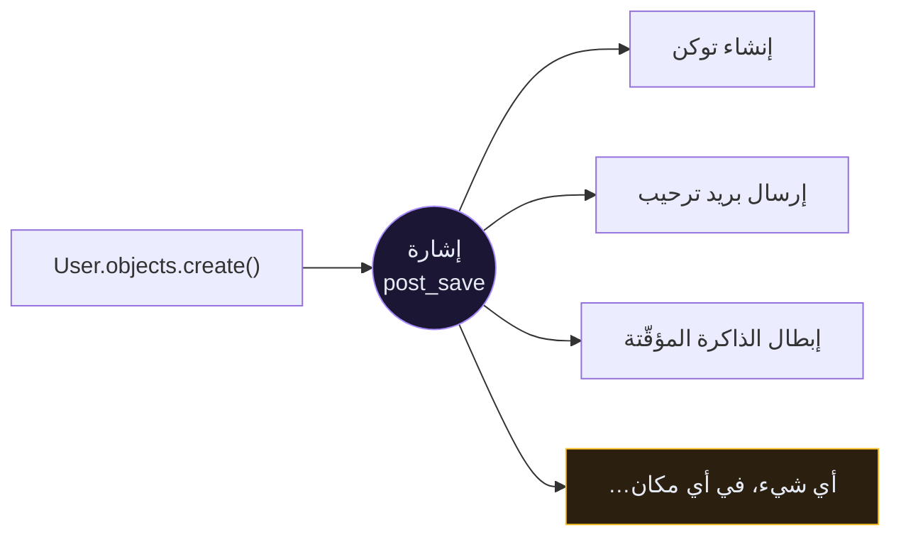
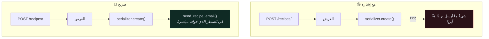

# 📡 الإشارات — Signals

> الإشارات تسمح لك بتشغيل كود عند وقوع حدث، دون أن يعلم مُطلِق الحدث بوجودك. هذه قوّتها، وهذه مشكلتها كاملةً.
>
> 🇬🇧 النسخة الإنجليزية: [[EN/19.Production DRF/7.Signals|Signals]]

---

## 🎯 الفكرة

```python
# app/core/signals.py
from django.db.models.signals import post_save
from django.dispatch import receiver


@receiver(post_save, sender=settings.AUTH_USER_MODEL)
def create_auth_token(sender, instance, created, **kwargs):
    """امنح كل مستخدم جديد توكنًا."""
    if created:
        Token.objects.create(user=instance)
```

صار `User.objects.create_user(...)` في أي مكان في الكود يُنشئ توكنًا أيضًا. **والكود المُستدعي لا يعلم بذلك إطلاقًا.**



---

## 📋 الإشارات المهمّة

| الإشارة | تُطلَق | الاستخدام المعتاد |
| --- | --- | --- |
| `pre_save` | قبل `.save()` | اشتقاق حقل (slug مثلًا) |
| `post_save` | بعد `.save()` | إنشاء كائنات مرتبطة، إبطال الذاكرة |
| `pre_delete` | قبل `.delete()` | تنظيف موارد خارجية والصفّ ما زال موجودًا |
| `post_delete` | بعد `.delete()` | حذف الملفات المرفوعة |
| `m2m_changed` | تغيّر علاقة M2M | التفاعل مع إضافة وسوم |

### التسجيل، ليعمل فعلًا

```python
# app/core/apps.py
class CoreConfig(AppConfig):
    name = "core"

    def ready(self):
        import core.signals      # noqa: F401
```

> [!WARNING] التعليق `# noqa: F401` إلزامي
> يُبلّغ flake8 عن الاستيراد كغير مستخدم، وهو ليس كذلك: **استيراد الوحدة هو ما يُسجّل المستقبِلات**. احذف الاستيراد «تنظيفًا» فتتوقّف إشاراتك بصمت، بلا أي خطأ في أي مكان.

---

## ✅ متى تكون الإشارة الأداة الصحيحة؟

**حين لا تملك المُرسِل.** هذه أقوى حالة. لا تستطيع تعديل `User.save()` في `django.contrib.auth`، لكنك تستطيع الاستماع إليها.

**اهتمامات عابرة للطبقات فعلًا.** تسجيل التدقيق، إبطال الذاكرة المؤقّتة، تحديث فهرس البحث — سلوك ينطبق على نماذج كثيرة ولا ينتمي إلى أيٍّ منها.

**تنظيف الموارد الخارجية.**

```python
@receiver(post_delete, sender=Recipe)
def delete_recipe_image(sender, instance, **kwargs):
    if instance.image:
        instance.image.delete(save=False)
```

بدون هذا، حذف وصفة يترك ملفها على القرص إلى الأبد.

---

## ❌ متى تكون الأداة الخاطئة؟

### تكلفة التصحيح



لتعرف ما يحدث عند إنشاء وصفة مع إشارة، عليك البحث في المستودع كلّه عن `post_save` و`sender=Recipe`. مع الاستدعاء الصريح، تقرأ السطر التالي.

> [!TIP] القاعدة
> **إن كنت تملك الكود الذي يُطلق الحدث، فاستدعِ الدالّة مباشرةً.**
> الإشارات للتفاعل مع ما **لا** تتحكّم فيه.

```python
# ❌ إشارة — تأثير عن بُعد داخل كودك أنت
@receiver(post_save, sender=Recipe)
def notify(sender, instance, created, **kwargs):
    if created:
        send_recipe_email(instance)

# ✅ صريح — أنت تملك هذا المُسلسِل، فقُل ما يحدث
def create(self, validated_data):
    recipe = super().create(validated_data)
    transaction.on_commit(lambda: send_recipe_email(recipe))
    return recipe
```

### أربعة أنماط فشل إضافية

| المشكلة | ما يحدث |
| --- | --- |
| **`bulk_create` و`update()` تتجاوز الإشارات** | `Recipe.objects.filter(...).update(x=1)` لا تُطلق `post_save` إطلاقًا. ذاكرتك المؤقّتة لا تُبطَل ولا تعرف السبب. |
| **الإشارات تعمل داخل معاملة المُستدعي** | استثناء في مستقبِلك يتراجع عن الحفظ الأصلي. إشارة «تسجيل» صارت تكسر تسجيل المستخدمين. |
| **إشارات متتالية** | الإشارة أ تحفظ نموذجًا فتُطلق ب، فتحفظ آخر فتُطلق أ. الحلقات اللانهائية سهلة، وأثر التتبّع بعمق ٤٠٠ إطار. |
| **الاختبارات تبطؤ وتترابط** | كل إنشاء نموذج في كل اختبار صار يُرسل بريدًا أو يمسّ Redis. |

---

## 🧪 الاختبار مع الإشارات

**افصلها** حين لا ينبغي للاختبار أن يُطلقها:

```python
class RecipeTests(TestCase):

    def setUp(self):
        post_save.disconnect(notify_on_recipe_create, sender=Recipe)

    def tearDown(self):
        post_save.connect(notify_on_recipe_create, sender=Recipe)
```

**وأكِّدها** حين تكون الإشارة **هي** السلوك المُختبَر:

```python
def test_token_created_with_user(self):
    user = get_user_model().objects.create_user(
        email="test@example.com", password="testpass123"
    )

    self.assertTrue(Token.objects.filter(user=user).exists())
```

---

## 🎯 الخلاصة الصادقة

الإشارات **عكسٌ للتحكّم**. وككلّ عكس للتحكّم، تشتري فكّ الارتباط بثمن هو القابلية للتتبّع. في قاعدة كود صغيرة، فكّ الارتباط يساوي القليل، والقابلية للتتبّع تساوي الكثير.

**اجعل الاستدعاء الصريح هو الافتراضي. واستخدم الإشارة حين تستطيع تسمية سبب استحالة الاستدعاء الصريح.**

---

## ⚠️ أخطاء شائعة

- **الإشارة لا تُطلَق** ← الوحدة غير مُستورَدة في `AppConfig.ready()`، أو حذف أحدهم الاستيراد «غير المستخدم».
- **الإشارة تُطلَق مرّتين** ← استُوردت الوحدة مرّتين. استخدم `dispatch_uid`:
  ```python
  @receiver(post_save, sender=Recipe, dispatch_uid="recipe_cache_invalidate")
  ```
- **لا تُطلَق مع `bulk_create`** ← صحيح بالتصميم. استخدم حلقة، أو أبطِل يدويًا.
- **التسجيل ينكسر بعد إضافة إشارة «بريئة»** ← المستقبِل رمى استثناءً داخل معاملة المُستدعي. غلّف الأجزاء الخطرة بـ `try/except`.
- **`instance.pk` هي `None` في `pre_save`** ← متوقّع عند الإنشاء؛ الصفّ لم يوجد بعد.

---

## 🧠 اختبر نفسك

> [!QUESTION]
> ١. لماذا يهمّ `# noqa: F401` في `AppConfig.ready()`؟
> ٢. لماذا لا تُطلق `QuerySet.update()` إشارة `post_save`، وما الذي ينكسر بسبب ذلك؟
> ٣. اذكر القاعدة التي تختار بها بين إشارة واستدعاء مباشر.

---

## 🔗 روابط ذات صلة

- [[8.المعاملات]] · [[3.التخزين المؤقّت]] · [[9.المهامّ الخلفية مع Celery]]
- [[0.قائمة جاهزية الإنتاج]]
