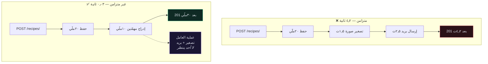

# ⚙️ المهامّ الخلفية مع Celery

> كل ثانية يقضيها عرضك في انتظار خادم بريد هي ثانية لا يستطيع فيها عامل uWSGI أن يخدم أحدًا آخر.
>
> 🇬🇧 النسخة الإنجليزية: [[EN/19.Production DRF/9.Background Jobs with Celery|Background Jobs with Celery]]

---

## 🎯 الفكرة

انقل العمل البطيء أو المعرّض للفشل أو غير الجوهري خارج مسار الطلب. يحصل العميل على `201` فورًا، ويحدث العمل في عملية منفصلة.



| الجزء | وظيفته |
| --- | --- |
| **الوسيط** (Redis / RabbitMQ) | يحمل الرسائل في الطابور |
| **العامل** | عملية منفصلة تسحب المهامّ وتُنفّذها |
| **خلفيّة النتائج** (اختيارية) | تُخزّن القيم المُعادة والحالة |
| **Beat** (اختياري) | يُطلق المهامّ حسب جدول — cron لكن ببايثون |

---

## 🛠️ الإعداد

```python
# app/app/celery.py
import os
from celery import Celery

os.environ.setdefault("DJANGO_SETTINGS_MODULE", "app.settings")

app = Celery("app")
app.config_from_object("django.conf:settings", namespace="CELERY")
app.autodiscover_tasks()
```

```python
# app/app/settings.py
CELERY_BROKER_URL = os.environ.get("REDIS_URL", "redis://redis:6379/0")
CELERY_TASK_SERIALIZER = "json"
CELERY_ACCEPT_CONTENT = ["json"]
```

```yaml
# docker-compose.yml
  celery:
    build:
      context: .
    command: sh -c "celery -A app worker -l info"
    depends_on:
      - db
      - redis
```

> [!WARNING] العامل حاوية منفصلة
> له الصورة نفسها والكود نفسه، لكنه **ليس** عملية الويب. نشر كود جديد يعني إعادة تشغيل العامل أيضًا — وهذا سبب شائع جدًّا لـ«إصلاحي لا يعمل» حين يُعاد بناء حاوية التطبيق وحدها.

---

## ✍️ كتابة مهمّة

```python
# app/recipe/tasks.py
from celery import shared_task
from django.core.mail import send_mail

from core.models import Recipe


@shared_task(
    bind=True,
    autoretry_for=(Exception,),
    retry_backoff=True,
    retry_kwargs={"max_retries": 3},
)
def send_recipe_created_email(self, recipe_id):
    """أخبِر المالك بأن وصفته حُفظت."""
    recipe = Recipe.objects.select_related("user").get(id=recipe_id)

    send_mail(
        subject=f"Recipe saved: {recipe.title}",
        message=f"Your recipe '{recipe.title}' is live.",
        from_email="noreply@example.com",
        recipient_list=[recipe.user.email],
        using="notifications",          # Django 6.1 — اسم مُعرَّف في MAILERS
    )
```

```python
# app/recipe/views.py
def perform_create(self, serializer):
    recipe = serializer.save(user=self.request.user)
    transaction.on_commit(
        lambda: send_recipe_created_email.delay(recipe.id)
    )
```

---

## 🚨 القواعد الثلاث

### ١. مرّر المُعرِّفات لا الكائنات

```python
send_email.delay(recipe)      # ❌ يُسلسِل كائن النموذج كاملًا؛ البيانات قديمة عند التنفيذ
send_email.delay(recipe.id)   # ✅ العامل يجلب الصفّ الحالي
```

تسلسل نموذج داخل الطابور يعني أن العامل يعمل على لقطة قد تكون أقدم بثوانٍ أو دقائق — ويفرض مُسلسِلًا غير آمن. `json` + المُعرِّفات هي التركيبة الوحيدة السليمة.

### ٢. دائمًا `on_commit`

```python
# ❌ العامل قد يبدأ قبل تثبيت المعاملة ← DoesNotExist
recipe = serializer.save(user=self.request.user)
send_email.delay(recipe.id)

# ✅
transaction.on_commit(lambda: send_email.delay(recipe.id))
```

هذا **أشهر خطأ في Celery مع Django**، ولا يظهر إلّا تحت الحِمل. راجع [[8.المعاملات]].

### ٣. المهامّ يجب أن تكون مُتكافئة التكرار

Celery يضمن التسليم **مرة على الأقلّ**. عاملٌ يموت بعد إنجاز العمل وقبل الإقرار بالرسالة سيرى الرسالة نفسها مجدّدًا.

```python
# ❌ تعمل مرّتين ← يُخصَم من المستخدم مرّتين
@shared_task
def charge_user(order_id):
    order = Order.objects.get(id=order_id)
    payment_gateway.charge(order.total)

# ✅ آمنة مهما تكرّرت
@shared_task
def charge_user(order_id):
    with transaction.atomic():
        order = Order.objects.select_for_update().get(id=order_id)
        if order.charged_at:
            return "already charged"
        payment_gateway.charge(order.total, idempotency_key=f"order-{order_id}")
        order.charged_at = timezone.now()
        order.save()
```

اكتب كل مهمّة على افتراض أنها ستعمل مرّتين، لأنها ستفعل في النهاية.

---

## ⏰ المهامّ المجدولة

```python
from celery.schedules import crontab

CELERY_BEAT_SCHEDULE = {
    "cleanup-orphan-images": {
        "task": "recipe.tasks.cleanup_orphan_images",
        "schedule": crontab(hour=3, minute=0),
    },
}
```

> [!CAUTION] عملية Beat واحدة فقط
> Beat **يجدول**، والعمّال **يُنفّذون**. حاويتا Beat تعنيان أن كل مهمّة مجدولة تُطلَق مرّتين. وسّع العمّال بحرّية؛ ولا توسّع Beat أبدًا.

---

## 🧪 اختبار المهامّ

**اختبر الدالّة لا الطابور.** هذا تسعون بالمئة من القيمة:

```python
def test_send_recipe_email(self):
    recipe = create_recipe(user=self.user)

    send_recipe_created_email(recipe.id)      # استدعاء مباشر، بلا .delay()

    self.assertEqual(len(mail.outbox), 1)
```

> [!WARNING] `CELERY_TASK_ALWAYS_EAGER` ليس اختبارًا حقيقيًا للسلوك اللامتزامن
> يُشغّل المهامّ تزامنيًا داخل العملية نفسها، فلن يكشف أبدًا خطأ `on_commit` ولا فشل تسلسل ولا سباق تزامن. استخدمه للراحة، ولا تحسبه تغطية.

---

## 🤔 هل تحتاج Celery أصلًا؟

Celery يُضيف وسيطًا وحاويتين إضافيتين على الأقلّ وفئة كاملة من أنماط الفشل الجديدة.

| البديل | جيّد حين |
| --- | --- |
| **`django-q2` / `huey`** | تريد مهامّ خلفية بلا هذا الثقل التشغيلي |
| **طابور على PostgreSQL** (`procrastinate`) | تُشغّل Postgres أصلًا ولا تريد Redis |
| **cron + أمر إداري** | العمل دوري بحت، لا مدفوع بالأحداث |
| **Celery** | تحتاج إعادة محاولة وجدولة وتسلسل مهامّ وإنتاجية حقيقية |

> [!TIP] العتبة الصادقة
> إن كانت مهمّتك الخلفية الوحيدة «أرسل بريدًا واحدًا»، فإن أمرًا إداريًا على cron أو `django-q2` سيخدمك أفضل. Celery يستحقّ تعقيده حين يكون لديك عدّة أنواع من المهامّ، وتحتاج دلالات إعادة المحاولة، وتستطيع تبرير تشغيل حاويتين إضافيتين.

---

## ⚠️ أخطاء شائعة

- **`Received unregistered task`** ← الوحدة غير مُكتشَفة. `autodiscover_tasks()` يجد `tasks.py` داخل `INSTALLED_APPS` فقط.
- **المهمّة تُشغّل كودًا قديمًا** ← أعدت بناء حاوية التطبيق دون العامل.
- **`DoesNotExist` متقطّعة** ← ينقص `on_commit`.
- **العامل يتوقّف عن سحب المهامّ بصمت** ← تسرّب ذاكرة؛ أضِف `--max-tasks-per-child=100`.
- **`kombu.exceptions.EncodeError`** ← مرّرت كائن نموذج بدل مُعرِّف.

---

## 🧠 اختبر نفسك

> [!QUESTION]
> ١. لماذا تُمرِّر `recipe.id` بدل `recipe`؟
> ٢. لماذا يجب أن تكون كل مهمّة مُتكافئة التكرار، رغم أن Celery «يُسلّم» كل رسالة؟
> ٣. لماذا `CELERY_TASK_ALWAYS_EAGER` راحةٌ لا اختبار للسلوك اللامتزامن؟

---

## 🔗 روابط ذات صلة

- [[8.المعاملات]] · [[7.الإشارات]] · [[3.التخزين المؤقّت]]
- [[EN/22.Django Core/11.Email and Mailers|البريد و MAILERS]] 🇬🇧
- [[0.قائمة جاهزية الإنتاج]]
