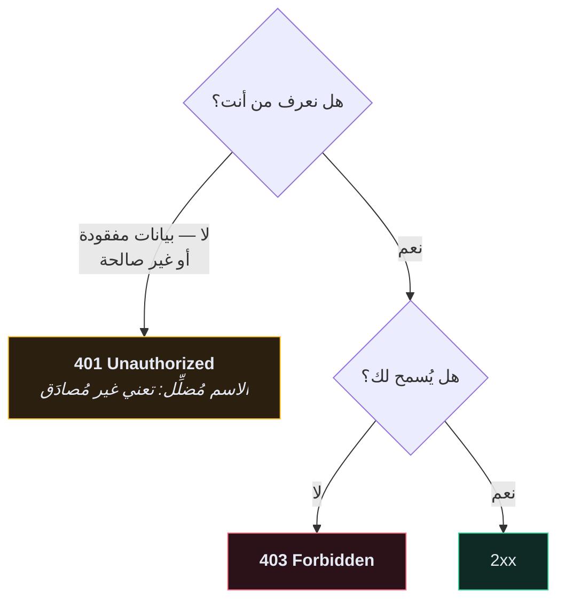

# 🔢 رموز حالة HTTP

> استخدم الثابت لا الرقم. `status.HTTP_204_NO_CONTENT` يقول ما يعنيه؛ الرقم `204` يُجبر القارئ على البحث.

```python
from rest_framework import status

return Response(data, status=status.HTTP_201_CREATED)
```

> 🇬🇧 النسخة الإنجليزية: [[EN/20.Reference/1.HTTP Status Codes|HTTP Status Codes]]

---

## ✅ 2xx — نجح

| الرمز | الثابت | أرجِعه حين |
| --- | --- | --- |
| **200** | `HTTP_200_OK` | نجح `GET` أو `PUT` أو `PATCH` وهناك محتوى |
| **201** | `HTTP_201_CREATED` | أنشأ `POST` موردًا — أرفقه في الجسم |
| **202** | `HTTP_202_ACCEPTED` | أدرجت العمل في طابور؛ لم يكتمل بعد |
| **204** | `HTTP_204_NO_CONTENT` | نجح `DELETE` — **الجسم فارغ إلزامًا** |

> [!WARNING] `204` تعني «بلا محتوى» حرفيًا
> إرجاع جسم معها مخالفة للبروتوكول، وبعض عملاء HTTP يتعلّقون أو يرمون خطأً. إن أردت قول شيء، استخدم `200`.

---

## ❌ 4xx — العميل أخطأ

| الرمز | الثابت | أرجِعه حين | يرفعه DRF عبر |
| --- | --- | --- | --- |
| **400** | `HTTP_400_BAD_REQUEST` | فشل التحقّق، أو الجسم مُشوَّه | `ValidationError` |
| **401** | `HTTP_401_UNAUTHORIZED` | **لا بيانات اعتماد أو غير صالحة** | `NotAuthenticated` |
| **403** | `HTTP_403_FORBIDDEN` | **بيانات صالحة، لكن ممنوع** | `PermissionDenied` |
| **404** | `HTTP_404_NOT_FOUND` | لا يوجد — أو ليس لك | `NotFound` |
| **405** | `HTTP_405_METHOD_NOT_ALLOWED` | المسار موجود، الطريقة لا | `MethodNotAllowed` |
| **409** | `HTTP_409_CONFLICT` | تعارض مع الحالة الحالية | — |
| **415** | `HTTP_415_UNSUPPORTED_MEDIA_TYPE` | `Content-Type` خاطئ | `UnsupportedMediaType` |
| **429** | `HTTP_429_TOO_MANY_REQUESTS` | تجاوز حدّ المعدّل | `Throttled` |

### `401` مقابل `403` — التمييز الذي يخطئ فيه الناس



**`401` = «لا أعرفك».** إعادة المحاولة ببيانات اعتماد قد تنجح.
**`403` = «أعرفك، والجواب لا».** إعادة المحاولة لن تُفيد.

> [!TIP] فضّل `404` على `403` لكائن يخصّ غيرك
> الردّ بـ `403` **يؤكّد وجود الكائن**. ترشيحه خارج `get_queryset()` يُعطي `404` ولا يُسرّب شيئًا. راجع [[الصلاحيات]].

---

## 💥 5xx — أنت أخطأت

| الرمز | المعنى |
| --- | --- |
| **500** | استثناء غير مُعالَج — **دائمًا خطأ برمجي** |
| **502** | nginx يعمل، وuWSGI لا يستجيب |
| **503** | تعطّل مؤقّت — أرسل `Retry-After` |
| **504** | المُخدِّم الخلفي تأخّر |

**لا تُرجع 5xx لخطأ من العميل أبدًا.** الرمز 500 يعني أن لديك **أنت** شيئًا لإصلاحه؛ تلويث هذه الإشارة يجعل لوحة الأخطاء عديمة الفائدة.

---

## 🗺️ رموز هذا المشروع

| نقطة النهاية | الطريقة | النجاح | الفشل |
| --- | --- | --- | --- |
| `/api/user/create/` | POST | `201` | `400` بريد مكرّر / كلمة مرور ضعيفة |
| `/api/user/token/` | POST | `200` | `400` بيانات خاطئة، `429` تجاوز الحدّ |
| `/api/user/me/` | GET | `200` | `401` بلا توكن |
| `/api/recipe/recipes/` | GET | `200` | `401` |
| `/api/recipe/recipes/` | POST | `201` | `400`، `401` |
| `/api/recipe/recipes/{id}/` | GET | `200` | `401`، `404` غير موجود **أو ليس لك** |
| `/api/recipe/recipes/{id}/` | DELETE | `204` | `401`، `404` |
| `.../upload-image/` | POST | `200` | `400` صورة خاطئة، `413` حجم كبير |
| `/api/recipe/tags/` | GET | `200` | `401` |

---

## 🧠 اختبر نفسك

> [!QUESTION]
> ١. `204` أم `200` عند نجاح `DELETE`، ولماذا؟
> ٢. مستخدم بتوكن صالح يطلب وصفة غيره. أفضل رمز؟
> ٣. أيّ رمز 4xx يعني «حاول ببيانات اعتماد» وأيّها يعني «لا تُتعب نفسك»؟

---

## 🔗 روابط ذات صلة

- [[الصلاحيات]] · [[تصميم REST API]] · [[0.فهرس المرجع]]
- [[EN/18.All Fixes/2.Errors You Will Actually Hit|الأخطاء التي ستواجهها فعلًا]] 🇬🇧
