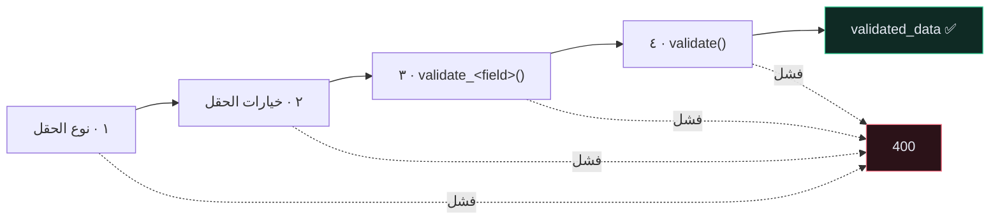

# 🧬 مصفوفة حقول المُسلسِل

> 🇬🇧 النسخة الإنجليزية: [[EN/20.Reference/2.Serializer Field Matrix|Serializer Field Matrix]]

---

## 🔤 أنواع الحقول

| الحقل | بايثون | JSON | ملاحظات |
| --- | --- | --- | --- |
| `CharField` | `str` | نصّ | `max_length`، `trim_whitespace=True` |
| `EmailField` | `str` | نصّ | يتحقّق من الصيغة |
| `URLField` | `str` | نصّ | يتحقّق من الصيغة |
| `SlugField` | `str` | نصّ | حروف وأرقام و`-` و`_` |
| `UUIDField` | `UUID` | نصّ | |
| `IntegerField` | `int` | رقم | `max_value`، `min_value` |
| `FloatField` | `float` | رقم | ❌ ليس للمال |
| `DecimalField` | `Decimal` | **نصّ** افتراضيًا | `max_digits`، `decimal_places` — ✅ للمال |
| `BooleanField` | `bool` | منطقي | |
| `DateField` | `date` | `"2026-08-16"` | |
| `DateTimeField` | `datetime` | ISO 8601 | واعٍ بالمنطقة إن `USE_TZ` |
| `ChoiceField` | أي نوع | أي نوع | `choices=[...]` |
| `ListField` | `list` | مصفوفة | `child=serializers.IntegerField()` |
| `ImageField` | ملف | رابط عند القراءة | يحتاج Pillow |
| `SerializerMethodField` | أي شيء | أي شيء | **للقراءة فقط دائمًا** |
| `HiddenField` | — | غائب | `default=CurrentUserDefault()` |

> [!WARNING] `DecimalField` يُسلسَل كنصّ
> `"price": "5.50"` لا `5.50` — **عن قصد**، لتجنّب خطأ تقريب الفاصلة العائمة. لتغييره:
> ```python
> REST_FRAMEWORK = {"COERCE_DECIMAL_TO_STRING": False}
> ```
> افعل ذلك عن علم؛ إنه تغيير كاسر للعملاء الحاليين. راجع [[Decimal مقابل Float]].

---

## ⚙️ خيارات الحقل

| الخيار | يؤثّر في | المعنى |
| --- | --- | --- |
| `read_only=True` | الكتابة | لا يُقبَل من العميل أبدًا |
| `write_only=True` | القراءة | لا يُعاد للعميل أبدًا — **كلمات المرور** |
| `required=False` | الكتابة | يجوز حذفه |
| `allow_null=True` | الكتابة | `null` قيمة صالحة |
| `allow_blank=True` | الكتابة | `""` صالحة (`CharField` فقط) |
| `default=...` | الكتابة | تُستخدم عند الغياب |
| `source="other"` | الاثنان | يربط باسم مختلف في النموذج |
| `validators=[...]` | الكتابة | مُتحقِّقات إضافية |

### ثلاث حالات مختلفة تمامًا

```python
description = serializers.CharField(
    required=False,      # يجوز غياب المفتاح كليًا
    allow_blank=True,    # "description": ""    مقبولة
    allow_null=True,     # "description": null  مقبولة
)
```

`required=False` وحدها لا تزال ترفض `""` و`null`.

---

## ✅ خطّافات التحقّق الأربعة، بالترتيب



```python
def validate_title(self, value):
    """حقل واحد. يستقبل القيمة ويُعيدها."""
    if len(value.strip()) < 3:
        raise serializers.ValidationError("Title must be at least 3 characters.")
    return value.strip()


def validate(self, attrs):
    """عدّة حقول. يستقبل القاموس كاملًا ويُعيده."""
    if attrs.get("time_minutes", 0) > 1440:
        raise serializers.ValidationError({"time_minutes": "Too long."})
    return attrs
```

> [!WARNING] `validate_<field>` **يجب** أن تُعيد القيمة
> نسيان `return` يُعيد `None` ويُخزّنه DRF بصمت. لا خطأ، لا تحذير — فقط قيمة فارغة في قاعدة بياناتك.

> [!TIP] ارفع الخطأ بقاموس ليرتبط بحقل
> `ValidationError("رسالة")` ← `{"non_field_errors": [...]}`
> `ValidationError({"title": "رسالة"})` ← `{"title": [...]}`

---

## 🏗️ خيارات `Meta`

```python
class Meta:
    model = Recipe
    fields = ["id", "title", "time_minutes", "price", "link", "tags"]
    read_only_fields = ["id"]
    extra_kwargs = {"price": {"min_value": 0}}
```

| الخيار | الأثر |
| --- | --- |
| `fields` | قائمة سماح صريحة — **استخدمها دائمًا** |
| `exclude` | كل شيء عداها — هشّ؛ الحقول الجديدة تتسرّب تلقائيًا |
| `read_only_fields` | اختصار بدل تصريح كل حقل |
| `extra_kwargs` | خيارات لكل حقل دون إعادة تصريحه |
| `depth = 1` | تداخل تلقائي **للقراءة فقط** |

> [!CAUTION] `fields = "__all__"` ثغرة أمنية مؤجَّلة
> تكشف كل عمود حالي **وكل عمود ستضيفه لاحقًا**. راجع [[المُسلسِلات]].

---

## 🔗 الحقول العلائقية

| الحقل | القراءة | قابل للكتابة |
| --- | --- | --- |
| `PrimaryKeyRelatedField` | `3` | ✅ |
| `StringRelatedField` | `"نباتي"` | ❌ |
| `SlugRelatedField(slug_field="name")` | `"vegan"` | ✅ |
| مُسلسِل متداخل | `{"id": 3, "name": "نباتي"}` | ❌ **افتراضيًا** |

```python
tags = TagSerializer(many=True, read_only=True)   # آمن وافتراضي
tags = TagSerializer(many=True, required=False)   # يتطلّب create()/update() بخطّ يدك
```

راجع [[الدالة get_or_create]].

---

## 🎭 وصفات جاهزة

**إخفاء كلمة المرور**
```python
extra_kwargs = {"password": {"write_only": True, "min_length": 5}}
```

**ضبط المالك دون كشف الحقل**
```python
user = serializers.HiddenField(default=serializers.CurrentUserDefault())
```

**حقل محسوب للقراءة فقط**
```python
tag_count = serializers.SerializerMethodField()

def get_tag_count(self, obj):
    return obj.tags.count()      # ⚠️ N+1 ما لم تُحمَّل مسبقًا
```

**تغيير اسم حقل في الـ API دون لمس النموذج**
```python
source_url = serializers.CharField(source="link", required=False)
```

---

## ⚠️ أخطاء شائعة

- **`Got AttributeError ... for field 'x'`** ← `x` ليس في النموذج وليس `SerializerMethodField`.
- **حقل يصبح `None` بصمت** ← نسيت `return` في `validate_<field>`.
- **حقل `read_only` «مطلوب»** ← وضعت `required=True` أيضًا؛ متنافيان.
- **`KeyError: 'request'`** ← أنشأت المُسلسِل يدويًا دون `context={"request": request}`.

---

## 🔗 روابط ذات صلة

- [[المُسلسِلات]] · [[7.مرجع حقول النموذج]] · [[الدالة get_or_create]]
- [[0.فهرس المرجع]]
