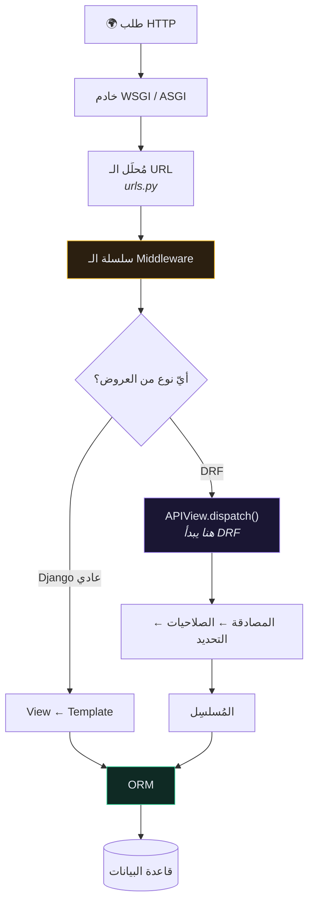

# 🧰 إطار Django REST — DRF

> 🇬🇧 النسخة الإنجليزية: [[EN/_Concepts/Django REST Framework|Django REST Framework]]

---

## 🎯 ماذا يُضيف فوق Django؟

Django يمنحك الـ ORM وتوجيه الـ URLs ولوحة الإدارة. **DRF يُضيف طبقة الـ API فوقها.**

| DRF يمنحك | لولاه لكتبته بيدك |
| --- | --- |
| [[المُسلسِلات]] | التحويل بين النموذج و JSON، والتحقّق من الصحّة |
| [[مجموعات العروض ViewSet]] وأخواتها | سباكة CRUD، خمس مرات لكل مورد |
| أصناف [[مصادقة التوكن\|المصادقة]] | قراءة الترويسات والبحث عن المستخدم |
| أصناف [[الصلاحيات]] | فحوص التفويض في كل عرض |
| التفاوض على المحتوى | التعامل مع ترويسة `Accept` |
| الـ API القابل للتصفّح | عميلًا كاملًا لمجرّد الاختبار |
| التقسيم والتحديد والفلترة | كلّها |

يمكنك بناء API بـ Django وحده. لكنك ستُعيد كتابة الجدول أعلاه، بجودة أقلّ.

---

## ⚙️ الإعداد

```python
# app/app/settings.py
INSTALLED_APPS = [
    "rest_framework",
    "rest_framework.authtoken",
    ...
]

REST_FRAMEWORK = {
    "DEFAULT_AUTHENTICATION_CLASSES": [
        "rest_framework.authentication.TokenAuthentication",
    ],
    "DEFAULT_PERMISSION_CLASSES": [
        "rest_framework.permissions.IsAuthenticated",
    ],
}
```

---

## 🚧 أين يبدأ DRF بالضبط؟

هذا هو أهمّ سؤال في التصحيح.



**كل ما هو فوق `APIView.dispatch()` هو Django خالص.** معرفة هذا الحدّ تختصر معظم وقت التصحيح:

| ما تراه | المسؤول |
| --- | --- |
| `400` مع `{"field": [...]}` | مُسلسِل DRF |
| `400 Bad Request` بلا محتوى | `ALLOWED_HOSTS` في Django |
| `403 CSRF Failed` | middleware في Django، لا صلاحيات DRF |
| `500` قبل تشغيل عرضك | middleware أو الإعدادات |

![[drf-request-lifecycle.svg]]

---

## 🔗 روابط ذات صلة

- [[المُسلسِلات]] · [[مجموعات العروض ViewSet]] · [[الصلاحيات]]
- [[تصميم REST API]] · [[هيكل مشروع Django]]
- [[EN/_Concepts/Django REST Framework|النسخة الإنجليزية]] 🇬🇧
