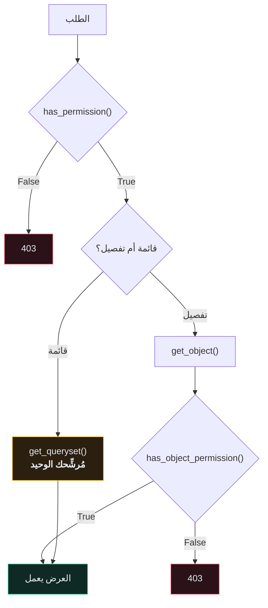

# 🛡️ الصلاحيات — Permissions

> 🇬🇧 النسخة الإنجليزية: [[EN/_Concepts/Permissions|Permissions]]

---

## 🎯 التمييز الجوهري

[[مصادقة التوكن|المصادقة]] تسأل: **من أنت؟**
الصلاحيات تسأل: **هل يُسمح لك؟**

الخلط بينهما هو السبب المباشر لتسريب البيانات في الـ APIs.

| الصنف | يسمح لـ |
| --- | --- |
| `AllowAny` | الجميع — الافتراضي إن لم تضبط شيئًا |
| `IsAuthenticated` | أي مستخدم مسجّل الدخول |
| `IsAdminUser` | من لديه `user.is_staff` |
| `IsAuthenticatedOrReadOnly` | القراءة للجميع، الكتابة للمسجّلين |

```python
authentication_classes = [TokenAuthentication]
permission_classes = [IsAuthenticated]
```

اضبط افتراضيًا آمنًا واستثنِ عن قصد — **افشل مُغلقًا**:

```python
REST_FRAMEWORK = {
    "DEFAULT_PERMISSION_CLASSES": ["rest_framework.permissions.IsAuthenticated"],
}
```

> [!CAUTION] `IsAuthenticated` ليست تفويضًا
> هي تُثبت أن الطالب **مستخدمٌ ما**، ولا تقول شيئًا عن كونه **المستخدم المعنيّ**. هذه الفجوة بالضبط هي الثغرة رقم ١ في تصنيف OWASP للـ APIs، والمعروفة بـ IDOR.

---

## ⚠️ الخطأ الذي يقع فيه الجميع

```python
def has_permission(self, request, view):
    """تُستدعى مع كل طلب، قبل تشغيل العرض. لا يوجد كائن بعد."""

def has_object_permission(self, request, view, obj):
    """تُستدعى لكائن واحد فقط، عبر get_object().
    ❌ لا تُستدعى إطلاقًا في نقاط نهاية القوائم."""
```



**السيناريو الكارثي:** إن كانت حمايتك الوحيدة صنف صلاحيات على مستوى الكائن، فإن `GET /recipes/` يُعيد **كل الوصفات في قاعدة البيانات كلها**. لأن DRF لا يملك كائنًا واحدًا ليفحصه، فلا يستدعي الدالة أصلًا.

**الحماية في القوائم تأتي من مجموعة الاستعلام. دائمًا:**

```python
def get_queryset(self):
    return self.queryset.filter(user=self.request.user)
```

---

## 🔢 لماذا `404` أفضل من `403`؟

| الحالة | DRF يُعيد | صحيح؟ |
| --- | --- | --- |
| بلا بيانات اعتماد | `401` | ✅ |
| توكن صالح، صلاحية مرفوضة | `403` | ✅ |
| توكن صالح، والصف مُرشَّح خارج `get_queryset()` | `404` | ✅ **وأفضل** |

الردّ بـ `403` على كائن يخصّ مستخدمًا آخر **يؤكّد أن الكائن موجود**. مع مُعرِّفات متسلسلة، يستطيع مهاجم أن يمشي على النطاق ويرسم خريطة قاعدة بياناتك من رموز الحالة وحدها.

الترشيح في `get_queryset()` يُعطي `404` في الحالتين، ولا يُسرِّب شيئًا.

---

## 🛠️ كتابة صنف صلاحيات

```python
# app/core/permissions.py
from rest_framework import permissions


class IsOwner(permissions.BasePermission):
    """صلاحية على مستوى الكائن: المالك فقط."""

    message = "You do not have permission to access this object."

    def has_object_permission(self, request, view, obj):
        return obj.user == request.user


class IsOwnerOrReadOnly(permissions.BasePermission):
    """القراءة للجميع، الكتابة للمالك."""

    def has_object_permission(self, request, view, obj):
        if request.method in permissions.SAFE_METHODS:
            return True
        return obj.user == request.user
```

`SAFE_METHODS` هي `("GET", "HEAD", "OPTIONS")` — الطرق التي لا تُغيّر الحالة.

> [!WARNING] `get_permissions()` تُعيد **كائنات**، لا أصنافًا
> ```python
> return [IsOwner]      # ❌ خطأ وقت التشغيل
> return [IsOwner()]    # ✅
> ```
> بينما `permission_classes` تريد أصنافًا. نعم، هذا تناقض في التصميم.

---

## 🧪 الاختبارات التي لا يجوز تخطّيها

```python
def test_cannot_read_other_users_recipe(self):
    """وصفة مستخدم آخر غير متاحة."""
    other = create_user(email="other@example.com")
    recipe = create_recipe(user=other)

    res = self.client.get(detail_url(recipe.id))

    self.assertEqual(res.status_code, status.HTTP_404_NOT_FOUND)
```

اكتب واحدًا لكل عملية — قراءة، تعديل، حذف — **لكل مورد يملكه مستخدم**. هذه هي مجموعة الاختبارات التي تمنع الـ API من أن يصبح خبرًا صحفيًا.

---

## ⚠️ أخطاء شائعة

- **نقطة نهاية القائمة تُعيد كل شيء** ← الصلاحية على مستوى الكائن لا تنطبق على القوائم. رشِّح مجموعة الاستعلام.
- **`403` على نقطة نهاية عامة** ← الافتراضي العالمي `IsAuthenticated`؛ أضف `AllowAny` صراحةً.
- **الصلاحية تمرّ لكن البيانات خاطئة** ← تفحص `obj.user` بينما العلاقة الفعلية `obj.recipe.user`.
- **`request.user.id` يرمي خطأ** ← المستخدم مجهول. تحقّق من `request.user.is_authenticated` أولًا.

---

## 🧠 اختبر نفسك

> [!QUESTION]
> ١. لماذا لا تحمي صلاحية على مستوى الكائن نقطةَ نهاية قائمة؟
> ٢. لماذا `404` أفضل أمنيًا من `403` لكائن يخصّ غيرك؟
> ٣. ما الفرق بين ما تريده `permission_classes` وما تُعيده `get_permissions()`؟

---

## 🔗 روابط ذات صلة

- [[مصادقة التوكن]] · [[مجموعات الاستعلام QuerySet]]
- [[EN/_Concepts/Permissions|النسخة الإنجليزية]] 🇬🇧
- [[EN/19.Production DRF/10.Security Checklist|قائمة تدقيق الأمان]] 🇬🇧
