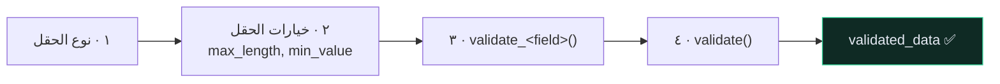

# 🧬 المُسلسِلات — Serializers

> 🇬🇧 النسخة الإنجليزية: [[EN/_Concepts/Serializers|Serializers]]

---

## 🎯 وظيفتان، لا واحدة

معظم الالتباس يأتي من نسيان أن الخيار الواحد يؤثّر في اتجاه واحد فقط:

| الاتجاه | الاسم | ما يحدث |
| --- | --- | --- |
| 📤 خارج | **التسلسل** (serialization) | كائن النموذج ← أنواع بايثون ← JSON |
| 📥 داخل | **فكّ التسلسل** (deserialization) | JSON ← تحقّق ← `create()` / `update()` |

```python
class RecipeSerializer(serializers.ModelSerializer):

    class Meta:
        model = Recipe
        fields = ["id", "title", "time_minutes", "price", "link"]
        read_only_fields = ["id"]
```

| | `Serializer` | `ModelSerializer` |
| --- | --- | --- |
| الحقول | تُصرّح بكل حقل يدويًا | تُستنتَج من النموذج |
| `create()` / `update()` | تكتبهما بنفسك | جاهزتان |
| استخدمه لـ | تسجيل الدخول، التقارير، webhooks | أي شيء يقابل نموذجًا |

---

## 🔒 حدود تسرّب البيانات

المُسلسِل هو **البوّابة التي تخرج منها بياناتك**. ولهذا:

```python
# ❌ يكشف تجزئة كلمة المرور، is_superuser، وكل عمود ستضيفه مستقبلًا
class Meta:
    model = get_user_model()
    fields = "__all__"

# ✅ قائمة سماح صريحة
class Meta:
    model = get_user_model()
    fields = ["id", "email", "name"]
    extra_kwargs = {"password": {"write_only": True, "min_length": 10}}
```

> [!CAUTION] `fields = "__all__"` ثغرة أمنية مؤجَّلة
> هي اشتراك دائم في **كل عمود سيُضاف إلى النموذج لاحقًا**. تُضيف `is_premium` إلى النموذج بعد ستة أشهر، فيظهر في الـ API في اليوم نفسه — دون أن يلمس أحد المُسلسِل.

`write_only` هو ما يمنع كلمة المرور من الخروج في الاستجابة.

---

## ✅ طبقات التحقّق الأربع



```python
def validate_title(self, value):
    """حقل واحد. يستقبل القيمة ويُعيدها."""
    if len(value.strip()) < 3:
        raise serializers.ValidationError("Title must be at least 3 characters.")
    return value.strip()


def validate(self, attrs):
    """عدّة حقول معًا. يستقبل القاموس كاملًا ويُعيده."""
    if attrs.get("time_minutes", 0) > 1440:
        raise serializers.ValidationError({"time_minutes": "Too long."})
    return attrs
```

> [!WARNING] `validate_<field>` **يجب** أن تُعيد القيمة
> إن نسيت `return`، تُعيد الدالة `None` ويُخزّنها DRF بصمت. لا خطأ ولا تحذير — فقط قيمة فارغة في قاعدة بياناتك. والأسوأ أن نصف الوظيفة يعمل: القيم القصيرة تُرفض بشكل صحيح، فيبدو الكود مُختبَرًا.

> [!TIP] ارفع الخطأ بقاموس ليرتبط بحقل
> `ValidationError("رسالة")` ← `{"non_field_errors": [...]}`
> `ValidationError({"title": "رسالة"})` ← `{"title": [...]}` — أنفع بكثير لواجهة المستخدم.

---

## 🪆 الكتابة المتداخلة

```python
POST /recipes/  {"title": "كاري", "tags": [{"name": "نباتي"}]}
```

يرفض DRF التعامل مع هذا تلقائيًا:

```text
The .create() method does not support writable nested fields by default.
```

**وهذا رفضٌ مقصود.** لا يستطيع DRF أن يعرف إن كنت تقصد: أنشئ وسمًا جديدًا، أم اعثر على الموجود، أم ارفض التكرار — والتخمين الخاطئ يُفسد البيانات بصمت. فيطلب منك أن تُصرّح:

```python
def create(self, validated_data):
    tags = validated_data.pop("tags", [])
    recipe = Recipe.objects.create(**validated_data)
    auth_user = self.context["request"].user

    for tag in tags:
        tag_obj, _ = Tag.objects.get_or_create(user=auth_user, **tag)
        recipe.tags.add(tag_obj)

    return recipe
```

`pop` قبل `create` ضروري: المفاتيح المتداخلة ليست حقولًا في النموذج، وتركها يرمي `TypeError`. راجع [[الدالة get_or_create]].

---

## ⚠️ أخطاء شائعة

- **`Got AttributeError when attempting to get a value for field 'x'`** ← الحقل غير موجود في النموذج وليس `SerializerMethodField`.
- **الحقل يصبح `None` بصمت** ← نسيت `return` في `validate_<field>`.
- **كلمة المرور تظهر في الاستجابة** ← ينقص `write_only`.
- **`KeyError: 'request'`** ← أنشأت المُسلسِل يدويًا دون `context={"request": request}`.
- **«هذا الحقل مطلوب» لحقل ترسله فعلًا** ← ينقص ترويسة `Content-Type: application/json`، أو الحقل `read_only=True`.

---

## 🧠 اختبر نفسك

> [!QUESTION]
> ١. لماذا يرفض DRF الكتابة المتداخلة بدل أن يخمّن؟
> ٢. كيف يصبح `fields = "__all__"` ثغرة **لاحقًا** دون أن يعدّل أحد المُسلسِل؟
> ٣. ماذا يحدث إن نسيت `return` في `validate_title`؟

---

## 🔗 روابط ذات صلة

- [[الدالة get_or_create]] · [[الصلاحيات]]
- [[EN/_Concepts/Serializers|النسخة الإنجليزية]] 🇬🇧
- [[EN/20.Reference/2.Serializer Field Matrix|مصفوفة حقول المُسلسِل]] 🇬🇧
