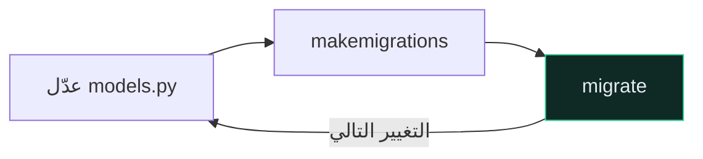

# 🗃️ نماذج Django — Models

> 🇬🇧 النسخة الإنجليزية: [[EN/_Concepts/Django Models|Django Models]]

---

## 🎯 الفكرة

**صنف واحد = جدول واحد. خاصيّة واحدة = عمود واحد.** هذه هي حيلة الـ ORM كلها.

```python
from django.db import models


class Recipe(models.Model):
    user = models.ForeignKey(settings.AUTH_USER_MODEL, on_delete=models.CASCADE)
    title = models.CharField(max_length=255)
    description = models.TextField(blank=True)
    time_minutes = models.IntegerField()
    price = models.DecimalField(max_digits=5, decimal_places=2)
    tags = models.ManyToManyField("Tag")

    def __str__(self):
        return self.title
```

الوراثة من `models.Model` تمنحك `.objects.all()` و`.save()` و`.delete()` مجانًا.

`__str__` يُكلّف سطرًا واحدًا وهو ما يظهر في لوحة الإدارة وفي الـ shell. اكتبه دائمًا.

![[data-model-erd.svg]]

---

## 🔤 أنواع الحقول الأساسية

| الحقل | العمود | ملاحظات |
| --- | --- | --- |
| `CharField(max_length=n)` | `varchar(n)` | `max_length` **إلزامي** |
| `TextField()` | `text` | بلا حدّ |
| `EmailField()` | `varchar(254)` | يتحقّق من الصيغة |
| `IntegerField()` | `integer` | |
| `DecimalField(max_digits, decimal_places)` | `numeric` | ✅ **للمال** |
| `FloatField()` | `double precision` | ❌ **لا للمال أبدًا** |
| `BooleanField()` | `boolean` | |
| `DateTimeField()` | timestamp | واعٍ بالمنطقة الزمنية إن `USE_TZ` |
| `ImageField()` | مسار نصّي | يحتاج Pillow |

راجع [[Decimal مقابل Float]] لسبب استبعاد `FloatField` من المبالغ المالية.

---

## 🔗 العلاقات

```python
user = models.ForeignKey(settings.AUTH_USER_MODEL, on_delete=models.CASCADE)
tags = models.ManyToManyField("Tag")
```

| النوع | العلاقة |
| --- | --- |
| `ForeignKey` | كثير ← واحد. العمود على الجدول **الحالي** |
| `OneToOneField` | واحد ← واحد |
| `ManyToManyField` | كثير ↔ كثير. جدول وصل مستقلّ |

> [!CAUTION] استخدم `settings.AUTH_USER_MODEL` دائمًا
> ```python
> user = models.ForeignKey(settings.AUTH_USER_MODEL, ...)   # ✅
> from core.models import User                              # ❌
> ```
> الأولى تُحَلّ بتكاسل، وتنجو من تبديل نموذج المستخدم، وتتجنّب الاستيراد الدائري. هذه أكثر نصيحة تتكرّر في Django، لأن البديل يفشل بطرق يصعب التراجع عنها.

### `on_delete` — اختر عن قصد

| القيمة | عند حذف الأب |
| --- | --- |
| `CASCADE` | احذف هذا الصف أيضًا |
| `PROTECT` | **ارفض** حذف الأب |
| `SET_NULL` | اضبطه على `NULL` (يتطلّب `null=True`) |
| `DB_CASCADE` ✨ | كـ `CASCADE`، لكن **قاعدة البيانات** تُنفّذه |

`CASCADE` للبيانات المملوكة (وصفات المستخدم). `PROTECT` لما تكره فقدانه بصمت.

> [!WARNING] `DB_CASCADE` جديد في 6.1 ولا يُطلق الإشارات
> أسرع بكثير، لكن لا `post_delete`. في هذا المشروع تُحذَف صور الوصفات عبر إشارة — فتحويل ذلك المفتاح إلى `DB_CASCADE` سيترك كل الصور يتيمة على القرص. راجع [[1.الجديد في Django 6.1]].

---

## ⚙️ `null` مقابل `blank`

| الخيار | المستوى | المعنى |
| --- | --- | --- |
| `null=True` | **قاعدة البيانات** | العمود يقبل `NULL` |
| `blank=True` | **التحقّق** | النماذج والمُسلسِلات تقبل الفراغ |

| نوع الحقل | التركيبة الصحيحة |
| --- | --- |
| نصّ اختياري | `blank=True` **فقط** — استخدم `""` لا `NULL` |
| رقم أو تاريخ أو مفتاح أجنبي اختياري | `null=True, blank=True` |
| إلزامي | لا هذا ولا ذاك |

> [!WARNING] `null=True` على `CharField` خطأ في الغالب
> ينتج عنه تمثيلان للفراغ — `""` و`NULL` — وكل استعلام صار عليه أن يتعامل معهما. توثيق Django نفسه ينصح بتجنّبه.

---

## 🏛️ القيود — الطبقة التي لا يتجاوزها شيء

```python
class Meta:
    ordering = ["-id"]
    constraints = [
        models.UniqueConstraint(fields=["user", "title"], name="unique_title_per_user"),
        models.CheckConstraint(condition=models.Q(price__gte=0), name="price_non_negative"),
    ]
```

> [!TIP] القيود تتفوّق على التحقّق
> تحقّق المُسلسِل يمكن تجاوزه — من لوحة الإدارة، أو أمر إداري، أو جلسة shell، أو خطأ برمجي. أمّا `CheckConstraint` فتفرضه قاعدة البيانات على **كل** كتابة.
> استخدم الاثنين: المُسلسِل يُعطي رسالة `400` مفهومة، والقيد يضمن الصحّة.

---

## 🔄 الحلقة الأبدية



---

## 🔗 روابط ذات صلة

- [[الترحيلات]] · [[مجموعات الاستعلام QuerySet]] · [[Decimal مقابل Float]]
- [[EN/20.Reference/7.Model Field Reference|مرجع حقول النموذج]] 🇬🇧
