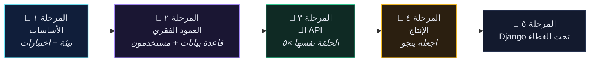
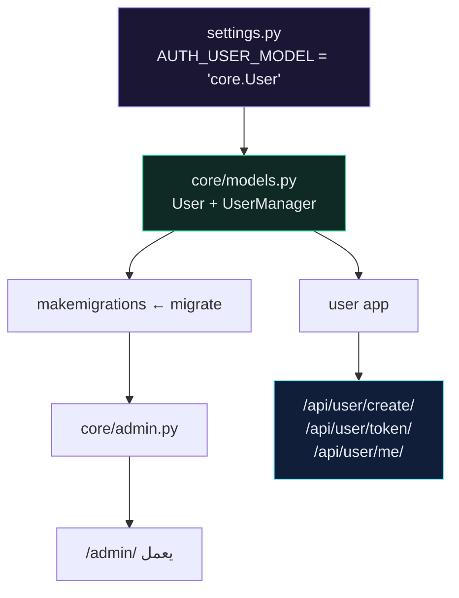

# 🧭 مسار التعلّم

> [!TIP] كيف تستخدم هذه الصفحة
> **القراءة الأولى:** من الأعلى إلى الأسفل، وابنِ المشروع معها. لا تتجاوز المرحلة الأولى — هي الأقل إثارة والأكثر أهمية.
> **بعد ذلك:** تجاهل هذه الصفحة واستخدم [[خريطة المحتوى]] والبحث.

![[learning-path.svg]]

---

## شكل الرحلة

---

## المرحلة ١ — الأساسات

**الهدف:** `docker compose up` يعمل، `flake8` نظيف، واختبار واحد يفشل عن قصد.

| # | القسم | ما تتعلّمه فعلًا | تعرف أنك انتهيت حين |
| --- | --- | --- | --- |
| ٠١ | تصميم التطبيق | الـ ١٩ endpoint التي تتّجه إليها | ترسم خريطة الـ endpoints بنفسك |
| ٠٢ | إعداد النظام | Docker، Docker Compose، Git | `docker --version` يعمل |
| ٠٣ | التطوير المُوجَّه بالاختبار | أحمر ← أخضر ← إعادة هيكلة | تكتب الاختبار **أولًا** مرة واحدة |
| ٠٤ | إعداد المشروع | Dockerfile، compose، flake8 | خادم التطوير يستجيب على `:8000` |
| ٠٥ | GitHub Actions | تشغيل الاختبارات عند كل push | علامة خضراء على GitHub |

> [!WARNING] الفخّ في المرحلة الأولى
> الجميع تقريبًا يتسرّع هنا للوصول إلى «Django الحقيقي»، ثم يقضي المرحلة الثالثة في تصحيح **بيئته** بدل تصحيح **كوده**.
> **Docker و CI و flake8 أولًا.** هذا هو الهدف كله، لا مقدّمة له.

---

## المرحلة ٢ — العمود الفقري

**الهدف:** مشروع يعمل على PostgreSQL بنموذج مستخدم مخصّص ولوحة إدارة.

| # | القسم | الفكرة الوحيدة المهمّة |
| --- | --- | --- |
| ٠٦ | إعداد قاعدة البيانات | Postgres يبدأ **أبطأ** من Django ← `wait_for_db` نمط إنتاجي حقيقي |
| ٠٧ | TDD مع Django | `TestCase`، المحاكاة (mocking)، أخطاء الاختبارات الشائعة |
| ٠٨ | نموذج المستخدم المخصّص | أنجزه في **اليوم الأول**. تغييره لاحقًا كابوس ترحيلات |
| ٠٩ | لوحة إدارة Django | واجهة CRUD مجانية: سجّل نموذجًا، تحصل على لوحة تحكّم |
| ١٠ | توثيق الـ API | `drf-spectacular` يقرأ كودك ← التوثيق لا يتقادم أبدًا |

---

## المرحلة ٣ — بناء الـ API

**الهدف:** ١٩ endpoint، جميعها مُختبَرة.

الأقسام الخمسة التالية هي **الخطوات الأربع نفسها** في كل مرة. حين ترى النمط، يصبح الباقي مجرّد كتابة:

| # | القسم | المفهوم الجديد |
| --- | --- | --- |
| ١١ | Build User API | مصادقة التوكن، `write_only`، `IsAuthenticated` |
| ١٢ | Build Recipe API | `ModelViewSet`، الـ routers، `get_serializer_class()` |
| ١٣ | Build Tag API | المُسلسِلات المتداخلة، `get_or_create` عند الكتابة |
| ١٤ | Build Ingredient API | إعادة هيكلة عرضَين في صنف أساس واحد |
| ١٥ | Build Image API | `@action`، `MultiPartParser`، ملفات الوسائط |
| ١٦ | الفلترة | معاملات الاستعلام، `OpenApiParameter` |

---

## المرحلة ٤ — الإنتاج

**الهدف:** أن ينجو المشروع من التماس مع الإنترنت.

| # | القسم | يغطّي |
| --- | --- | --- |
| ١٧ | النشر | compose الإنتاج، uWSGI، nginx، المتغيّرات السرّية |
| ١٨ | كل الإصلاحات | مراجعة Django + الأخطاء التي ستواجهها فعلًا |
| ١٩ | DRF في الإنتاج | التقسيم، التحديد، التخزين المؤقّت، N+1، الأمان، التسجيل |
| ٢٠ | المرجع | أوراق مرجعية تفتحها أسبوعيًا لسنوات |
| ٢١ | المقابلات والواقع | أسئلة وأجوبة، أخطاء حقيقية، قرارات معمارية |

---

## المرحلة ٥ — Django تحت الغطاء

**الهدف:** فهم ما تفترضه DRF ولم تشرحه الدورة.

| # | القسم | يغطّي |
| --- | --- | --- |
| ٢٢ | أساسيات Django | الإعدادات، middleware، QuerySets، المصادقة، الأمان، async |

ابدأ من [[1.الجديد في Django 6.1]] إن كنت تستخدم الإصدار الحالي.

---

## جدول زمني واقعي

| الإيقاع | م١ | م٢ | م٣ | م٤ |
| --- | --- | --- | --- | --- |
| **مكثّف** (تفرّغ كامل) | يومان | يومان | ٤ أيام | ٣ أيام |
| **منتظم** (ساعتان يوميًا) | أسبوع | أسبوع | أسبوعان | أسبوعان |
| **عطلة نهاية الأسبوع** | ٣ أسابيع | ٣ أسابيع | ٦ أسابيع | ٥ أسابيع |

> [!NOTE] نصيحة صادقة
> المرحلة الثالثة تبدو سريعة لأنها تتكرّر. المرحلة الرابعة تبدو بطيئة لأن لا شيء فيها يتكرّر. خطّط على هذا الأساس — ولا تعامل المرحلة الرابعة كاختيارية.

---

## 🔗 روابط ذات صلة

- [[الصفحة الرئيسية]]
- [[خريطة المحتوى]]
- [[0.فهرس المفاهيم]]
