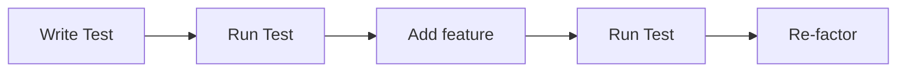

# Test Driven Development (TDD) — Complete Guide

---

# 1️⃣ What is a Unit Test?

## 🎯 Definition

A **unit test** is code that tests another piece of code to verify that it works correctly.

It tests a small unit of functionality, such as:

- A function
    
- A method
    
- An API endpoint
    
- A model
    

---

## 🧠 How Unit Tests Work

Unit tests follow 3 main steps:

### Step 1 — Arrange (Setup conditions)

Provide inputs and prepare environment.

### Step 2 — Act (Run the code)

Execute the function or feature.

### Step 3 — Assert (Check result)

Verify that the output is correct using assertions.

---

## 💻 Example (Python Unit Test)

Code to test:

```python
def add(a, b):
    return a + b
```

Unit test:

```python
def test_add():
    result = add(2, 3)
    assert result == 5
```

Explanation:

- Input = 2, 3
    
- Expected output = 5
    
- Assertion checks correctness
    

---

## 📦 Django Example (API test)

```python
response = client.get("/api/users/")
assert response.status_code == 200
```

This checks that the API works correctly.

---

## ⚠️ Why Unit Tests are Important

Unit tests provide several benefits:

### 1. Ensure code works correctly

They verify that your code behaves as expected.

### 2. Detect bugs early

If something breaks, tests will fail immediately.

### 3. Improve code reliability

Your application becomes more stable.

### 4. Give developers confidence

You can safely modify code without fear of breaking features.

---

## 🧩 Mental Model

Unit test = Automatic checker

It checks your code every time you run tests.

---

# 2️⃣ What is Test Driven Development (TDD)?

## 🎯 Definition

Test Driven Development (TDD) is a development method where you write tests BEFORE writing the actual code.

Instead of:

```
Write code → Write test
```

You do:

```
Write test → Write code → Pass test
```

---

# 3️⃣ Traditional Development vs TDD

## Traditional Approach

Step 1: Write code  
Step 2: Write test  
Step 3: Test code

Problem:

- Tests may be incomplete
    
- Harder to test properly
    

---

## TDD Approach

Step 1: Write test  
Step 2: Run test → test fails  
Step 3: Write code  
Step 4: Run test → test passes  
Step 5: Refactor code  
Step 6: Run test again

---

# 4️⃣ TDD Cycle (Core Process)

This is the most important concept.

## Step 1 — Write Test

Define expected behavior.

Example:

```python
def test_add():
    assert add(2, 3) == 5
```

---

## Step 2 — Run Test (Fail)

Test fails because function doesn't exist yet.

This is expected.

---

## Step 3 — Write Code

Implement the feature.

```python
def add(a, b):
    return a + b
```

---

## Step 4 — Run Test (Pass)

Test passes.

Feature works correctly.

---

## Step 5 — Refactor Code

Improve code quality without breaking functionality.

---

## Step 6 — Run Test Again

Ensure everything still works.

---

# 5️⃣ TDD Flow Diagram

```
Write Test
    ↓
Run Test → FAIL
    ↓
Write Code
    ↓
Run Test → PASS
    ↓
Refactor Code
    ↓
Run Test → PASS
```

This cycle repeats for every feature.

---

# 6️⃣ Benefits of Test Driven Development

## 1. Better code design

You think about expected behavior before coding.

---

## 2. Fewer bugs

Tests detect errors immediately.

---

## 3. Safer refactoring

You can modify code without fear.

Tests will catch problems.

---

## 4. High test coverage

Most of your code will be tested.

---

## 5. More confidence in your application

Developers trust the codebase.

---

# 7️⃣ Django Example with TDD

Step 1 — Write test:

```python
def test_user_creation():
    user = User.objects.create(username="khalil")
    assert user.username == "khalil"
```

Step 2 — Implement model if needed

Step 3 — Run test → pass

---

# 8️⃣ Real-World Example (API Development)

Goal: Create API endpoint `/api/users/`

TDD approach:

Step 1: Write test

```python
response = client.get("/api/users/")
assert response.status_code == 200
```

Step 2: Run test → FAIL

Step 3: Create API endpoint

Step 4: Run test → PASS

---

# 9️⃣ Summary Table

|Concept|Meaning|
|---|---|
|Unit Test|Code that tests code|
|Assertion|Checks expected output|
|TDD|Write test before code|
|Test Coverage|Percentage of code tested|
|Refactoring|Improving code safely|

---

# 🔥 Key Takeaway (Very Important)

Normal development:

```
Write code → Write test
```

TDD development:

```
Write test → Write code → Pass test
```

TDD makes software more reliable, stable, and professional.


#### What is TDD
- Development practice


