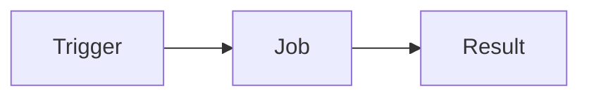

# GitHub Actions

- Automation tool
- Similar to Travis-CI, GitLab CI/CD, Jenkins
- Run jobs when code changes

## Common uses
- Deployment
- Code linting
- Unit tests

## How it works

- Trigger: Every think happens when code changes in GitHub.
- Job: is activated when a push is triggered in GitHub.
- Result: success or fail of job
