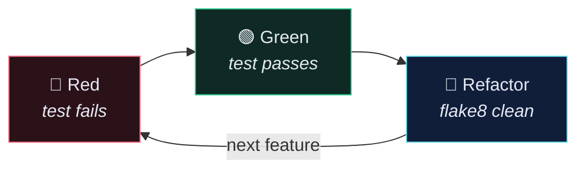

# 🧱 Writing the Tag Model and Listing Tags

> Red, then green. The test comes first — that's the whole method.

---

## 🔬 Step 1 — The failing model test

```python
# app/core/tests/test_models.py
def test_create_tag(self):
    """Test creating a tag is successful."""
    user = create_user()
    tag = models.Tag.objects.create(user=user, name="Tag1")

    self.assertEqual(str(tag), tag.name)
```

Run it:

```bash
docker compose run --rm app sh -c "python manage.py test"
```

`AttributeError: module 'core.models' has no attribute 'Tag'` — **good**. That's the red.

---

## 🛠️ Step 2 — The model

```python
# app/core/models.py
class Tag(models.Model):
    """Tag for filtering recipes."""
    name = models.CharField(max_length=255)
    user = models.ForeignKey(
        settings.AUTH_USER_MODEL,
        on_delete=models.CASCADE,
    )

    def __str__(self):
        return self.name
```

Three decisions in nine lines:

| Line | Decision | Why |
| --- | --- | --- |
| `settings.AUTH_USER_MODEL` | not `from core.models import User` | the only import that survives you swapping the user model — hard-coding it is the classic circular-import bug |
| `on_delete=models.CASCADE` | delete the user → delete their tags | tags are meaningless without their owner |
| `__str__` | returns the name | what shows up in `/admin` and in the shell; costs nothing, saves you constantly |

Then, always:

```bash
docker compose run --rm app sh -c "python manage.py makemigrations"
```

Register it in admin while you're here:

```python
# app/core/admin.py
admin.site.register(models.Tag)
```

---

## 🔬 Step 3 — The API tests

```python
# app/recipe/tests/test_tags_api.py
from django.contrib.auth import get_user_model
from django.urls import reverse
from django.test import TestCase

from rest_framework import status
from rest_framework.test import APIClient

from core.models import Tag
from recipe.serializers import TagSerializer


TAGS_URL = reverse("recipe:tag-list")


def create_user(email="user@example.com", password="testpass123"):
    return get_user_model().objects.create_user(email=email, password=password)


class PublicTagsApiTests(TestCase):
    """Unauthenticated API requests."""

    def setUp(self):
        self.client = APIClient()

    def test_auth_required(self):
        """Test auth is required for retrieving tags."""
        res = self.client.get(TAGS_URL)

        self.assertEqual(res.status_code, status.HTTP_401_UNAUTHORIZED)


class PrivateTagsApiTests(TestCase):
    """Authenticated API requests."""

    def setUp(self):
        self.user = create_user()
        self.client = APIClient()
        self.client.force_authenticate(self.user)

    def test_retrieve_tags(self):
        """Test retrieving a list of tags."""
        Tag.objects.create(user=self.user, name="Vegan")
        Tag.objects.create(user=self.user, name="Dessert")

        res = self.client.get(TAGS_URL)

        tags = Tag.objects.all().order_by("-name")
        serializer = TagSerializer(tags, many=True)
        self.assertEqual(res.status_code, status.HTTP_200_OK)
        self.assertEqual(res.data, serializer.data)

    def test_tags_limited_to_user(self):
        """Test list of tags is limited to authenticated user."""
        user2 = create_user(email="user2@example.com")
        Tag.objects.create(user=user2, name="Fruity")
        tag = Tag.objects.create(user=self.user, name="Comfort Food")

        res = self.client.get(TAGS_URL)

        self.assertEqual(res.status_code, status.HTTP_200_OK)
        self.assertEqual(len(res.data), 1)
        self.assertEqual(res.data[0]["name"], tag.name)
        self.assertEqual(res.data[0]["id"], tag.id)
```

> [!TIP] The two-class split is the pattern
> `PublicXApiTests` (unauthenticated) and `PrivateXApiTests` (authenticated). Every API test file in this project uses it. `test_auth_required` is the test people skip and then ship an open endpoint.

`test_tags_limited_to_user` is the most valuable test here. It is the one that catches the `Tag.objects.all()` mistake before a user does.

---

## 🛠️ Step 4 — The serializer

```python
# app/recipe/serializers.py
class TagSerializer(serializers.ModelSerializer):
    """Serializer for tags."""

    class Meta:
        model = Tag
        fields = ["id", "name"]
        read_only_fields = ["id"]
```

Note what's **not** in `fields`: `user`. The client never sends it and never sees it — the server takes it from the token. Exposing `user` as a writable field would let anyone create a tag owned by someone else.

---

## 🛠️ Step 5 — The view

```python
# app/recipe/views.py
from rest_framework import viewsets, mixins
from rest_framework.authentication import TokenAuthentication
from rest_framework.permissions import IsAuthenticated

from core.models import Tag
from recipe import serializers


class TagViewSet(mixins.DestroyModelMixin,
                 mixins.UpdateModelMixin,
                 mixins.ListModelMixin,
                 viewsets.GenericViewSet):
    """Manage tags in the database."""
    serializer_class = serializers.TagSerializer
    queryset = Tag.objects.all()
    authentication_classes = [TokenAuthentication]
    permission_classes = [IsAuthenticated]

    def get_queryset(self):
        """Filter queryset to authenticated user."""
        return self.queryset.filter(user=self.request.user).order_by("-name")
```

### `queryset` vs `get_queryset()`

```python
queryset = Tag.objects.all()        # ← evaluated once, at import; DRF uses it for basename lookup
def get_queryset(self):             # ← called per request; this is the one that decides what you see
    return self.queryset.filter(user=self.request.user)
```

The class attribute exists so the router can infer the URL basename. The method is what actually runs. **Setting only the attribute and forgetting the method is how every user sees every tag.**

---

## 🛠️ Step 6 — The URL

```python
# app/recipe/urls.py
from django.urls import path, include
from rest_framework.routers import DefaultRouter

from recipe import views

router = DefaultRouter()
router.register("recipes", views.RecipeViewSet)
router.register("tags", views.TagViewSet)

app_name = "recipe"

urlpatterns = [
    path("", include(router.urls)),
]
```

`router.register("tags", …)` generates:

| Generated URL name | Path | Reversed by |
| --- | --- | --- |
| `recipe:tag-list` | `/api/recipe/tags/` | `reverse("recipe:tag-list")` |
| `recipe:tag-detail` | `/api/recipe/tags/{id}/` | `reverse("recipe:tag-detail", args=[id])` |

`app_name = "recipe"` is what makes the `recipe:` prefix work. Without it, `reverse("recipe:tag-list")` raises `NoReverseMatch` — and that error message does not mention `app_name`, which is why it costs people an hour.

---

## ✅ Step 7 — Green

```bash
docker compose run --rm app sh -c "python manage.py test && flake8"
```



---

## ⚠️ Gotchas

- **`NoReverseMatch: 'recipe' is not a registered namespace`** → missing `app_name = "recipe"` in `recipe/urls.py`.
- **`Basename argument not specified` on `router.register`** → the viewset has no `queryset` class attribute. Add it even though `get_queryset()` does the real work.
- **Tests pass but all users see all tags** → you wrote `queryset` but not `get_queryset()`. Write `test_tags_limited_to_user` and it can't happen.
- **`res.data` order doesn't match** → the test must use the same `.order_by()` the view uses. Unordered querysets have no guaranteed order in Postgres.

---

## 🧠 Check yourself

> [!QUESTION]
> 1. Why is `user` absent from `TagSerializer.Meta.fields`?
> 2. What does the `queryset` class attribute do if `get_queryset()` overrides it anyway?
> 3. What breaks if you remove `app_name` from `recipe/urls.py`?

---

## 🔗 Related

- [[1.Tag API — Design and Endpoints]]
- [[3.Write tests for creating tags Follow Along]]
- [[Creating Tags]]
- [[Refactoring]]
- [[3.ViewSet and Router Cheatsheet]]
