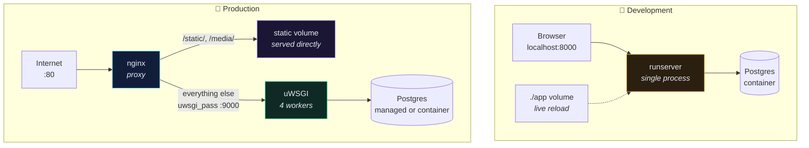
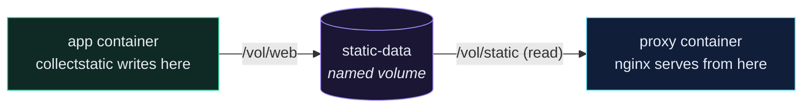

# 🚀 From Dev Compose to Production

> Your `docker-compose.yml` is a **development** file. Shipping it to a server is the single most common way a Django project gets owned.

---

## 🎯 Core Concept

There are **two** compose files:

| File                       | Runs                | Server                       | Code                 |
| -------------------------- | ------------------- | ---------------------------- | -------------------- |
| `docker-compose.yml`       | on your laptop      | `runserver` (dev server)     | mounted as a volume  |
| `docker-compose-deploy.yml`| on the real machine | **uWSGI** behind **nginx**   | baked into the image |

They share almost nothing. That's the point.

---

## 🤔 Why the dev file must never ship

Four things in your dev compose are actively dangerous in production:

```yaml
# docker-compose.yml — DEV ONLY
services:
  app:
    command: >
      sh -c "python manage.py runserver 0.0.0.0:8000"   # ❶
    volumes:
      - ./app:/app                                       # ❷
    environment:
      - DEBUG=1                                          # ❸
      - DB_PASS=changeme                                 # ❹
```

| ❶ | `runserver` is **single-threaded, unoptimised, and explicitly not for production**. Django itself prints a warning. It cannot serve static files efficiently, has no worker model, and will fall over under any real traffic. |
| ❷ | The volume mount means the container runs *your laptop's* code. On a server there is no laptop — the code must be **inside the image**. |
| ❸ | `DEBUG=1` renders a full stack trace, your settings, and your environment variables to anyone who triggers a 500. It also disables `ALLOWED_HOSTS` checking. |
| ❹ | A password in a file in git is not a password. |

---

## 🗺️ The two topologies



**Why nginx sits in front:** uWSGI is very good at running Python and very bad at everything else. nginx handles slow clients, TLS, gzip, and static files — and hands only real application requests to uWSGI.

---

## 🛠️ Implementation

### `docker-compose-deploy.yml`

```yaml
services:
  app:
    build:
      context: .
    restart: always
    volumes:
      - static-data:/vol/web
    environment:
      - DB_HOST=db
      - DB_NAME=${DB_NAME}
      - DB_USER=${DB_USER}
      - DB_PASS=${DB_PASS}
      - SECRET_KEY=${SECRET_KEY}
      - ALLOWED_HOSTS=${ALLOWED_HOSTS}
    depends_on:
      - db

  db:
    image: postgres:16-alpine
    restart: always
    volumes:
      - postgres-data:/var/lib/postgresql/data
    environment:
      - POSTGRES_DB=${DB_NAME}
      - POSTGRES_USER=${DB_USER}
      - POSTGRES_PASSWORD=${DB_PASS}

  proxy:
    build:
      context: ./proxy
    restart: always
    depends_on:
      - app
    ports:
      - 80:8000
    volumes:
      - static-data:/vol/static

volumes:
  postgres-data:
  static-data:
```

### The four differences, line by line

| Change                        | Reason                                                                 |
| ----------------------------- | ---------------------------------------------------------------------- |
| No `./app:/app` volume        | Code is baked into the image at build time — the image *is* the release |
| `restart: always`             | Container comes back after a crash or a server reboot                   |
| `${VAR}` everywhere           | Values come from a `.env` file that is **not** in git                   |
| Only `proxy` publishes a port | `app` and `db` are unreachable from the internet — only nginx is         |

> [!CAUTION]
> Note what is *not* in the `db` service: a `ports:` entry. If you publish `5432:5432` you have put a Postgres instance on the public internet. People scan for this continuously.

---

## 🧩 The shared volume trick

`static-data` is mounted into **both** `app` and `proxy`:



Django writes the files once at container start; nginx serves them forever without ever waking Python. This is why `/static/admin/css/base.css` is fast.

---

## ⚠️ Gotchas

> [!WARNING] `ALLOWED_HOSTS` is not optional
> With `DEBUG=False`, Django refuses every request whose `Host` header isn't in `ALLOWED_HOSTS`, returning `400 Bad Request`. Your first production deploy will 400 on everything until you set it. This is Django protecting you from host-header poisoning, not a bug.

- **"It works locally but 502s on the server"** → uWSGI isn't running or crashed at boot. `docker compose -f docker-compose-deploy.yml logs app`.
- **"CSS is missing in /admin"** → `collectstatic` didn't run, or the two containers aren't sharing the volume.
- **"Database connection refused on boot"** → `depends_on` waits for the *container*, not for Postgres to be *ready*. This is exactly what [[8.Create wait_for_db|wait_for_db]] exists for — keep it in your production entrypoint.

---

## 🧠 Check yourself

> [!QUESTION]
> 1. Why can't you just set `DEBUG=False` in the dev compose file and call it production?
> 2. What breaks if you remove the `static-data` volume from the `proxy` service only?
> 3. Why does `db` have no `ports:` entry?

---

## 🔗 Related

- [[2.uWSGI and the Production Dockerfile]]
- [[3.nginx as a Reverse Proxy]]
- [[4.Environment Variables and Secrets]]
- [[6.docker-compose.yml]] — the dev original
- [[10.Security Checklist]]
