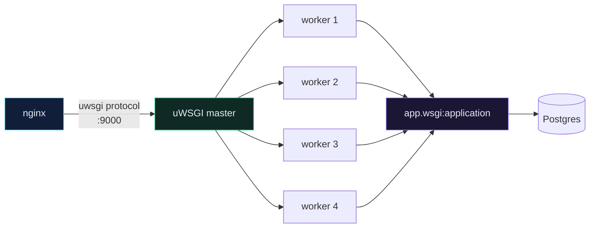

# 🧵 uWSGI and the Production Dockerfile

> `runserver` handles one request at a time and tells you not to use it. uWSGI is what replaces it.

---

## 🎯 Core Concept

**WSGI** is the contract between a Python web framework and a web server. Django ships a WSGI application at `app/wsgi.py` — a single callable. A WSGI *server* (uWSGI, Gunicorn, uvicorn) imports that callable and runs it across many worker processes.



Four workers = four requests served genuinely in parallel. `runserver` = one.

---

## 🤔 Why uWSGI and not Gunicorn?

Both are fine. Honest comparison:

| | **uWSGI** | **Gunicorn** |
| --- | --- | --- |
| Speaks to nginx via | the binary `uwsgi` protocol (faster) | HTTP |
| Configuration | enormous surface, sometimes cryptic | small, obvious |
| Written in | C | Python |
| Default choice for | this course, many older deployments | most new projects |

> [!TIP]
> If you're starting fresh and have no strong opinion, **Gunicorn** is easier to live with. Learn uWSGI here because it's what you'll inherit in existing codebases, and because the `uwsgi_pass` wiring is worth understanding once.

---

## 🛠️ Implementation

### `requirements.txt`

```text
Django>=3.2.4,<3.3
djangorestframework>=3.12.4,<3.13
psycopg2>=2.8.6,<2.9
drf-spectacular>=0.15.1,<0.16
Pillow>=8.2.0,<8.3
uwsgi>=2.0.19,<2.1
```

### `Dockerfile`

```dockerfile
FROM python:3.9-alpine3.13
LABEL maintainer="noetix"

ENV PYTHONUNBUFFERED 1

COPY ./requirements.txt /tmp/requirements.txt
COPY ./requirements.dev.txt /tmp/requirements.dev.txt
COPY ./scripts /scripts
COPY ./app /app
WORKDIR /app
EXPOSE 8000

ARG DEV=false
RUN python -m venv /py && \
    /py/bin/pip install --upgrade pip && \
    apk add --update --no-cache postgresql-client jpeg-dev && \
    apk add --update --no-cache --virtual .tmp-build-deps \
        build-base postgresql-dev musl-dev zlib zlib-dev linux-headers && \
    /py/bin/pip install -r /tmp/requirements.txt && \
    if [ $DEV = "true" ]; \
        then /py/bin/pip install -r /tmp/requirements.dev.txt ; \
    fi && \
    rm -rf /tmp && \
    apk del .tmp-build-deps && \
    adduser \
        --disabled-password \
        --no-create-home \
        django-user && \
    mkdir -p /vol/web/media && \
    mkdir -p /vol/web/static && \
    chown -R django-user:django-user /vol && \
    chmod -R 755 /vol && \
    chmod -R +x /scripts

ENV PATH="/scripts:/py/bin:$PATH"

USER django-user

CMD ["run.sh"]
```

### `scripts/run.sh` — the entrypoint

```bash
#!/bin/sh

set -e

python manage.py wait_for_db
python manage.py collectstatic --noinput
python manage.py migrate

uwsgi --socket :9000 --workers 4 --master --enable-threads --module app.wsgi
```

---

## 🔬 Reading `run.sh` line by line

| Line | What it does | Why it's there |
| --- | --- | --- |
| `set -e` | abort on the first failing command | a failed migration must **not** be followed by a running server |
| `wait_for_db` | block until Postgres answers | containers start in parallel; the DB is slower — see [[9.Implement `wait_for_db`]] |
| `collectstatic --noinput` | copy every app's static files into `/vol/web/static` | nginx serves that directory; `--noinput` because there's no human to answer prompts |
| `migrate` | apply pending migrations | every release applies its own schema changes |
| `uwsgi --socket :9000` | listen on the uwsgi protocol, not HTTP | nginx talks `uwsgi_pass`, not `proxy_pass` |
| `--workers 4` | four OS processes | rough starting point: `2 × CPU cores` |
| `--master` | supervisor process that restarts dead workers | without it, a crashed worker is just gone |
| `--enable-threads` | allow Python threads inside workers | some libraries (Sentry, APM agents) need this |
| `--module app.wsgi` | import path to the WSGI callable | `app/wsgi.py` → `application` |

---

## 🔐 Why `USER django-user` matters

The last instruction before `CMD` switches away from root. If an attacker achieves remote code execution inside the container, they land as an unprivileged user who cannot install packages, cannot write outside `/vol`, and cannot escalate as easily.

```dockerfile
# ❌ default — everything runs as root
CMD ["run.sh"]

# ✅ drop privileges first
USER django-user
CMD ["run.sh"]
```

This is one line and it removes an entire class of escalation. Running containers as root remains one of the most common findings in real Docker audits.

---

## ⚠️ Gotchas

> [!WARNING] `PYTHONUNBUFFERED 1` is not cosmetic
> Without it, Python buffers stdout. Your logs appear minutes late — or never, if the container dies — and you will debug a production incident with no output at all.

- **`uwsgi` fails to build on Alpine** → you're missing `build-base` / `linux-headers`. They're in `.tmp-build-deps` above, and deleted afterwards so they don't bloat the image.
- **`Permission denied` running `run.sh`** → missing `chmod -R +x /scripts`, or `/scripts` isn't on `PATH`.
- **Static files 404 after deploy** → `collectstatic` ran, but `STATIC_ROOT` in settings doesn't match the volume path. It must be `/vol/web/static`.
- **Changes to code don't appear** → correct. There's no volume mount in production. Rebuild: `docker compose -f docker-compose-deploy.yml build app`.

> [!CAUTION] Migrations on multiple app containers
> `run.sh` runs `migrate` on **every** container start. With one container that's fine. The moment you scale to several app containers they will race each other. At that point, move `migrate` into a separate one-shot release step.

---

## 🧠 Check yourself

> [!QUESTION]
> 1. Why does uWSGI listen on a socket rather than serving HTTP directly?
> 2. What would break if you deleted `set -e` from `run.sh`?
> 3. Why is `apk del .tmp-build-deps` in the *same* `RUN` instruction as the install?

---

## 🔗 Related

- [[1.From Dev Compose to Production]]
- [[3.nginx as a Reverse Proxy]]
- [[5.Dockerfile]] — the dev original
- [[9.Implement `wait_for_db`]]
- [[🗂️ Django Static & Media Files (with Docker)]]
