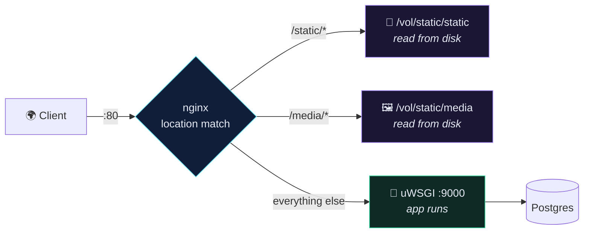
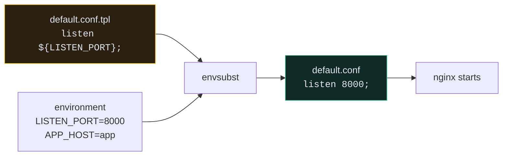

# 🔀 nginx as a Reverse Proxy

> Every request hits nginx first. It answers the boring ones itself and only bothers Python with the interesting ones.

---

## 🎯 Core Concept

A **reverse proxy** sits in front of your application and forwards requests to it. Unlike a forward proxy (which acts for the *client*), it acts for the *server* — clients never talk to uWSGI directly.



---

## 🤔 Why not let uWSGI serve everything?

Five jobs nginx does that you do **not** want a Python process doing:

| Job | What happens without nginx |
| --- | --- |
| **Static files** | Every CSS request occupies a uWSGI worker for milliseconds it should spend on your API |
| **Slow clients** | A client on 2G holding a connection open ties up a full Python worker until it finishes |
| **TLS termination** | Certificate handling inside your app process |
| **gzip** | Responses go out uncompressed, or Python burns CPU compressing them |
| **Buffering** | uWSGI writes a large response slowly instead of dumping it to nginx and moving on |

The rule: **Python should only ever do things only Python can do.**

---

## 🛠️ Implementation

### `proxy/default.conf.tpl`

```nginx
server {
    listen ${LISTEN_PORT};

    location /static {
        alias /vol/static;
    }

    location / {
        uwsgi_pass              ${APP_HOST}:${APP_PORT};
        include                 /etc/nginx/uwsgi_params;
        client_max_body_size    10M;
    }
}
```

It's a **template** (`.tpl`), not a config — `${LISTEN_PORT}` and friends get substituted at container start.

### `proxy/uwsgi_params`

```nginx
uwsgi_param  QUERY_STRING       $query_string;
uwsgi_param  REQUEST_METHOD     $request_method;
uwsgi_param  CONTENT_TYPE       $content_type;
uwsgi_param  CONTENT_LENGTH     $content_length;

uwsgi_param  REQUEST_URI        $request_uri;
uwsgi_param  PATH_INFO          $document_uri;
uwsgi_param  DOCUMENT_ROOT      $document_root;
uwsgi_param  SERVER_PROTOCOL    $server_protocol;
uwsgi_param  REMOTE_ADDR        $remote_addr;
uwsgi_param  REMOTE_PORT        $remote_port;
uwsgi_param  SERVER_ADDR        $server_addr;
uwsgi_param  SERVER_PORT        $server_port;
uwsgi_param  SERVER_NAME        $server_name;
```

These are the CGI-style variables uWSGI hands to Django as `request.META`. Without them, `request.method` and `request.path` are empty.

### `proxy/run.sh`

```bash
#!/bin/sh

set -e

envsubst < /etc/nginx/default.conf.tpl > /etc/nginx/conf.d/default.conf
nginx -g 'daemon off;'
```

### `proxy/Dockerfile`

```dockerfile
FROM nginxinc/nginx-unprivileged:1-alpine
LABEL maintainer="noetix"

COPY ./default.conf.tpl /etc/nginx/default.conf.tpl
COPY ./uwsgi_params /etc/nginx/uwsgi_params
COPY ./run.sh /run.sh

ENV LISTEN_PORT=8000
ENV APP_HOST=app
ENV APP_PORT=9000

USER root

RUN mkdir -p /vol/static && \
    chmod 755 /vol/static && \
    touch /etc/nginx/conf.d/default.conf && \
    chown nginx:nginx /etc/nginx/conf.d/default.conf && \
    chmod +x /run.sh

VOLUME /vol/static

USER nginx

CMD ["/run.sh"]
```

---

## 🔬 The `envsubst` pattern

This is the idea worth stealing for every containerised config file you ever write:



**One image, many environments.** The same built image runs on staging and production with different ports and hostnames, because the config is generated at *start* time from the environment rather than baked in at *build* time.

---

## ⚠️ Gotchas

> [!WARNING] `nginx: [emerg] host not found in upstream "app"`
> nginx resolves `app` via Docker's internal DNS at startup. If the `app` container isn't up yet, nginx exits immediately. `depends_on: - app` plus `restart: always` handles this — nginx dies once, restarts, and finds it.

- **413 Request Entity Too Large on image upload** → `client_max_body_size` defaults to 1M. Recipe photos are bigger. The `10M` above is why it works.
- **`/static/` 404s but the files exist** → `alias` vs `root` confusion. With `location /static { alias /vol/static; }`, the request `/static/admin/x.css` maps to `/vol/static/admin/x.css` — the `/static` prefix is *replaced*. With `root` it would be *appended*.
- **`502 Bad Gateway`** → nginx is fine; uWSGI isn't listening. Check the app container's logs.
- **Everything is 400 Bad Request** → that's Django's `ALLOWED_HOSTS`, not nginx. See [[4.Environment Variables and Secrets]].

> [!TIP] `nginx-unprivileged`
> The base image is `nginxinc/nginx-unprivileged`, not plain `nginx`. It runs as the `nginx` user instead of root — same reasoning as `USER django-user` in the app image. It's why the Dockerfile has to briefly `USER root` to fix permissions, then drop back.

---

## 🔒 Where TLS goes

Nothing above terminates HTTPS. Three normal options:

| Approach | Good for |
| --- | --- |
| **Certbot / Let's Encrypt in the nginx container** | one server you own |
| **Cloud load balancer** (AWS ALB, GCP LB) terminates TLS, forwards HTTP | anything on a cloud provider |
| **Cloudflare** in front | quickest, adds caching and DDoS protection for free |

Whichever you pick, once TLS is in front you must set `SECURE_PROXY_SSL_HEADER` in Django, or it will think every request is plain HTTP and redirect-loop:

```python
# app/settings.py
SECURE_PROXY_SSL_HEADER = ("HTTP_X_FORWARDED_PROTO", "https")
```

---

## 🧠 Check yourself

> [!QUESTION]
> 1. Why does the proxy need the `static-data` volume mounted read-only when the app container writes to it?
> 2. What does `envsubst` buy you that a hard-coded `default.conf` doesn't?
> 3. A user uploads a 4 MB photo and gets 413. Which file do you edit?

---

## 🔗 Related

- [[2.uWSGI and the Production Dockerfile]]
- [[4.Environment Variables and Secrets]]
- [[🗂️ Django Static & Media Files (with Docker)]]
- [[10.Security Checklist]]
