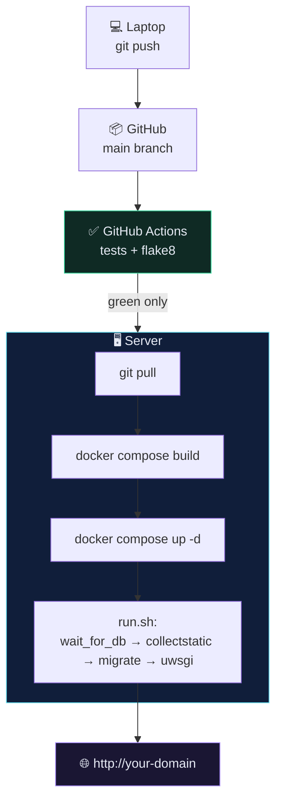

# 🌍 Deploying to a Server

> Everything up to here was configuration. This is the part where it becomes reachable from a phone.

---

## 🎯 The shape of a deploy



---

## 🛠️ Path A — a plain VPS or EC2 instance

The most common and most educational route. Any Ubuntu box works: EC2, DigitalOcean, Hetzner, Linode.

### 1. Provision

| Choice | Recommendation | Why |
| --- | --- | --- |
| OS | Ubuntu 22.04 LTS | best-documented, long support |
| Size | 2 vCPU / 2 GB RAM minimum | Docker build needs RAM; 1 GB will OOM |
| Storage | 20 GB+ | images and volumes accumulate fast |
| Firewall | inbound **22** (SSH), **80**, **443** only | nothing else needs to be open |

> [!CAUTION] Port 5432 stays closed
> If your security group opens the Postgres port to `0.0.0.0/0`, automated scanners will find it. They are not looking for you specifically — they are looking for everyone, constantly.

### 2. Connect

```bash
ssh -i ~/.ssh/your-key.pem ubuntu@<server-ip>
```

### 3. Install Docker

```bash
sudo apt-get update && sudo apt-get install -y ca-certificates curl gnupg
```

```bash
curl -fsSL https://get.docker.com | sudo sh
```

```bash
sudo usermod -aG docker $USER && newgrp docker
```

### 4. Give the server read-only access to your repo

Generate a key **on the server**:

```bash
ssh-keygen -t ed25519 -C "deploy@recipe-api" -f ~/.ssh/id_ed25519 -N ""
```

```bash
cat ~/.ssh/id_ed25519.pub
```

Paste that into **GitHub → your repo → Settings → Deploy keys → Add deploy key**. Leave *Allow write access* **unchecked** — the server never needs to push.

> [!TIP] Why a deploy key and not your own credentials
> A deploy key is scoped to one repository and can be revoked without touching your account. Putting your personal SSH key or a personal access token on a server means the server can reach every repo you can.

### 5. Clone and configure

```bash
git clone git@github.com:<you>/<repo>.git && cd <repo>
```

```bash
cp .env.sample .env && nano .env
```

Fill in a generated `SECRET_KEY`, a strong `DB_PASS`, your domain in `ALLOWED_HOSTS`, and `DEBUG=0`. See [[4.Environment Variables and Secrets]].

### 6. Launch

```bash
docker compose -f docker-compose-deploy.yml up -d --build
```

### 7. Create your admin user

```bash
docker compose -f docker-compose-deploy.yml run --rm app sh -c "python manage.py createsuperuser"
```

### 8. Verify

```bash
curl -I http://<server-ip>/api/docs/
```

---

## 🔁 Redeploying after a change

```bash
git pull && docker compose -f docker-compose-deploy.yml build app && docker compose -f docker-compose-deploy.yml up -d
```

`run.sh` re-runs `collectstatic` and `migrate` on every start, so schema changes apply themselves.

> [!WARNING] There is downtime here
> The old container stops before the new one is healthy. For a learning project that's fine. For real traffic you want a second container and a load balancer, or a platform that does rolling deploys for you.

---

## 🛤️ Path B — a platform that does this for you

If the goal is *"my API is online"* rather than *"I understand deployment"*, these accept a Dockerfile and handle the rest:

| Platform | Free tier | Notes |
| --- | --- | --- |
| **Railway** | trial credit | reads your Dockerfile, gives you a Postgres add-on and a domain |
| **Render** | yes (sleeps) | closest to "push and forget", native Docker support |
| **Fly.io** | small allowance | `fly launch` detects Django; runs close to users |
| **DigitalOcean App Platform** | no | predictable pricing, managed Postgres |

All four want the same two things you already built: a working `Dockerfile` and config read from environment variables. **The work in this section is what makes those platforms trivial** — not the other way round.

---

## 🤖 Automating it with GitHub Actions

Extend the CI you built in [[3.Create the Workflow Config]]:

```yaml
# .github/workflows/deploy.yml
name: Deploy

on:
  push:
    branches: [main]

jobs:
  test:
    name: Test and Lint
    runs-on: ubuntu-20.04
    steps:
      - uses: actions/checkout@v3
      - name: Test
        run: docker compose run --rm app sh -c "python manage.py test"
      - name: Lint
        run: docker compose run --rm app sh -c "flake8"

  deploy:
    name: Deploy
    needs: test
    runs-on: ubuntu-20.04
    steps:
      - name: SSH and redeploy
        uses: appleboy/ssh-action@v1.0.0
        with:
          host: ${{ secrets.SERVER_HOST }}
          username: ${{ secrets.SERVER_USER }}
          key: ${{ secrets.SERVER_SSH_KEY }}
          script: |
            cd ~/recipe-api
            git pull
            docker compose -f docker-compose-deploy.yml build app
            docker compose -f docker-compose-deploy.yml up -d
```

`needs: test` is the important line — **deploy only runs if the tests passed.** That single dependency is most of what "CI/CD" means in practice.

Store `SERVER_HOST`, `SERVER_USER` and `SERVER_SSH_KEY` in **Settings → Secrets and variables → Actions**. Never in the YAML.

---

## ⚠️ Gotchas

- **Build gets OOM-killed on a 1 GB box** → add swap, or build the image in CI and push it to a registry instead of building on the server.
- **`permission denied` on the Docker socket** → you skipped `newgrp docker` (or need to log out and back in).
- **Disk full after a few weeks** → old images pile up. `docker system prune -af --volumes` — read that flag list before running it, `--volumes` deletes unused volumes.
- **Container works, domain doesn't** → DNS A record isn't pointing at the server, or the domain isn't in `ALLOWED_HOSTS`.
- **Site works on IP but not domain** → almost always `ALLOWED_HOSTS`.

---

## 🔗 Related

- [[6.Post-Deploy Checklist]]
- [[4.Environment Variables and Secrets]]
- [[3.Create the Workflow Config]]
- [[10.Security Checklist]]
- [[11.Logging and Observability]]
