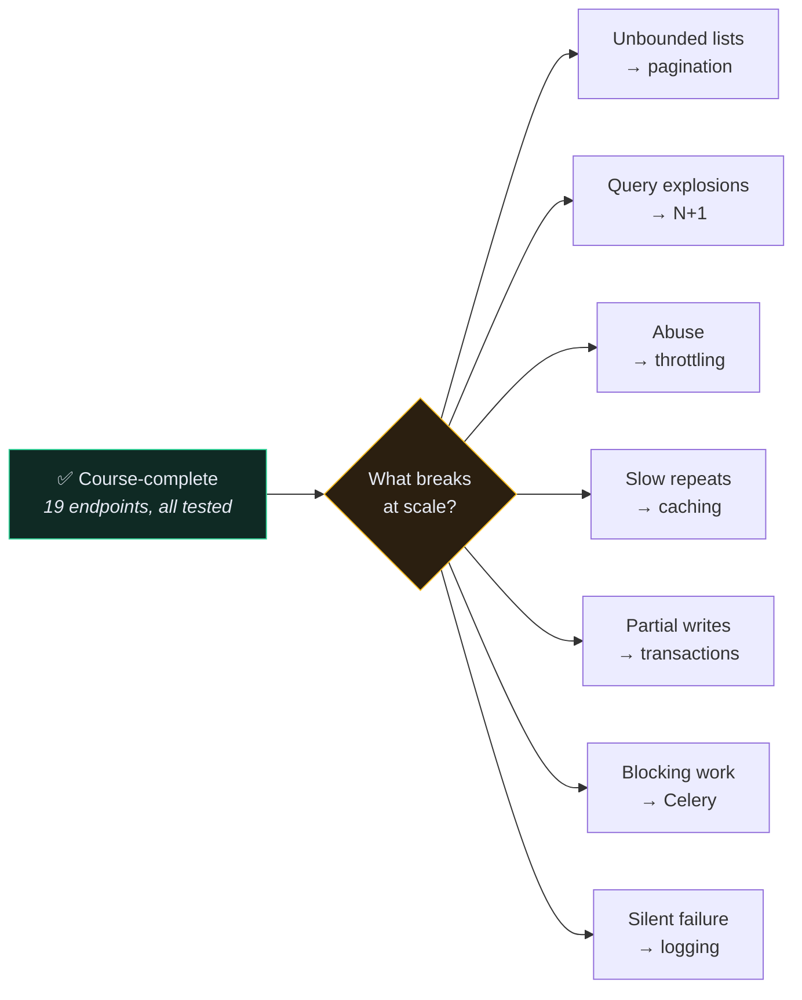
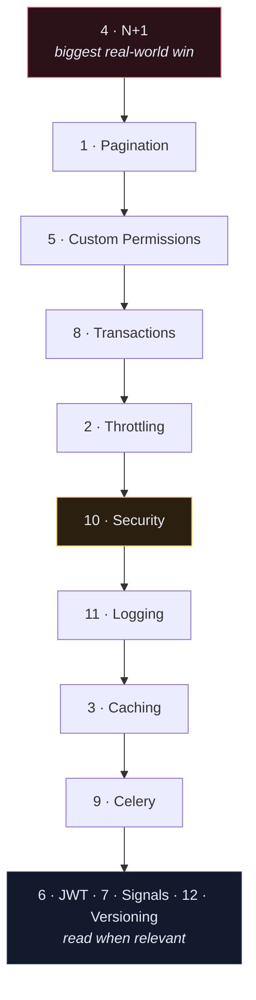

# 🎖️ Production Readiness Checklist

> The course teaches you to build the API. This section teaches you to keep it alive.
>
> Every item here is something that is *fine* at ten users and *fatal* at ten thousand.

---

> [!INFO] Written against Django 6.1
> If you're upgrading, read [[1.What's New in Django 6.1]] first — it changes the answers to two items below (`fetch_mode` for N+1, and `MAILERS` for email) and drops support for the PostgreSQL and Python versions the course pins.

## 🚦 The gap

---

## The checklist

### 🔴 Do these before any real traffic

| | Item | Note |
| --- | --- | --- |
| ☐ | Every list endpoint is paginated | [[1.Pagination]] |
| ☐ | No N+1 queries on list endpoints | [[4.The N+1 Problem]] |
| ☐ | `DEBUG=False`, `SECRET_KEY` from env, `ALLOWED_HOSTS` set | [[10.Security Checklist]] |
| ☐ | HTTPS everywhere, secure cookie flags on | [[6.Post-Deploy Checklist]] |
| ☐ | Every write that touches 2+ tables is in a transaction | [[8.Transactions]] |
| ☐ | Unauthenticated request to a private endpoint returns 401 | [[6.Post-Deploy Checklist]] |
| ☐ | User A cannot read User B's rows | [[5.Custom Permissions]] |
| ☐ | Database backups exist **and have been restored once** | [[6.Post-Deploy Checklist]] |

### 🟡 Do these before you have users who care

| | Item | Note |
| --- | --- | --- |
| ☐ | Throttling on auth endpoints and anonymous traffic | [[2.Throttling and Rate Limiting]] |
| ☐ | Errors reach you, not just the log file | [[11.Logging and Observability]] |
| ☐ | Slow or external work is off the request path | [[9.Background Jobs with Celery]] |
| ☐ | Structured logs with a request ID | [[11.Logging and Observability]] |
| ☐ | Uptime monitoring on a real endpoint | [[6.Post-Deploy Checklist]] |
| ☐ | An index on every field you filter or order by | [[4.The N+1 Problem]] |

### 🟢 Do these when the shape of the problem demands it

| | Item | Note |
| --- | --- | --- |
| ☐ | Caching on expensive read endpoints | [[3.Caching]] |
| ☐ | A versioning strategy before the first breaking change | [[12.Versioning an API]] |
| ☐ | JWT instead of token auth — **only** if you can say why | [[6.Token vs JWT vs Session]] |
| ☐ | Signals audited: are they helping or hiding? | [[7.Signals]] |

---

## 📖 Read in this order

If you're going through the section rather than looking something up:

**N+1 first** because it is the single change with the largest measurable effect on a working Django API — routinely 10–50× on a list endpoint, for four lines of code.

---

## 🎯 The mindset shift

| Course thinking | Production thinking |
| --- | --- |
| "does it return the right data?" | "how many queries did that take?" |
| "the test passes" | "what happens on the 10,000th row?" |
| "the happy path works" | "what does a hostile client do with this?" |
| "it works on my machine" | "what do I see when it breaks at 3am?" |
| "I'll add that later" | "what does adding it later cost?" |

---

## 🔗 Related

- [[Noetix Home]]
- [[6.Post-Deploy Checklist]]
- [[DRF Mastery Roadmap]]
- [[Debugging Decision Tree]]
