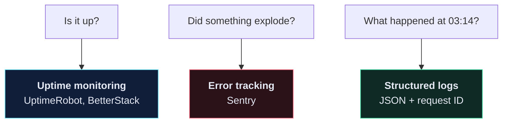

# 🔭 Logging and Observability

> The question isn't "did it break". It's "will I find out, and will I be able to tell what happened".

---

## 🎯 The three questions



`print()` answers none of them.

---

## 🖨️ Why not `print()`

| | `print()` | `logging` |
| --- | --- | --- |
| Severity levels | ❌ | ✅ DEBUG → CRITICAL |
| Turn off in prod without editing code | ❌ | ✅ |
| Timestamp, module, line | ❌ | ✅ |
| Route to file / Sentry / stdout | ❌ | ✅ |
| Structured (machine-parseable) | ❌ | ✅ |

```python
# ❌
print(f"user {user.id} created recipe")

# ✅
import logging
logger = logging.getLogger(__name__)
logger.info("recipe created", extra={"user_id": user.id, "recipe_id": recipe.id})
```

`__name__` gives you a logger named after the module (`recipe.views`), so you can raise or lower verbosity per app without touching code.

---

## 🛠️ Configuration

```python
# app/app/settings.py
LOGGING = {
    "version": 1,
    "disable_existing_loggers": False,
    "formatters": {
        "verbose": {
            "format": "{levelname} {asctime} {name} {module}:{lineno} {message}",
            "style": "{",
        },
        "json": {
            "()": "pythonjsonlogger.jsonlogger.JsonFormatter",
            "format": "%(levelname)s %(asctime)s %(name)s %(message)s",
        },
    },
    "handlers": {
        "console": {
            "class": "logging.StreamHandler",
            "formatter": "json" if not DEBUG else "verbose",
        },
    },
    "root": {
        "handlers": ["console"],
        "level": "INFO",
    },
    "loggers": {
        "django.request": {
            "handlers": ["console"],
            "level": "ERROR",
            "propagate": False,
        },
        "django.db.backends": {
            "handlers": ["console"],
            "level": "DEBUG" if DEBUG else "WARNING",   # every SQL query — dev only
            "propagate": False,
        },
    },
}
```

> [!TIP] Log to stdout, not to files
> In containers, **stdout is the log**. Docker captures it, and every hosting platform reads it from there. Writing to `/var/log/app.log` inside a container means the logs die with the container and nobody ever reads them.

---

## 📊 Levels, and when to use each

| Level | Use for | Wakes someone up? |
| --- | --- | --- |
| `DEBUG` | variable values while developing | no — off in production |
| `INFO` | normal significant events: user registered, order placed | no |
| `WARNING` | recovered from something odd: retry succeeded, deprecated field used | no |
| `ERROR` | a request failed; a user is affected | **yes** |
| `CRITICAL` | the service is degraded or down | **yes, now** |

> [!WARNING] Alert fatigue is a real outage cause
> If `ERROR` fires forty times a day for things nobody acts on, everyone mutes the channel — and then misses the one that mattered. Anything logged at `ERROR` should be something a human would want to fix.

---

## 🧵 Request IDs — the highest-value addition

Without one, a production log is interleaved lines from dozens of concurrent requests. With one, you can pull a single user's exact journey.

```python
# app/core/middleware.py
import logging
import uuid
from contextvars import ContextVar

request_id_var: ContextVar[str] = ContextVar("request_id", default="-")


class RequestIDMiddleware:
    def __init__(self, get_response):
        self.get_response = get_response

    def __call__(self, request):
        rid = request.headers.get("X-Request-ID") or uuid.uuid4().hex[:12]
        request_id_var.set(rid)
        request.request_id = rid

        response = self.get_response(request)
        response["X-Request-ID"] = rid
        return response


class RequestIDFilter(logging.Filter):
    def filter(self, record):
        record.request_id = request_id_var.get()
        return True
```

```python
# app/app/settings.py
MIDDLEWARE = [
    "core.middleware.RequestIDMiddleware",
    ...
]
```

Add `request_id` to your formatter and every line for one request shares an ID. Return it in the response header too — now a user can paste their failing request's ID into a support ticket and you find it instantly.

---

## 🚨 Error tracking with Sentry

Logs tell you what happened *if you go looking*. Sentry tells you **without** looking.

```bash
pip install "sentry-sdk[django]"
```

```python
# app/app/settings.py
import sentry_sdk
from sentry_sdk.integrations.django import DjangoIntegration

SENTRY_DSN = os.environ.get("SENTRY_DSN")

if SENTRY_DSN and not DEBUG:
    sentry_sdk.init(
        dsn=SENTRY_DSN,
        integrations=[DjangoIntegration()],
        traces_sample_rate=0.1,
        send_default_pii=False,
        environment=os.environ.get("ENVIRONMENT", "production"),
        release=os.environ.get("GIT_SHA", "unknown"),
    )
```

What you get for those ten lines: full traceback with local variables, the request that caused it, how many users hit it, whether it's new or a regression, and which release introduced it.

> [!CAUTION] `send_default_pii=False`
> With PII on, Sentry captures cookies, headers, and user data — including `Authorization` headers. That's an auth token in a third-party service. Keep it off and add only the fields you need:
> ```python
> sentry_sdk.set_user({"id": request.user.id})
> ```

`release=GIT_SHA` is the underrated one: Sentry then tells you *which deploy* introduced an error.

---

## 🧩 A DRF exception handler that logs

```python
# app/core/exceptions.py
import logging

from rest_framework.views import exception_handler

logger = logging.getLogger(__name__)


def custom_exception_handler(exc, context):
    response = exception_handler(exc, context)

    if response is not None:
        request = context.get("request")
        logger.warning(
            "api_error",
            extra={
                "status_code": response.status_code,
                "path": getattr(request, "path", None),
                "method": getattr(request, "method", None),
                "user_id": getattr(getattr(request, "user", None), "id", None),
                "detail": str(exc),
            },
        )

    return response
```

```python
REST_FRAMEWORK = {
    "EXCEPTION_HANDLER": "core.exceptions.custom_exception_handler",
}
```

Now every 4xx is visible. A spike in 401s means someone is probing you; a spike in 400s means a client shipped a bad release. Neither shows up in a 500-only view of the world.

---

## 🩺 A health endpoint

```python
# app/core/views.py
from django.db import connection
from rest_framework.decorators import api_view, permission_classes
from rest_framework.permissions import AllowAny
from rest_framework.response import Response


@api_view(["GET"])
@permission_classes([AllowAny])
def health_check(request):
    """Report whether the app can reach its dependencies."""
    try:
        connection.ensure_connection()
        db_ok = True
    except Exception:
        db_ok = False

    status_code = 200 if db_ok else 503
    return Response({"status": "ok" if db_ok else "degraded", "database": db_ok},
                    status=status_code)
```

Point your uptime monitor at `/api/health/`, not at `/`. A `200` from a homepage that can't reach the database is a lie.

---

## 🔒 Never log these

- Passwords, even hashed
- Auth tokens, session IDs, API keys
- Full credit card numbers
- Personal data beyond what you need (GDPR: logs are personal data too)

```python
# ❌
logger.info(f"login attempt: {request.data}")     # contains the password

# ✅
logger.info("login attempt", extra={"email": request.data.get("email")})
```

Set a log retention period and honour it.

---

## ⚠️ Gotchas

- **No logs at all in Docker** → missing `ENV PYTHONUNBUFFERED 1`. Python buffers stdout and you see nothing.
- **`disable_existing_loggers: True`** silences Django's own loggers. Keep it `False`.
- **`django.db.backends` at DEBUG in production** → every SQL query logged. Enormous volume, real performance cost, and it logs query parameters.
- **Sentry quota burned in a day** → one noisy error firing thousands of times. Fix it or filter it with `before_send`.
- **Logs full of health-check noise** → exclude the health path in your handler filter.

---

## 🧠 Check yourself

> [!QUESTION]
> 1. Why log to stdout rather than a file in a container?
> 2. What does a request ID let you do that a timestamp doesn't?
> 3. Why is `send_default_pii=True` dangerous with token auth?

---

## 🔗 Related

- [[6.Post-Deploy Checklist]]
- [[10.Security Checklist]]
- [[2.Errors You Will Actually Hit]]
- [[Debugging Decision Tree]]
