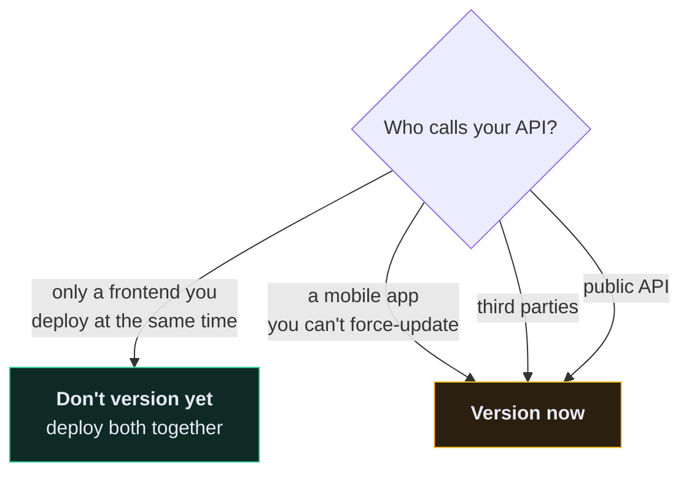
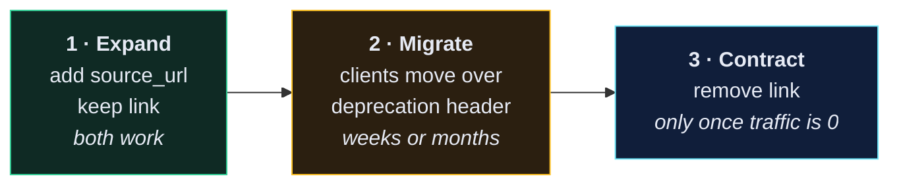

# 🔢 Versioning an API

> You need a versioning strategy the day *before* your first breaking change, not the day after.

---

## 🎯 The only question that matters

**Can you deploy a change and be certain no existing client breaks?**

Once the answer is no — because a mobile app is in the App Store, or a partner integrated last month, or a user wrote a script — you need versioning.



> [!TIP] Premature versioning has a cost too
> `/api/v1/` on a project with one frontend you deploy in lockstep buys nothing and adds a path segment you'll carry forever. Ship `/api/`, and add versioning when a real client is outside your control.

---

## 🔀 What counts as breaking

| Change | Breaking? |
| --- | --- |
| Adding a new endpoint | ❌ safe |
| Adding an **optional** field to a response | ❌ safe |
| Adding an **optional** request field | ❌ safe |
| Removing a response field | ✅ **breaking** |
| Renaming a field | ✅ **breaking** |
| Changing a type (`"5"` → `5`) | ✅ **breaking** |
| Making an optional request field required | ✅ **breaking** |
| Changing a status code | ✅ **breaking** |
| Adding pagination to a list endpoint | ✅ **breaking** — see [[1.Pagination]] |
| Tightening validation | ✅ **breaking** — payloads that worked now 400 |
| Changing default ordering | ⚠️ usually breaking in practice |

The rule: **adding is safe, removing and changing are not.**

---

## 🛣️ The strategies

```python
# app/app/settings.py
REST_FRAMEWORK = {
    "DEFAULT_VERSIONING_CLASS": "rest_framework.versioning.URLPathVersioning",
    "DEFAULT_VERSION": "v1",
    "ALLOWED_VERSIONS": ["v1", "v2"],
}
```

| Class | Looks like | Verdict |
| --- | --- | --- |
| `URLPathVersioning` | `/api/v1/recipes/` | ✅ **default choice** — visible, cacheable, trivially debuggable |
| `NamespaceVersioning` | same URL shape, uses URLconf namespaces | ✅ good when versions diverge a lot |
| `AcceptHeaderVersioning` | `Accept: application/json; version=1.0` | ⚠️ "purest" REST, hardest to `curl`, breaks naive caches |
| `QueryParameterVersioning` | `/api/recipes/?version=1` | ⚠️ easy to forget, pollutes query strings |
| `HostNameVersioning` | `v1.api.example.com` | ⚠️ needs DNS and certs per version |

**Pick URL path versioning** unless you have a specific reason not to. A URL you can paste into a browser and a log line you can read at a glance are worth more than protocol purity.

```python
# app/app/urls.py
urlpatterns = [
    path("api/v1/user/", include("user.urls")),
    path("api/v1/recipe/", include("recipe.urls")),
]
```

---

## 🛠️ Serving two versions from one viewset

You rarely need a whole parallel codebase. Usually one serializer differs.

```python
# app/recipe/views.py
class RecipeViewSet(viewsets.ModelViewSet):

    def get_serializer_class(self):
        if self.request.version == "v2":
            return serializers.RecipeV2Serializer
        return serializers.RecipeSerializer
```

```python
# app/recipe/serializers.py
class RecipeSerializer(serializers.ModelSerializer):
    """v1 — kept stable for existing clients."""

    class Meta:
        model = Recipe
        fields = ["id", "title", "time_minutes", "price", "link"]


class RecipeV2Serializer(serializers.ModelSerializer):
    """v2 — `link` renamed to `source_url`, duration is structured."""
    source_url = serializers.CharField(source="link", required=False)
    duration = serializers.SerializerMethodField()

    class Meta:
        model = Recipe
        fields = ["id", "title", "duration", "price", "source_url"]

    def get_duration(self, obj):
        return {"minutes": obj.time_minutes}
```

**One model, one view, two serializers.** The database never learns that versions exist — and that's the point. Versioning is a *presentation* concern.

---

## 🌉 The expand–migrate–contract pattern

The technique that lets you change almost anything without a new version:



```python
class RecipeSerializer(serializers.ModelSerializer):
    source_url = serializers.CharField(source="link", required=False)

    class Meta:
        model = Recipe
        fields = ["id", "title", "time_minutes", "price", "link", "source_url"]
        #                                                  ^^^^ deprecated, still served
```

The crucial part is step 2's exit criterion: **you remove the old field when the logs show nobody reads it**, not when the calendar says so.

```python
# app/core/middleware.py — measure before you delete
if "link" in request.query_params.get("fields", ""):
    logger.info("deprecated_field_used", extra={"field": "link", "user_id": request.user.id})
```

---

## 📢 Deprecation, done properly

```python
class DeprecationMiddleware:
    def __init__(self, get_response):
        self.get_response = get_response

    def __call__(self, request):
        response = self.get_response(request)

        if request.path.startswith("/api/v1/"):
            response["Deprecation"] = "true"
            response["Sunset"] = "Sat, 01 Nov 2026 00:00:00 GMT"
            response["Link"] = '</api/v2/>; rel="successor-version"'

        return response
```

`Deprecation` and `Sunset` are standardised HTTP headers (RFC 8594). Some client libraries surface them automatically, and they give you an honest audit trail of when you announced the change.

A workable deprecation policy:

| Step | Timing |
| --- | --- |
| Announce in docs + changelog | day 0 |
| `Deprecation` / `Sunset` headers live | day 0 |
| Email known integrators | day 0 and day 90 |
| Log every use of the old version | continuously |
| Remove | when usage is ~0 **and** past the sunset date |

---

## 📄 Versioned documentation

```python
# app/app/settings.py
SPECTACULAR_SETTINGS = {
    "TITLE": "Recipe API",
    "VERSION": "2.0.0",
    "SERVE_INCLUDE_SCHEMA": False,
}
```

```python
@extend_schema(
    deprecated=True,
    description="Deprecated. Use /api/v2/recipes/ instead. Sunset: 2026-11-01.",
)
def list(self, request, *args, **kwargs):
    return super().list(request, *args, **kwargs)
```

Swagger renders deprecated operations with a strike-through, so anyone reading [[4.Enabling Swagger Documentation URLs|your docs]] sees it without being told.

---

## 🎯 The honest advice

1. **Don't version until you must.** A single frontend you deploy in lockstep does not need it.
2. **Prefer additive changes forever.** Expand–migrate–contract avoids most version bumps entirely.
3. **When you must version, use the URL path.** It's boring, visible, and debuggable.
4. **Support at most two versions at a time.** Three is where the maintenance cost overtakes the benefit.
5. **Delete old versions.** A version you never remove is a version you maintain forever.

---

## 🧠 Check yourself

> [!QUESTION]
> 1. Why is enabling pagination a breaking change?
> 2. What does expand–migrate–contract let you avoid?
> 3. What's the actual exit criterion for deleting a deprecated field?

---

## 🔗 Related

- [[1.Pagination]]
- [[2.Automated API Documentation in Django REST Framework]]
- [[3.Architecture Decision Records]]
- [[0.Production Readiness Checklist]]
