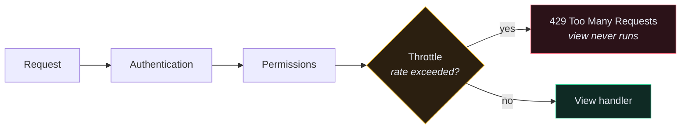
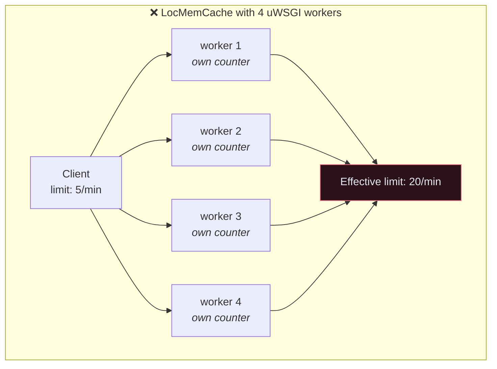

# 🚦 Throttling and Rate Limiting

> Your `/api/user/token/` endpoint will be brute-forced. Not *might be* — will be, by automated scanners, within days of the domain resolving.

---

## 🎯 Core Concept

**Throttling** caps how many requests a client may make in a time window. When the cap is exceeded, DRF returns `429 Too Many Requests` with a `Retry-After` header — and, critically, never touches your database or your view.



Throttling runs **after** authentication (so it can tell users apart) and **before** the view (so abuse costs you nothing).

---

## 🛠️ The 80% setup

```python
# app/app/settings.py
REST_FRAMEWORK = {
    "DEFAULT_THROTTLE_CLASSES": [
        "rest_framework.throttling.AnonRateThrottle",
        "rest_framework.throttling.UserRateThrottle",
    ],
    "DEFAULT_THROTTLE_RATES": {
        "anon": "100/hour",
        "user": "1000/hour",
    },
}
```

| Class | Identifies clients by | Applies to |
| --- | --- | --- |
| `AnonRateThrottle` | IP address | unauthenticated requests only |
| `UserRateThrottle` | user ID | authenticated requests only |
| `ScopedRateThrottle` | a per-view `throttle_scope` | whichever views opt in |

Rate strings are `<number>/<period>` where period is `second`, `minute`, `hour`, or `day`. Only the first character matters — `100/h` works.

---

## 🎯 The endpoint that actually needs this

A global 100/hour does not stop a password attack: 100 guesses an hour, across a botnet, forever. The login endpoint needs its own, much tighter budget.

```python
# app/app/settings.py
"DEFAULT_THROTTLE_RATES": {
    "anon": "100/hour",
    "user": "1000/hour",
    "login": "5/minute",       # ← the one that matters
    "register": "10/hour",
}
```

```python
# app/user/views.py
from rest_framework.throttling import ScopedRateThrottle


class CreateTokenView(ObtainAuthToken):
    """Create a new auth token for user."""
    serializer_class = AuthTokenSerializer
    renderer_classes = api_settings.DEFAULT_RENDERER_CLASSES
    throttle_classes = [ScopedRateThrottle]
    throttle_scope = "login"


class CreateUserView(generics.CreateAPIView):
    """Create a new user in the system."""
    serializer_class = UserSerializer
    throttle_classes = [ScopedRateThrottle]
    throttle_scope = "register"
```

> [!CAUTION] Throttle by more than IP on login
> `AnonRateThrottle` keys on IP. An attacker with a proxy pool gets a fresh budget per IP. The stronger defence is throttling **per submitted email** as well, so one account can't be attacked from a thousand addresses:
> ```python
> class LoginThrottle(SimpleRateThrottle):
>     scope = "login"
>
>     def get_cache_key(self, request, view):
>         email = request.data.get("email", "")
>         return self.cache_format % {"scope": self.scope, "ident": email.lower()}
> ```
> Use both. IP throttling stops noisy scanners; email throttling stops targeted attacks.

---

## 🗄️ Throttling needs a cache

DRF stores request timestamps in Django's cache. The default is **local memory, per process**:



With four workers, your 5/minute limit is really 20/minute — and it resets whenever a worker restarts. Use Redis:

```python
# app/app/settings.py
CACHES = {
    "default": {
        "BACKEND": "django.core.cache.backends.redis.RedisCache",
        "LOCATION": os.environ.get("REDIS_URL", "redis://redis:6379/1"),
    }
}
```

```yaml
# docker-compose-deploy.yml
  redis:
    image: redis:7-alpine
    restart: always
```

> [!WARNING] Throttling without a shared cache is theatre
> It will pass your tests, look correct in code review, and not work in production. This is the single most common way DRF throttling silently fails.

---

## 📡 Telling the client what happened

```http
HTTP/1.1 429 Too Many Requests
Retry-After: 47
Content-Type: application/json

{"detail": "Request was throttled. Expected available in 47 seconds."}
```

A well-behaved client reads `Retry-After` and backs off. Document this in your OpenAPI schema so client authors know it exists.

---

## 🧪 Testing it

```python
# app/user/tests/test_user_api.py
from django.core.cache import cache


class ThrottleTests(TestCase):

    def setUp(self):
        self.client = APIClient()
        cache.clear()          # ← throttle state lives in the cache

    def tearDown(self):
        cache.clear()

    def test_login_is_throttled(self):
        """Test repeated login attempts are throttled."""
        payload = {"email": "a@example.com", "password": "wrong"}

        for _ in range(5):
            self.client.post(TOKEN_URL, payload)

        res = self.client.post(TOKEN_URL, payload)

        self.assertEqual(res.status_code, status.HTTP_429_TOO_MANY_REQUESTS)
```

`cache.clear()` in `setUp` **and** `tearDown` is mandatory. Throttle counters leak between tests otherwise, and you get failures that depend on test ordering.

---

## 🚫 What throttling is not

| Threat | Throttling helps? |
| --- | --- |
| Password brute force | ✅ the main use |
| Scraping your whole dataset | ✅ slows it enormously |
| Accidental client retry loop | ✅ |
| Cost control on a paid downstream API | ✅ |
| **Volumetric DDoS** | ❌ — the request still reaches your server. That's Cloudflare's job, or your load balancer's |
| **Authorization** | ❌ — a throttled attacker with a valid token is still an attacker. See [[5.Custom Permissions]] |

---

## ⚠️ Gotchas

- **`Ratelimit` not applying at all** → `throttle_classes` set but the scope name isn't in `DEFAULT_THROTTLE_RATES`. DRF raises `ImproperlyConfigured` for `ScopedRateThrottle` but silently no-ops in some misconfigurations.
- **Everyone throttled at once behind a proxy** → all requests carry the proxy's IP. Set `NUM_PROXIES` in settings, or make sure `X-Forwarded-For` is trusted correctly.
- **Tests are flaky** → missing `cache.clear()`.
- **Limits reset on deploy** → in-memory cache. Redis.
- **Legit mobile clients hit limits** → poll intervals plus retries add up faster than you'd think. Log 429s before enforcing tight limits.

---

## 🧠 Check yourself

> [!QUESTION]
> 1. Why does IP-based throttling not fully protect a login endpoint?
> 2. What is the effective rate limit with `5/min` and 4 uWSGI workers on `LocMemCache`?
> 3. Why does throttling run after authentication rather than before?

---

## 🔗 Related

- [[5.Custom Permissions]]
- [[10.Security Checklist]]
- [[3.Caching]]
- [[7.Custom Token Authentication]]
