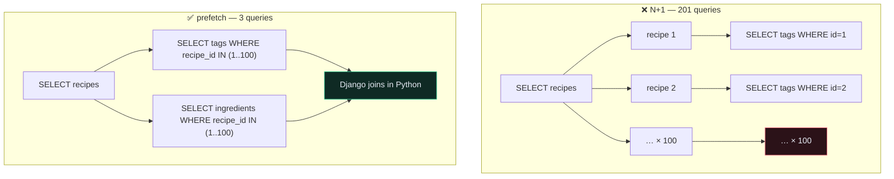
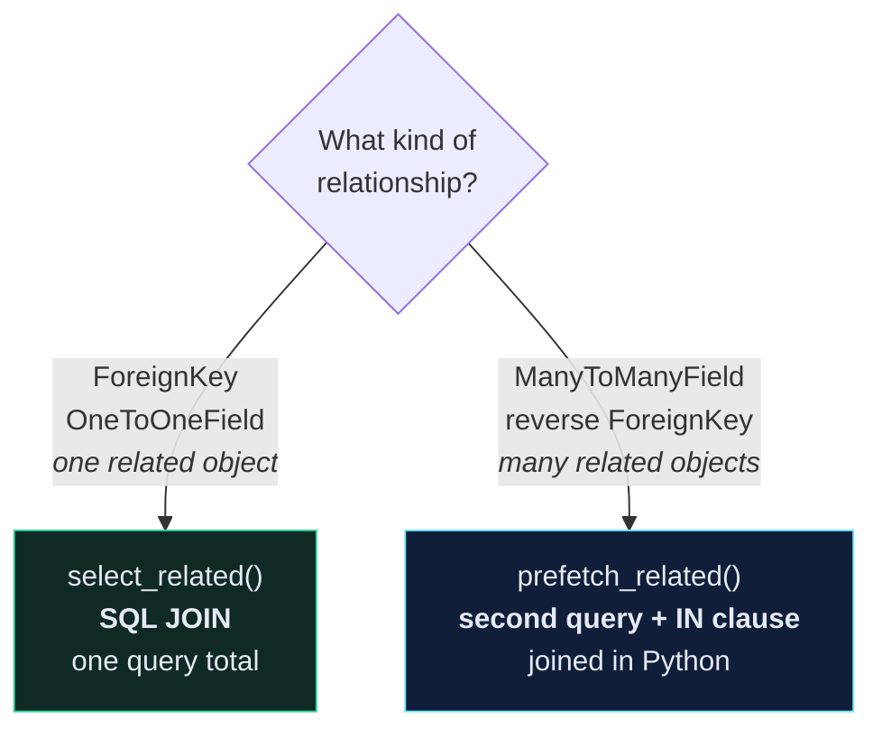

# 🐌 The N+1 Problem

> The highest-value four lines you will ever add to a Django API. Routinely 10–50× on a list endpoint.

---

## 🎯 Core Concept

Django's ORM is **lazy**. Accessing a related object triggers a query — and inside a loop, that's one query *per row*.

```python
# app/recipe/serializers.py
class RecipeSerializer(serializers.ModelSerializer):
    tags = TagSerializer(many=True, required=False)
    ingredients = IngredientSerializer(many=True, required=False)
```

Serializing 100 recipes:

```text
1   query   SELECT * FROM core_recipe WHERE user_id = 7
100 queries SELECT * FROM core_recipe_tags WHERE recipe_id = ?
100 queries SELECT * FROM core_recipe_ingredients WHERE recipe_id = ?
─────────────────────────────────────────────────────────────────
201 queries for one HTTP request
```

That's **N+1** — one query for the list, N for the related data. Each is fast. Two hundred round trips are not.



---

## 🛠️ The fix

```python
# app/recipe/views.py
class RecipeViewSet(viewsets.ModelViewSet):
    queryset = Recipe.objects.all()

    def get_queryset(self):
        return (
            self.queryset
            .filter(user=self.request.user)
            .select_related("user")                    # ← ForeignKey / OneToOne
            .prefetch_related("tags", "ingredients")   # ← ManyToMany / reverse FK
            .order_by("-id")
        )
```

201 queries → **3**.

---

## ⭐ Django 6.1: `fetch_mode()`

Since August 2026 there is a third tool, and it changes the shape of this problem.

```python
from django.db import models

# reactive: on first access, load the relation for EVERY row in the QuerySet
Recipe.objects.fetch_mode(models.FETCH_PEERS)

# strict: refuse to lazy-load at all
Recipe.objects.fetch_mode(models.FETCH_RAISE)      # raises FieldFetchBlocked
```

| Mode | On touching an unfetched relation |
| --- | --- |
| `FETCH_ONE` | query for this instance *(the default — the N+1 source)* |
| `FETCH_PEERS` | one query covering every peer from the same QuerySet |
| `FETCH_RAISE` | raise `FieldFetchBlocked` |

**`select_related`/`prefetch_related` require you to predict** which relations the serializer will touch. `FETCH_PEERS` reacts to what actually gets accessed — so a serializer change can't silently reintroduce N+1.

### The combination worth adopting

```python
def get_queryset(self):
    return (
        self.queryset
        .filter(user=self.request.user)
        .select_related("user")                     # explicit — I know I need this
        .prefetch_related("tags", "ingredients")    # explicit — and these
        .fetch_mode(models.FETCH_PEERS)             # safety net for everything else
        .order_by("-id")
    )
```

Keep the explicit calls: a JOIN you *know* you need still beats a reactive second query. Add `FETCH_PEERS` for what you forgot.

> [!TIP] `FETCH_RAISE` in test settings turns N+1 into a build failure
> Instead of hoping someone notices a slow endpoint, make the accidental lazy load a hard error in CI. It's the same idea as `assertNumQueries`, but it catches the case you didn't write a test for.

> [!WARNING] `select_related()` with no arguments is deprecated in 6.1
> ```python
> Recipe.objects.select_related()                 # ❌ removed in Django 7.0
> Recipe.objects.select_related("user")           # ✅
> ```

---

## 🔀 Which one do I use?



| | `select_related` | `prefetch_related` |
| --- | --- | --- |
| Works on | FK, OneToOne (**forward**) | M2M, reverse FK, **and** FK |
| Mechanism | SQL `JOIN` | separate query + `WHERE id IN (…)` |
| Queries added | 0 | 1 per relation |
| Joining happens in | the database | Python |
| Follows chains | `.select_related("recipe__user")` | `.prefetch_related("recipes__tags")` |

**Why M2M can't use a JOIN:** joining a recipe to its 5 tags returns 5 rows per recipe. 100 recipes × 5 tags = 500 rows to reconstruct 100 objects. That row multiplication is worse than a second query.

In this project:

```python
.select_related("user")                    # Recipe → User is a ForeignKey
.prefetch_related("tags", "ingredients")   # both are ManyToMany
```

---

## 🔍 How to actually see the problem

### In a test — the tool that ends the argument

```python
# app/recipe/tests/test_recipe_api.py
def test_recipe_list_query_count(self):
    """Test the list endpoint doesn't scale queries with rows."""
    for i in range(10):
        recipe = create_recipe(user=self.user)
        recipe.tags.add(Tag.objects.create(user=self.user, name=f"tag{i}"))

    with self.assertNumQueries(4):
        self.client.get(RECIPES_URL)
```

`assertNumQueries` turns "I think this is fast" into a test that fails when someone reintroduces the regression. **Add one to every list endpoint you care about.**

### In the shell

```python
from django.db import connection, reset_queries
from django.test.utils import CaptureQueriesContext

with CaptureQueriesContext(connection) as ctx:
    list(Recipe.objects.all()[:20])
print(len(ctx.captured_queries))
```

### In the browser — django-debug-toolbar

```bash
pip install django-debug-toolbar
```

It shows the query count and the duplicate queries per page. **Development only** — it exposes your settings.

---

## 🎯 Beyond N+1: three more ORM wins

### `only()` / `defer()` — stop fetching columns you don't serialize

```python
Recipe.objects.only("id", "title", "price", "time_minutes")
```

Matters when the table has a `TextField` you don't show in list view.

### `annotate()` — count in the database, not in Python

```python
# ❌ one COUNT query per recipe
for r in recipes:
    print(r.tags.count())

# ✅ one query, total
from django.db.models import Count
Recipe.objects.annotate(tag_count=Count("tags"))
```

### `Prefetch` — filter the prefetched rows

```python
from django.db.models import Prefetch

Recipe.objects.prefetch_related(
    Prefetch("tags", queryset=Tag.objects.filter(name__startswith="v"))
)
```

Without `Prefetch`, `recipe.tags.filter(...)` inside a loop re-queries per row and throws away everything you prefetched.

### Index anything you filter or order by

```python
class Recipe(models.Model):
    ...
    class Meta:
        indexes = [
            models.Index(fields=["user", "-id"]),
        ]
```

`.filter(user=…).order_by("-id")` is *the* query this API runs. A composite index on exactly that is close to free and matters more than any Python-level optimisation.

---

## ⚠️ Gotchas

> [!WARNING] `select_related` on a nullable FK silently changes your rows
> It generates an `INNER JOIN`, which drops rows whose FK is `NULL`. Django is usually smart enough to use `LEFT OUTER JOIN` for nullable fields — but when you chain `.filter()` on the related model, you can lose rows. Always check the count before and after.

- **`prefetch_related` didn't help** → you called `.filter()` or `.order_by()` on the related manager inside the loop, which discards the prefetch. Use `Prefetch(...)`.
- **`select_related` on a ManyToMany raises** → `FieldError: Invalid field name(s) given in select_related`. M2M needs `prefetch_related`.
- **Query count still grows** → something in your serializer touches a relation you didn't prefetch. `SerializerMethodField` is the usual culprit.
- **Prefetching made it slower** → you prefetched a relation the serializer never reads. Every prefetch costs a query; only add the ones you use.

> [!TIP] Optimise the list endpoint, not the detail endpoint
> `GET /recipes/1/` serializes one object — N+1 doesn't exist there. All the value is in the list views. Don't spend effort where there's nothing to win.

---

## 🧠 Check yourself

> [!QUESTION]
> 1. Why can't `select_related` handle a ManyToManyField?
> 2. You added `prefetch_related("tags")` but the query count is unchanged. What's the most likely cause?
> 3. Why is `assertNumQueries` more valuable than a one-off timing measurement?

---

## 🔗 Related

- [[1.Pagination]]
- [[3.Caching]]
- [[4.Django ORM Cookbook]]
- [[0.Production Readiness Checklist]]
