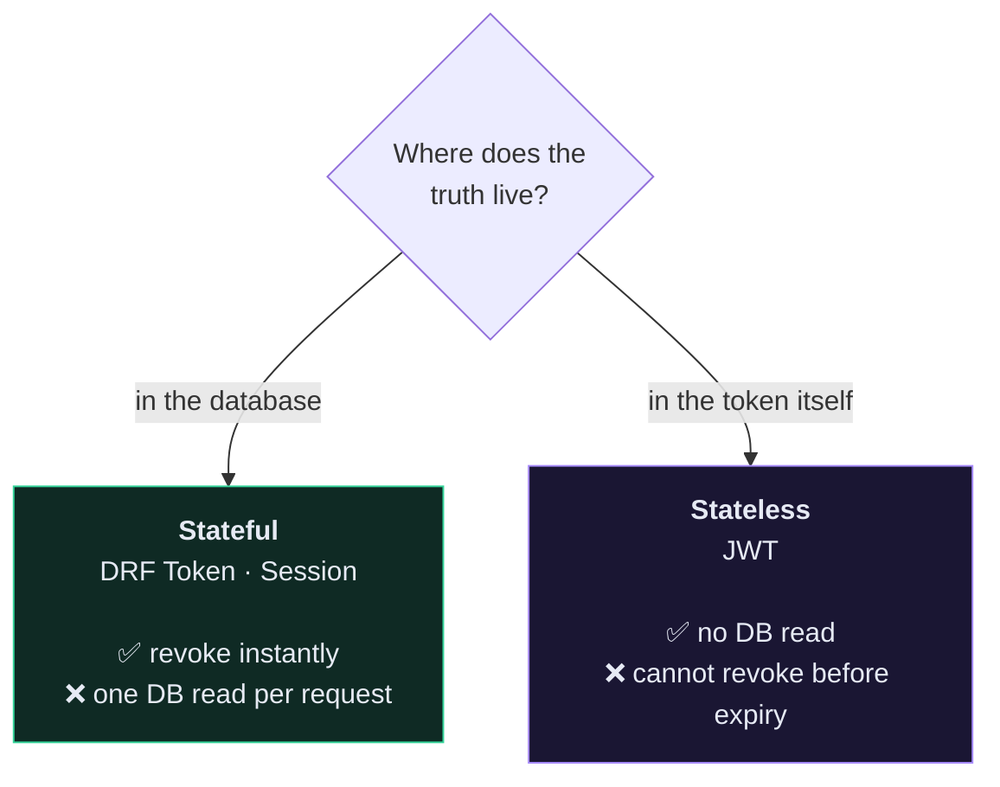
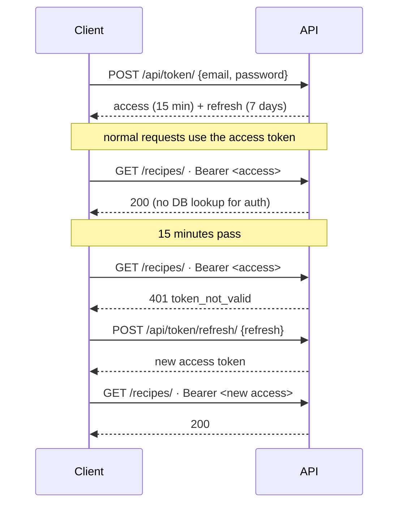
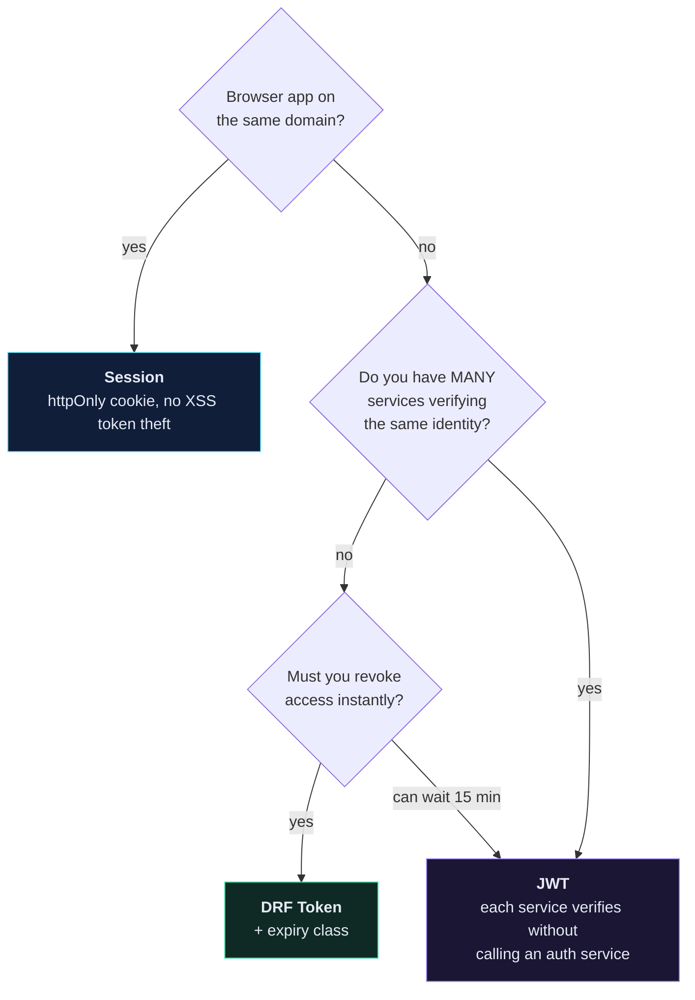

# 🔑 Token vs JWT vs Session

> Most people reach for JWT because it sounds modern, then discover they've traded a database lookup for a revocation problem they can't solve.

---

## 🎯 The one distinction that matters



Everything else is detail. **Stateful = revocable. Stateless = fast. You cannot have both** without reintroducing state (a denylist), at which point you've rebuilt stateful auth with extra steps.

---

## 📊 The comparison

| | **DRF Token** | **JWT** | **Session** |
| --- | --- | --- | --- |
| Where state lives | `authtoken_token` table | inside the token | server session store |
| Transport | `Authorization: Token …` | `Authorization: Bearer …` | `sessionid` cookie |
| DB hit per request | 1 | 0 | 1 (unless cached) |
| Expires by default | ❌ never | ✅ minutes | ✅ 2 weeks |
| Instant revocation | ✅ delete the row | ❌ wait for expiry |✅ delete the session |
| Carries claims (role, tenant) | ❌ | ✅ | ❌ |
| Works cross-domain | ✅ | ✅ | ⚠️ CORS + cookie pain |
| CSRF exposure | ❌ | ❌ | ✅ needs protection |
| Extra dependency | none — built in | `djangorestframework-simplejwt` | none — built in |
| Good for | mobile, SPA, most APIs | microservices, high scale | Django templates, the admin |

---

## 🪙 DRF Token — what you built

```python
# app/app/settings.py
INSTALLED_APPS = [..., "rest_framework.authtoken"]

REST_FRAMEWORK = {
    "DEFAULT_AUTHENTICATION_CLASSES": [
        "rest_framework.authentication.TokenAuthentication",
    ],
}
```

![[token-auth-flow.svg]]

**The honest weakness:** the default token never expires. A token stolen in 2024 works in 2027. Fix it with a custom authentication class:

```python
# app/core/authentication.py
from datetime import timedelta
from django.utils import timezone
from rest_framework.authentication import TokenAuthentication
from rest_framework.exceptions import AuthenticationFailed


class ExpiringTokenAuthentication(TokenAuthentication):
    """Token auth where tokens expire after 7 days."""

    def authenticate_credentials(self, key):
        user, token = super().authenticate_credentials(key)

        if token.created < timezone.now() - timedelta(days=7):
            token.delete()
            raise AuthenticationFailed("Token has expired.")

        return user, token
```

That single class removes the main argument against DRF tokens.

---

## 🎫 JWT — what you're actually buying

A JWT is three base64 segments: `header.payload.signature`.

```json
{
  "token_type": "access",
  "exp": 1755360000,
  "user_id": 42,
  "role": "chef"
}
```

The server verifies the signature and trusts the contents — **no database lookup**. That's the entire value proposition.

```bash
pip install djangorestframework-simplejwt
```

```python
# app/app/settings.py
from datetime import timedelta

REST_FRAMEWORK = {
    "DEFAULT_AUTHENTICATION_CLASSES": [
        "rest_framework_simplejwt.authentication.JWTAuthentication",
    ],
}

SIMPLE_JWT = {
    "ACCESS_TOKEN_LIFETIME": timedelta(minutes=15),
    "REFRESH_TOKEN_LIFETIME": timedelta(days=7),
    "ROTATE_REFRESH_TOKENS": True,
    "BLACKLIST_AFTER_ROTATION": True,
}
```

```python
# app/app/urls.py
from rest_framework_simplejwt.views import TokenObtainPairView, TokenRefreshView

urlpatterns = [
    path("api/token/", TokenObtainPairView.as_view(), name="token_obtain_pair"),
    path("api/token/refresh/", TokenRefreshView.as_view(), name="token_refresh"),
]
```

### The two-token dance



The short access lifetime **is** the revocation story: you can't revoke it, so you make it die quickly on its own.

> [!CAUTION] JWT's real problems
> 1. **You cannot log someone out.** Deleting the token client-side is all you get. A stolen access token works until `exp`.
> 2. **A denylist reintroduces the database.** `BLACKLIST_AFTER_ROTATION` needs a table and a lookup — the exact thing you chose JWT to avoid.
> 3. **`localStorage` is XSS-readable.** Any injected script exfiltrates the token. `httpOnly` cookies are safer but bring CSRF back.
> 4. **Claims go stale.** Demote a user's role and their existing token still says `"role": "chef"` until it expires.
> 5. **`alg: none` and algorithm confusion** are real historical CVEs in JWT libraries. Pin your algorithm.

---

## 🍪 Session — still the right answer sometimes

```python
REST_FRAMEWORK = {
    "DEFAULT_AUTHENTICATION_CLASSES": [
        "rest_framework.authentication.SessionAuthentication",
    ],
}
```

Best when your API is consumed by a browser on the **same domain**: the `httpOnly` `Secure` `SameSite=Lax` cookie is genuinely the most XSS-resistant option available, and the browser manages it for you.

It's also what makes the Django admin and DRF's browsable API work — which is why the course keeps it enabled alongside token auth for development.

> [!WARNING] SessionAuthentication enforces CSRF
> Unsafe methods require an `X-CSRFToken` header. Non-browser clients hitting a session-authenticated endpoint get `403 CSRF Failed`, which reads like a permission bug and isn't.

---

## 🧭 Choosing



**Honest default for this API and most others: DRF Token with an expiry class.** One indexed primary-key lookup per request costs well under a millisecond. You are almost certainly not at the scale where that is your bottleneck — and if you get there, [[3.Caching|cache the token lookup]] before you rearchitect your auth.

Reach for JWT when you can name the specific problem it solves for you. "It's the standard" is not that.

---

## 🔐 Storage, whichever you pick

| Client | Store it in | Never |
| --- | --- | --- |
| iOS | Keychain | `UserDefaults` |
| Android | EncryptedSharedPreferences / Keystore | `SharedPreferences` |
| Web SPA | `httpOnly` `Secure` `SameSite` cookie | `localStorage` |
| CLI / server | environment variable or OS keyring | committed config |

> [!CAUTION] `localStorage` is the recurring mistake
> It's convenient, every tutorial uses it, and it is readable by any JavaScript on the page — including anything injected through an XSS hole or a compromised npm dependency.

---

## 🧠 Check yourself

> [!QUESTION]
> 1. Why does adding a JWT denylist undermine the reason you chose JWT?
> 2. A user's admin rights are revoked. How long can they still act as an admin under each scheme?
> 3. Why does a non-browser client get `403 CSRF Failed` from a session-authenticated endpoint?

---

## 🔗 Related

- [[4.Authentication in Django REST Framework]]
- [[7.Custom Token Authentication]]
- [[5.Custom Permissions]]
- [[10.Security Checklist]]
- [[3.Architecture Decision Records]]
