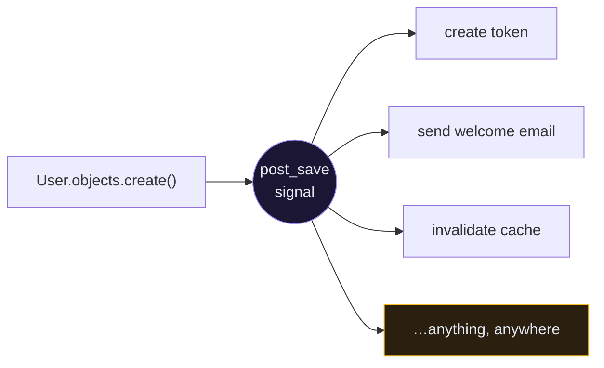
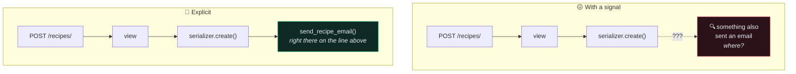

# 📡 Signals

> Signals let you run code when something happens, without the thing that happened knowing about you. That is their power and their entire problem.

---

## 🎯 Core Concept

```python
# app/core/signals.py
from django.db.models.signals import post_save
from django.dispatch import receiver
from rest_framework.authtoken.models import Token
from django.conf import settings


@receiver(post_save, sender=settings.AUTH_USER_MODEL)
def create_auth_token(sender, instance, created, **kwargs):
    """Give every new user a token."""
    if created:
        Token.objects.create(user=instance)
```

`User.objects.create_user(...)` anywhere in the codebase now also creates a token. The calling code has no idea.



---

## 📋 The signals worth knowing

| Signal | Fires | Common use |
| --- | --- | --- |
| `pre_save` | before `.save()` | derive a field (slug, normalised value) |
| `post_save` | after `.save()` | create related objects, invalidate cache |
| `pre_delete` | before `.delete()` | clean up external resources while you still have the row |
| `post_delete` | after `.delete()` | delete uploaded files |
| `m2m_changed` | a M2M relation changes | react to tags being added |
| `pre_migrate` / `post_migrate` | around migrations | seed reference data |
| `request_started` / `request_finished` | per request | instrumentation |

### Registering them so they actually run

```python
# app/core/apps.py
from django.apps import AppConfig


class CoreConfig(AppConfig):
    default_auto_field = "django.db.models.BigAutoField"
    name = "core"

    def ready(self):
        import core.signals      # noqa: F401
```

> [!WARNING] The `# noqa: F401` is required
> flake8 flags the import as unused because nothing references it. It isn't unused — importing the module is what registers the receivers. Delete the import "for cleanliness" and your signals silently stop firing, with no error anywhere.

---

## ✅ When signals are the right tool

**You don't own the sender.** This is the strongest case. You cannot edit `django.contrib.auth`'s `User.save()`, but you can listen to it.

```python
@receiver(post_save, sender=settings.AUTH_USER_MODEL)
def create_auth_token(sender, instance, created, **kwargs):
    if created:
        Token.objects.create(user=instance)
```

**Genuinely cross-cutting concerns.** Audit logging, cache invalidation, search index updates — behaviour that applies to many models and belongs to none of them.

```python
@receiver([post_save, post_delete])
def invalidate_list_cache(sender, instance, **kwargs):
    if sender in (Recipe, Tag, Ingredient):
        cache.delete(f"recipes_list:{instance.user_id}")
```

**Cleaning up external resources.**

```python
@receiver(post_delete, sender=Recipe)
def delete_recipe_image(sender, instance, **kwargs):
    if instance.image:
        instance.image.delete(save=False)
```

Without this, deleting a recipe leaves its file on disk forever.

---

## ❌ When signals are the wrong tool

### The debugging cost



To find out what happens when a recipe is created, you must grep the entire codebase for `post_save` and `sender=Recipe`. With an explicit call, you read the next line.

### The rule of thumb

> [!TIP]
> **If you own the code that triggers the event, just call the function.**
> Signals are for reacting to things you *don't* control.

```python
# ❌ signal — action at a distance in your own code
@receiver(post_save, sender=Recipe)
def notify(sender, instance, created, **kwargs):
    if created:
        send_recipe_email(instance)

# ✅ explicit — you own this serializer, so say what happens
def create(self, validated_data):
    recipe = super().create(validated_data)
    transaction.on_commit(lambda: send_recipe_email(recipe))
    return recipe
```

### Four more failure modes

| Problem | What happens |
| --- | --- |
| **`bulk_create` / `.update()` skip signals** | `Recipe.objects.filter(...).update(x=1)` fires **no** `post_save`. Your cache never invalidates and you have no idea why. |
| **Signals run inside the caller's transaction** | An exception in your receiver rolls back the original save. A "logging" signal can now break user registration. |
| **Cascading signals** | Signal A saves a model, firing signal B, which saves another, firing A again. Infinite loops are easy and the traceback is 400 frames deep. |
| **Tests become slow and coupled** | Every model creation in every test now sends an email, hits Redis, or writes an audit row. |

---

## 🧪 Testing with signals

**Disconnect them** when a test shouldn't trigger them:

```python
from django.db.models.signals import post_save
from django.test import TestCase

from core.models import Recipe
from core.signals import notify_on_recipe_create


class RecipeTests(TestCase):

    def setUp(self):
        post_save.disconnect(notify_on_recipe_create, sender=Recipe)

    def tearDown(self):
        post_save.connect(notify_on_recipe_create, sender=Recipe)
```

**Assert them** when the signal *is* the behaviour under test:

```python
def test_token_created_with_user(self):
    """Test a token is created for each new user."""
    user = get_user_model().objects.create_user(
        email="test@example.com", password="testpass123"
    )

    self.assertTrue(Token.objects.filter(user=user).exists())
```

---

## 🎯 The honest summary

Signals are **inversion of control**. Like all inversion of control, they buy decoupling at the cost of traceability. In a small codebase the decoupling is worth little and the traceability is worth a lot.

**Default to explicit calls. Use signals when you can name why an explicit call is impossible.**

---

## ⚠️ Gotchas

- **Signal doesn't fire** → the module isn't imported in `AppConfig.ready()`, or someone deleted the "unused" import.
- **Signal fires twice** → the module got imported twice (once in `ready()`, once at the top of `models.py`). Use `dispatch_uid`:
  ```python
  @receiver(post_save, sender=Recipe, dispatch_uid="recipe_cache_invalidate")
  ```
- **Signal doesn't fire on `bulk_create`** → correct, by design. Loop, or invalidate manually.
- **Registration breaks after adding a "harmless" signal** → the receiver raised inside the caller's transaction. Wrap risky receiver bodies in `try/except`.
- **`instance.pk` is `None` in `pre_save`** → expected on create; the row doesn't exist yet.

---

## 🧠 Check yourself

> [!QUESTION]
> 1. Why does `# noqa: F401` matter in `AppConfig.ready()`?
> 2. Why doesn't `QuerySet.update()` fire `post_save`, and what breaks because of it?
> 3. Give the rule for choosing between a signal and a direct function call.

---

## 🔗 Related

- [[8.Transactions]]
- [[3.Caching]]
- [[9.Background Jobs with Celery]]
- [[3.Architecture Decision Records]]
