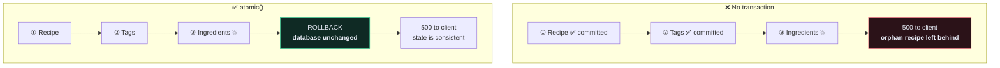

# 🔒 Transactions

> Half a write is worse than no write. A transaction is how you make "all of it or none of it" true.

---

## 🎯 Core Concept

Your recipe create endpoint writes to **three** tables:

```python
# app/recipe/serializers.py
def create(self, validated_data):
    tags = validated_data.pop("tags", [])
    ingredients = validated_data.pop("ingredients", [])
    recipe = Recipe.objects.create(**validated_data)      # ① core_recipe
    self._get_or_create_tags(tags, recipe)                # ② core_tag + join table
    self._get_or_create_ingredients(ingredients, recipe)  # ③ core_ingredient + join
    return recipe
```

If ③ raises — bad data, a constraint violation, the database going away — ① and ② are already committed. You now have a recipe with tags and no ingredients, and the client got a `500` telling them it failed.



---

## 🛠️ Three ways to apply it

### 1. Context manager — the precise one

```python
from django.db import transaction


def create(self, validated_data):
    tags = validated_data.pop("tags", [])
    ingredients = validated_data.pop("ingredients", [])

    with transaction.atomic():
        recipe = Recipe.objects.create(**validated_data)
        self._get_or_create_tags(tags, recipe)
        self._get_or_create_ingredients(ingredients, recipe)

    return recipe
```

Wraps exactly what needs wrapping. **Prefer this.**

### 2. Decorator — the whole function

```python
@transaction.atomic
def perform_create(self, serializer):
    serializer.save(user=self.request.user)
```

### 3. `ATOMIC_REQUESTS` — every request in a transaction

```python
# app/app/settings.py
DATABASES = {
    "default": {
        ...
        "ATOMIC_REQUESTS": True,
    }
}
```

Safe by default, but it holds a database connection open for the **entire** request — including any slow external HTTP call inside your view. Under load that exhausts your connection pool. Use it only if your views are short and purely database-bound.

---

## ⚠️ The four traps

### 1. Catching an exception *inside* `atomic()` breaks it

```python
# ❌ TransactionManagementError on the next query
with transaction.atomic():
    try:
        Recipe.objects.create(**data)
    except IntegrityError:
        pass
    Tag.objects.create(...)     # 💥 "An error occurred in the current transaction"

# ✅ nest a savepoint
with transaction.atomic():
    try:
        with transaction.atomic():
            Recipe.objects.create(**data)
    except IntegrityError:
        pass
    Tag.objects.create(...)     # fine
```

Once a database error occurs, the transaction is poisoned. Django refuses further queries until you roll back to a savepoint — and the inner `atomic()` *is* that savepoint.

### 2. Side effects fire before the commit

```python
# ❌ the email goes out; then the transaction rolls back
with transaction.atomic():
    recipe = Recipe.objects.create(**data)
    send_notification_email(recipe)      # 💥 unrollbackable
    risky_operation()                    # raises

# ✅ defer until the commit actually lands
with transaction.atomic():
    recipe = Recipe.objects.create(**data)
    transaction.on_commit(lambda: send_notification_email(recipe))
    risky_operation()
```

`on_commit` is the correct home for **anything the database can't undo**: emails, webhooks, cache invalidation, push notifications, and especially [[9.Background Jobs with Celery|Celery tasks]].

> [!CAUTION] The classic Celery race
> ```python
> with transaction.atomic():
>     recipe = Recipe.objects.create(**data)
>     process_recipe.delay(recipe.id)     # ❌ worker may start BEFORE the commit
> ```
> The worker picks up the task, queries for `recipe.id`, and gets `DoesNotExist` — because the row isn't committed yet. Intermittent, unreproducible locally, constant in production. Always:
> ```python
> transaction.on_commit(lambda: process_recipe.delay(recipe.id))
> ```

### 3. Two concurrent requests overwrite each other

```python
# ❌ lost update
recipe = Recipe.objects.get(id=1)
recipe.views_count += 1        # read 10
recipe.save()                  # write 11 — but so did the other request

# ✅ let the database do the arithmetic
from django.db.models import F
Recipe.objects.filter(id=1).update(views_count=F("views_count") + 1)

# ✅ or lock the row
with transaction.atomic():
    recipe = Recipe.objects.select_for_update().get(id=1)
    recipe.views_count += 1
    recipe.save()
```

`F()` is one atomic `UPDATE … SET x = x + 1` and needs no lock. `select_for_update()` holds a row lock until the transaction ends — correct when you must read, decide, then write.

### 4. Tests hide transaction bugs

`TestCase` wraps each test in a transaction and rolls it back. That means `on_commit` callbacks **never fire** in a normal `TestCase`:

```python
from django.test import TestCase


class RecipeTests(TestCase):

    def test_notification_sent_on_commit(self):
        with self.captureOnCommitCallbacks(execute=True) as callbacks:
            self.client.post(RECIPES_URL, payload)

        self.assertEqual(len(callbacks), 1)
```

`captureOnCommitCallbacks(execute=True)` runs them. Without it, you'll write `on_commit` code that is never once exercised by your test suite.

---

## 🎯 When you need a transaction

| Situation | Needed? |
| --- | --- |
| Single `Model.objects.create()` | ❌ already atomic |
| Nested write across 2+ tables | ✅ **always** |
| Read → decide → write | ✅ plus `select_for_update` |
| Counter increment | ✅ or use `F()` |
| Money, inventory, bookings | ✅ non-negotiable |
| Read-only endpoint | ❌ |
| A view that calls an external API | ⚠️ keep the API call **outside** the atomic block |

---

## 🔬 Isolation levels, briefly

Postgres defaults to `READ COMMITTED`: you see other transactions' committed changes, so the same query can return different results twice within one transaction.

`SERIALIZABLE` prevents that but makes the database abort transactions that would conflict — meaning your application must **retry** them. That's real work, and the default is right for almost everything. Know the word exists; reach for it only when you have a proven anomaly.

---

## 🧠 Check yourself

> [!QUESTION]
> 1. Why does catching `IntegrityError` inside `atomic()` break subsequent queries?
> 2. Why does `process_recipe.delay(id)` inside a transaction cause intermittent `DoesNotExist`?
> 3. Why doesn't a plain `TestCase` execute your `on_commit` callbacks?

---

## 🔗 Related

- [[9.Background Jobs with Celery]]
- [[7.Signals]]
- [[4.Implementing Tag Creation]]
- [[4.Django ORM Cookbook]]
