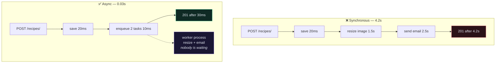
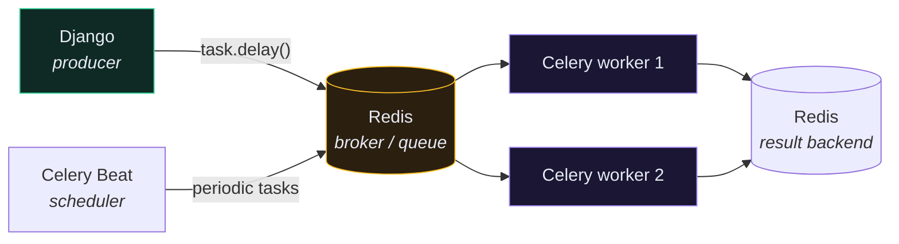

# ⚙️ Background Jobs with Celery

> Every second your view spends waiting on an email server is a second a uWSGI worker cannot serve anyone else.

---

## 🎯 Core Concept

Move slow, failure-prone, or non-essential work off the request path. The client gets `201` immediately; the work happens in a separate process.



---

## 🧩 The moving parts



| Part | Job |
| --- | --- |
| **Broker** (Redis / RabbitMQ) | holds queued messages |
| **Worker** | a separate process that pulls and executes tasks |
| **Result backend** (optional) | stores return values and status |
| **Beat** (optional) | fires tasks on a schedule — cron, but in Python |

---

## 🛠️ Setup

```bash
pip install celery redis
```

```python
# app/app/celery.py
import os
from celery import Celery

os.environ.setdefault("DJANGO_SETTINGS_MODULE", "app.settings")

app = Celery("app")
app.config_from_object("django.conf:settings", namespace="CELERY")
app.autodiscover_tasks()
```

```python
# app/app/__init__.py
from .celery import app as celery_app

__all__ = ("celery_app",)
```

```python
# app/app/settings.py
CELERY_BROKER_URL = os.environ.get("REDIS_URL", "redis://redis:6379/0")
CELERY_RESULT_BACKEND = os.environ.get("REDIS_URL", "redis://redis:6379/0")
CELERY_TASK_SERIALIZER = "json"
CELERY_ACCEPT_CONTENT = ["json"]
CELERY_TIMEZONE = "UTC"
CELERY_TASK_TRACK_STARTED = True
CELERY_TASK_TIME_LIMIT = 30 * 60
```

```yaml
# docker-compose.yml
  redis:
    image: redis:7-alpine

  celery:
    build:
      context: .
    command: sh -c "celery -A app worker -l info"
    volumes:
      - ./app:/app
    environment:
      - DB_HOST=db
      - REDIS_URL=redis://redis:6379/0
    depends_on:
      - db
      - redis
```

> [!WARNING] The worker is a separate container
> It has the same image and the same code, but it is **not** the web process. Deploying new code means restarting the worker too — a very common cause of "my fix isn't working" when only the app container was rebuilt.

---

## ✍️ Writing a task

```python
# app/recipe/tasks.py
from celery import shared_task
from django.core.mail import send_mail

from core.models import Recipe


@shared_task(
    bind=True,
    autoretry_for=(Exception,),
    retry_backoff=True,
    retry_kwargs={"max_retries": 3},
)
def send_recipe_created_email(self, recipe_id):
    """Email the owner that their recipe was saved."""
    recipe = Recipe.objects.select_related("user").get(id=recipe_id)

    send_mail(
        subject=f"Recipe saved: {recipe.title}",
        message=f"Your recipe '{recipe.title}' is live.",
        from_email="noreply@example.com",
        recipient_list=[recipe.user.email],
        using="notifications",          # Django 6.1 — picks a MAILERS alias
    )
```

> [!INFO] Django 6.1 replaced `EMAIL_*` with `MAILERS`
> The whole `EMAIL_BACKEND` / `EMAIL_HOST` / `EMAIL_PORT` family is deprecated and disappears in Django 7.0. Configure named mailers instead and select one per send with `using=`. See [[11.Email and Mailers]].
>
> Note also that `using=` cannot be combined with the deprecated `connection=`, `fail_silently=`, `auth_user=` or `auth_password=` arguments — that raises `TypeError`.

Calling it:

```python
# app/recipe/views.py
from django.db import transaction

from recipe.tasks import send_recipe_created_email


def perform_create(self, serializer):
    recipe = serializer.save(user=self.request.user)
    transaction.on_commit(
        lambda: send_recipe_created_email.delay(recipe.id)
    )
```

---

## 🚨 The three rules

### 1. Pass IDs, never objects

```python
# ❌ pickles a whole model instance; the data is stale by the time it runs
send_email.delay(recipe)

# ✅ the worker fetches the current row
send_email.delay(recipe.id)
```

Serializing a model into the queue means the worker acts on a snapshot that may be seconds or minutes old — and it forces an unsafe serializer. `json` + IDs is the only sane combination.

### 2. Always `on_commit`

```python
# ❌ worker may run before the transaction commits → DoesNotExist
recipe = serializer.save(user=self.request.user)
send_email.delay(recipe.id)

# ✅
transaction.on_commit(lambda: send_email.delay(recipe.id))
```

This is the **single most common Celery bug in Django**, and it only shows up under load. See [[8.Transactions]].

### 3. Tasks must be idempotent

Celery guarantees *at-least-once* delivery. A worker that dies after doing the work but before acknowledging the message will see that message again.

```python
# ❌ runs twice → user gets charged twice
@shared_task
def charge_user(order_id):
    order = Order.objects.get(id=order_id)
    payment_gateway.charge(order.total)

# ✅ safe to run any number of times
@shared_task
def charge_user(order_id):
    with transaction.atomic():
        order = Order.objects.select_for_update().get(id=order_id)
        if order.charged_at:
            return "already charged"
        payment_gateway.charge(order.total, idempotency_key=f"order-{order_id}")
        order.charged_at = timezone.now()
        order.save()
```

Write every task assuming it will run twice, because eventually it will.

---

## ⏰ Scheduled tasks with Beat

```python
# app/app/settings.py
from celery.schedules import crontab

CELERY_BEAT_SCHEDULE = {
    "cleanup-orphan-images": {
        "task": "recipe.tasks.cleanup_orphan_images",
        "schedule": crontab(hour=3, minute=0),
    },
    "refresh-stats": {
        "task": "recipe.tasks.refresh_stats",
        "schedule": 300.0,            # every 5 minutes
    },
}
```

```yaml
  celery-beat:
    build:
      context: .
    command: sh -c "celery -A app beat -l info"
```

> [!CAUTION] Exactly one Beat process
> Beat *schedules*; workers *execute*. Two Beat containers means every scheduled task fires twice. Scale workers freely; never scale Beat.

---

## 🧪 Testing tasks

**Test the function, not the queue.** Ninety percent of the value:

```python
def test_send_recipe_email(self):
    """Test the task sends one email."""
    recipe = create_recipe(user=self.user)

    send_recipe_created_email(recipe.id)      # call it directly, no .delay()

    self.assertEqual(len(mail.outbox), 1)
```

For the integration path, run tasks eagerly:

```python
# app/app/settings.py
if "test" in sys.argv:
    CELERY_TASK_ALWAYS_EAGER = True
    CELERY_TASK_EAGER_PROPAGATES = True
```

> [!WARNING] Eager mode is not a real test of async behaviour
> It runs tasks synchronously in-process, so it will never catch an `on_commit` bug, a serialization failure, or a race. Use it for convenience; don't mistake it for coverage.

---

## 🤔 Do you actually need Celery?

Celery adds a broker, at least two extra containers, and a whole class of new failure modes. Consider the lighter options first:

| Option | Good when |
| --- | --- |
| **`django-q2` / `huey`** | you want background jobs without the operational weight |
| **`transaction.on_commit` + a thread** | genuinely fire-and-forget, loss is acceptable |
| **Postgres-backed queue** (`procrastinate`) | you already run Postgres and don't want Redis |
| **Cron + a management command** | it's purely periodic, not event-driven |
| **Celery** | you need retries, scheduling, chaining, and real throughput |

> [!TIP] The honest threshold
> If your only background job is "send one email", a management command on cron or `django-q2` will serve you better than Celery. Adopt Celery when you have several kinds of job, need retry semantics, and can justify running two more containers.

---

## ⚠️ Gotchas

- **`Received unregistered task`** → the module isn't discovered. `autodiscover_tasks()` only finds `tasks.py` inside `INSTALLED_APPS`.
- **Task runs old code** → you rebuilt the app container but not the worker.
- **`DoesNotExist` intermittently** → missing `on_commit`.
- **Worker silently stops taking tasks** → memory leak; add `--max-tasks-per-child=100`.
- **Tasks pile up forever** → no monitoring. Run Flower (`celery -A app flower`) or export queue depth.
- **`kombu.exceptions.EncodeError`** → you passed a model instance instead of an ID.

---

## 🧠 Check yourself

> [!QUESTION]
> 1. Why pass `recipe.id` instead of `recipe`?
> 2. Why must every task be idempotent, given Celery "delivers" each message once?
> 3. Why is `CELERY_TASK_ALWAYS_EAGER` a convenience rather than a test of async behaviour?

---

## 🔗 Related

- [[8.Transactions]]
- [[7.Signals]]
- [[3.Caching]]
- [[11.Logging and Observability]]
