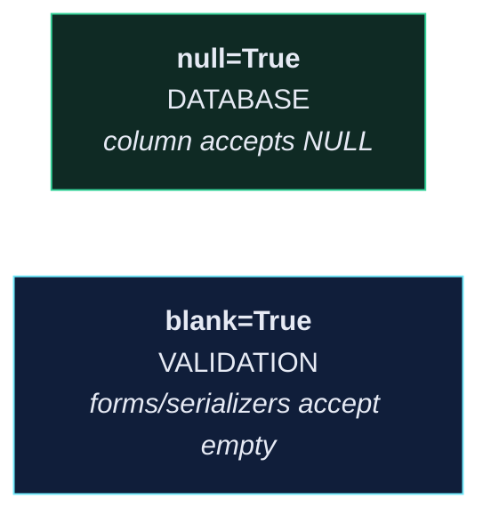

# 🗃️ Model Field Reference

> One model class = one table. One field = one column. Everything below is just picking the column type and its rules.

---

## 🔤 Text

| Field | Column | Notes |
| --- | --- | --- |
| `CharField(max_length=n)` | `varchar(n)` | `max_length` is **required** |
| `TextField()` | `text` | unbounded; no `max_length` needed |
| `SlugField()` | `varchar` | letters, numbers, `-`, `_`; indexed by default |
| `EmailField()` | `varchar(254)` | adds format validation |
| `URLField()` | `varchar(200)` | adds format validation |
| `UUIDField()` | `uuid` | great as a public-facing primary key |

```python
title = models.CharField(max_length=255)
description = models.TextField(blank=True)
```

> [!TIP] `CharField` or `TextField`?
> If there's a natural maximum (a title, a name), use `CharField` — the constraint is documentation the database enforces. If there isn't (a body, a description), use `TextField`. In Postgres there's no performance difference.

---

## 🔢 Numbers

| Field | Column | Notes |
| --- | --- | --- |
| `IntegerField()` | `integer` | ±2.1 billion |
| `BigIntegerField()` | `bigint` | |
| `PositiveIntegerField()` | `integer` + check | ≥ 0 |
| `SmallIntegerField()` | `smallint` | ±32,767 |
| `FloatField()` | `double precision` | ❌ **never for money** |
| `DecimalField(max_digits, decimal_places)` | `numeric` | ✅ money |
| `AutoField` / `BigAutoField` | `serial` | the implicit `id` |

```python
time_minutes = models.IntegerField()
price = models.DecimalField(max_digits=5, decimal_places=2)
```

> [!CAUTION] `FloatField` for money is a real bug
> `0.1 + 0.2 == 0.30000000000000004`. Over a million transactions, floats drift and your ledger won't balance. `DecimalField` is exact.
> `max_digits=5, decimal_places=2` means up to `999.99`.

---

## 📅 Dates and times

| Field | Notes |
| --- | --- |
| `DateField()` | date only |
| `DateTimeField()` | timezone-aware when `USE_TZ = True` |
| `TimeField()` | time only |
| `DurationField()` | stores a `timedelta` |

```python
created_at = models.DateTimeField(auto_now_add=True)   # set once, on INSERT
updated_at = models.DateTimeField(auto_now=True)       # set on every save()
```

| | `auto_now_add` | `auto_now` |
| --- | --- | --- |
| Set on create | ✅ | ✅ |
| Set on update | ❌ | ✅ |
| Editable | ❌ | ❌ |

> [!WARNING] `auto_now` doesn't fire on `QuerySet.update()`
> `Recipe.objects.filter(...).update(price=5)` bypasses `save()`, so `updated_at` stays stale. See [[4.Django ORM Cookbook]].

---

## ✅ Booleans and choices

```python
is_active = models.BooleanField(default=True)


class Recipe(models.Model):

    class Difficulty(models.TextChoices):
        EASY = "EA", "Easy"
        MEDIUM = "ME", "Medium"
        HARD = "HA", "Hard"

    difficulty = models.CharField(
        max_length=2,
        choices=Difficulty.choices,
        default=Difficulty.EASY,
    )
```

`TextChoices` gives you `Recipe.Difficulty.EASY` instead of a magic string, and `recipe.get_difficulty_display()` returns `"Easy"` for free.

---

## 📎 Files

| Field | Notes |
| --- | --- |
| `FileField(upload_to=…)` | stores a path; the file goes to `MEDIA_ROOT` |
| `ImageField(upload_to=…)` | `FileField` + dimension validation; requires Pillow |

```python
def recipe_image_file_path(instance, filename):
    """Generate a unique path for a new recipe image."""
    ext = os.path.splitext(filename)[1]
    filename = f"{uuid.uuid4()}{ext}"
    return os.path.join("uploads", "recipe", filename)


image = models.ImageField(null=True, upload_to=recipe_image_file_path)
```

The UUID matters: two users uploading `photo.jpg` would otherwise collide, and a filename from a client is untrusted input. See [[path generator function]].

---

## 🔗 Relationships

| Field | Cardinality | Column |
| --- | --- | --- |
| `ForeignKey(To, on_delete=…)` | many → one | `to_id` on this table |
| `OneToOneField(To, on_delete=…)` | one → one | `to_id` + unique |
| `ManyToManyField(To)` | many ↔ many | a separate join table |

```python
user = models.ForeignKey(
    settings.AUTH_USER_MODEL,
    on_delete=models.CASCADE,
)
tags = models.ManyToManyField("Tag")
ingredients = models.ManyToManyField("Ingredient")
```

> [!CAUTION] Always `settings.AUTH_USER_MODEL`
> Never `from core.models import User`. The setting is resolved lazily, survives a user-model swap, and avoids circular imports. This is the single most repeated piece of Django advice, because the alternative fails in ways that are hard to unwind.

### `on_delete` — choose deliberately

| Value | When the parent is deleted |
| --- | --- |
| `CASCADE` | delete this row too |
| `PROTECT` | **refuse** to delete the parent |
| `SET_NULL` | set to `NULL` (requires `null=True`) |
| `SET_DEFAULT` | set to the field's default |
| `RESTRICT` | refuse, unless another cascade also removes it |
| `DO_NOTHING` | leave a dangling FK — you're on your own |

`CASCADE` for owned data (a user's recipes). `PROTECT` for anything you'd hate to lose silently (orders referencing a product).

### `related_name`

```python
user = models.ForeignKey(User, on_delete=models.CASCADE, related_name="recipes")
```

```python
user.recipes.all()          # with related_name
user.recipe_set.all()       # without it
```

Set it. `recipe_set` reads badly and breaks the moment you have two FKs to the same model.

---

## ⚙️ Field options

| Option | Level | Meaning |
| --- | --- | --- |
| `null=True` | **database** | the column may be `NULL` |
| `blank=True` | **validation** | forms/serializers may leave it empty |
| `default=…` | both | value when unspecified |
| `unique=True` | database | unique constraint + index |
| `db_index=True` | database | plain index |
| `editable=False` | admin/forms | hidden from forms |
| `choices=[…]` | validation | restricted values |
| `verbose_name` | display | human label |
| `help_text` | display | appears in admin, forms, and OpenAPI |

### `null` vs `blank` — the classic confusion



| Field type | Correct combination |
| --- | --- |
| Optional text | `blank=True` **only** — use `""`, not `NULL` |
| Optional number/date/FK | `null=True, blank=True` |
| Required | neither |

> [!WARNING] `null=True` on a `CharField` is almost always wrong
> You end up with two representations of "empty" — `""` and `NULL` — and every query has to handle both. Django's own docs advise against it.

---

## 🏷️ `Meta`

```python
class Recipe(models.Model):
    ...

    class Meta:
        ordering = ["-id"]
        verbose_name_plural = "recipes"
        indexes = [
            models.Index(fields=["user", "-id"]),
        ]
        constraints = [
            models.UniqueConstraint(
                fields=["user", "title"],
                name="unique_recipe_title_per_user",
            ),
            models.CheckConstraint(
                check=models.Q(price__gte=0),
                name="price_non_negative",
            ),
        ]
```

| Option | Effect |
| --- | --- |
| `ordering` | default `ORDER BY` for every query on this model |
| `indexes` | composite indexes |
| `constraints` | `UniqueConstraint`, `CheckConstraint` — **enforced by the database** |
| `unique_together` | older form of `UniqueConstraint` |
| `db_table` | override the table name |
| `abstract = True` | a base class, no table of its own |

> [!TIP] Constraints beat validation
> Serializer validation can be bypassed — by the admin, a management command, a shell session, a bug. A `CheckConstraint` is enforced by Postgres for every write, always. Use both: the serializer gives a friendly `400`, the constraint guarantees correctness.

---

## 🧬 This project's models

```python
# app/core/models.py
class User(AbstractBaseUser, PermissionsMixin):
    email = models.EmailField(max_length=255, unique=True)
    name = models.CharField(max_length=255)
    is_active = models.BooleanField(default=True)
    is_staff = models.BooleanField(default=False)

    objects = UserManager()

    USERNAME_FIELD = "email"


class Recipe(models.Model):
    user = models.ForeignKey(settings.AUTH_USER_MODEL, on_delete=models.CASCADE)
    title = models.CharField(max_length=255)
    description = models.TextField(blank=True)
    time_minutes = models.IntegerField()
    price = models.DecimalField(max_digits=5, decimal_places=2)
    link = models.CharField(max_length=255, blank=True)
    image = models.ImageField(null=True, upload_to=recipe_image_file_path)
    tags = models.ManyToManyField("Tag")
    ingredients = models.ManyToManyField("Ingredient")

    def __str__(self):
        return self.title
```

![[data-model-erd.svg]]

---

## 🔄 Migrations

```bash
docker compose run --rm app sh -c "python manage.py makemigrations"
```

```bash
docker compose run --rm app sh -c "python manage.py migrate"
```

```bash
docker compose run --rm app sh -c "python manage.py sqlmigrate core 0002"
```

| Situation | What to do |
| --- | --- |
| "non-nullable field without a default" | add `null=True` or `default=…` |
| Need to backfill data | `makemigrations --empty` + a `RunPython` operation |
| Migration is wrong, not yet pushed | `migrate core 0001` to roll back, delete the file, regenerate |
| Migration is wrong, already pushed | **write a new forward migration** — never rewrite shared history |

> [!WARNING] Migrations are code — commit them
> They belong in git alongside the model change. A `models.py` change without its migration means everyone else's database silently diverges from yours.

---

## 🔗 Related

- [[2.Serializer Field Matrix]]
- [[4.Django ORM Cookbook]]
- [[10.Database Migrations]]
- [[2.Custom User Model – Design]]
