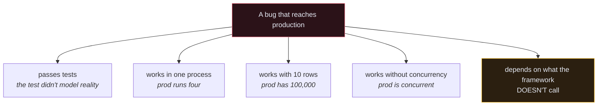

# 🐞 Common Bugs and Fixes

> The bugs that pass code review, pass tests, and fail in production. Each one is also a good answer to *"tell me about a bug you found."*

---

## 1. 🔓 The list endpoint that returns everyone's data

**Symptom:** nothing. Everything works. Tests pass.

```python
class RecipeViewSet(viewsets.ModelViewSet):
    queryset = Recipe.objects.all()
    permission_classes = [IsAuthenticated, IsOwner]     # feels safe
```

**What's wrong:** `IsOwner` implements `has_object_permission`, which DRF **never calls on a list endpoint**. `GET /recipes/` returns every recipe belonging to every user.

**Fix:**
```python
def get_queryset(self):
    return self.queryset.filter(user=self.request.user)
```

**Why it survives review:** the code reads as secure. There's a permission class right there. The bug is in what DRF *doesn't* call.

**The test that catches it forever:**
```python
def test_recipe_list_limited_to_user(self):
    other = create_user(email="other@example.com")
    create_recipe(user=other)
    create_recipe(user=self.user)

    res = self.client.get(RECIPES_URL)

    self.assertEqual(len(res.data), 1)
```

---

## 2. ⏱️ The Celery task that can't find its own row

**Symptom:** `Recipe.DoesNotExist` in the worker, maybe 1 in 50 times. Never reproduces locally.

```python
with transaction.atomic():
    recipe = serializer.save(user=self.request.user)
    process_recipe.delay(recipe.id)          # 💥
```

**What's wrong:** `.delay()` puts the message on the queue immediately. A free worker can pick it up and query before the transaction commits — the row genuinely doesn't exist yet.

**Fix:**
```python
transaction.on_commit(lambda: process_recipe.delay(recipe.id))
```

**Why it's rare locally:** one worker, no load, and the commit lands microseconds later. Under production concurrency, the race opens up.

---

## 3. 🔑 `Bearer` instead of `Token`

**Symptom:** `401 Unauthorized` with a token you can see is valid in the database.

```http
Authorization: Bearer 9c1f2e...     ❌ JWT syntax
Authorization: Token 9c1f2e...      ✅ DRF TokenAuthentication
```

**Why it's so common:** every JWT tutorial uses `Bearer`, HTTP clients default to it, and DRF's error message (`"Authentication credentials were not provided."`) doesn't mention the keyword at all.

---

## 4. 🐌 The 200-query list endpoint

**Symptom:** `GET /recipes/` takes 4 seconds with 200 recipes. Each query is 2ms.

**What's wrong:** [[4.The N+1 Problem|N+1]]. The serializer's nested `tags` and `ingredients` trigger a query per row.

**Fix:**
```python
.select_related("user").prefetch_related("tags", "ingredients")
```

**The test that stops it coming back:**
```python
with self.assertNumQueries(4):
    self.client.get(RECIPES_URL)
```

**Why it's a good interview story:** it's measurable. "200 queries down to 3, p95 from 4s to 90ms" is a sentence with numbers in it.

---

## 5. 🕵️ The serializer that leaked a field nobody added to it

**Symptom:** six months after launch, `is_premium` shows up in the public API response.

```python
class UserSerializer(serializers.ModelSerializer):
    class Meta:
        model = get_user_model()
        fields = "__all__"          # 💥
```

**What's wrong:** `"__all__"` is a live subscription to every column the model will ever have. Nobody edited the serializer — someone edited the *model*, and the API changed.

**Fix:** an explicit allow-list. Always.
```python
fields = ["id", "email", "name"]
```

---

## 6. 🔁 The `validate_` method that silently nulls a field

**Symptom:** the field is `None` in the database. No error anywhere.

```python
def validate_title(self, value):
    if len(value) < 3:
        raise serializers.ValidationError("Too short.")
    # 💥 no return
```

**What's wrong:** `validate_<field>` must **return the value**. Falling off the end returns `None`, and DRF stores it.

**Fix:** `return value`.

**Why it's insidious:** the validation half works. Short titles are rejected correctly, so the method looks tested.

---

## 7. 💰 Money in a `FloatField`

**Symptom:** a total is off by one cent. Occasionally.

```python
price = models.FloatField()                                   # ❌
price = models.DecimalField(max_digits=5, decimal_places=2)   # ✅
```

**What's wrong:** binary floats can't represent `0.1` exactly. `0.1 + 0.2 == 0.30000000000000004`. The error is invisible per-row and accumulates across a ledger.

**Fix cost:** a migration plus a data conversion. Cheap now, expensive after you have real financial data.

---

## 8. 🧪 The test asserting a stale object

**Symptom:** the endpoint works in the browser; the test insists the value didn't change.

```python
res = self.client.patch(url, {"title": "New"})
self.assertEqual(recipe.title, "New")      # 💥 still "Old"
```

**What's wrong:** `recipe` is a Python snapshot of the row from before the request. The `PATCH` changed the row, not your object.

**Fix:** `recipe.refresh_from_db()`.

---

## 9. 🎭 The mock that does nothing

**Symptom:** the test passes, but you can prove the real function ran.

```python
@patch("core.utils.send_email")      # ❌ patched the definition
def test_x(self, mock_send):
    ...
```

**What's wrong:** `recipe/views.py` already did `from core.utils import send_email`, binding the name into its own module. Patching `core.utils.send_email` doesn't change `recipe.views.send_email`.

**Fix:** patch where it's *used*.
```python
@patch("recipe.views.send_email")
```

---

## 10. 🚪 `DEBUG=True` in production

**Symptom:** someone triggers a 500 and gets your settings, environment variables, and a stack trace with local variables.

```python
DEBUG = bool(os.environ.get("DEBUG", 0))           # ❌ bool("0") is True
DEBUG = bool(int(os.environ.get("DEBUG", 0)))      # ✅
```

**What's wrong:** `os.environ` returns strings. Every non-empty string is truthy, so `DEBUG=0` turns debug **on**.

**Why it matters:** Django's debug page renders `SECRET_KEY` and database credentials. It also disables `ALLOWED_HOSTS`.

---

## 11. 🧹 The throttle that doesn't throttle

**Symptom:** rate limiting is configured, tested, reviewed — and the login endpoint accepts unlimited attempts in production.

**What's wrong:** DRF stores throttle counters in Django's cache. The default `LocMemCache` is **per process**. Four uWSGI workers means four independent counters and 4× the intended limit — reset on every restart.

**Fix:** a shared cache.
```python
CACHES = {"default": {"BACKEND": "django.core.cache.backends.redis.RedisCache", ...}}
```

**Why it passes tests:** the test suite runs in one process.

---

## 12. 📉 Signals that stop firing when someone optimises

**Symptom:** cache invalidation quietly breaks after an unrelated performance PR.

```python
# was:
for recipe in recipes:
    recipe.price = new_price
    recipe.save()                                  # fires post_save ✅

# became:
Recipe.objects.filter(...).update(price=new_price)  # fires nothing ❌
```

**What's wrong:** `QuerySet.update()` and `bulk_create()` bypass `save()`, so no signal fires, `auto_now` doesn't update, and any signal-based invalidation silently stops.

**The lesson:** invisible coupling breaks invisibly. See [[7.Signals]].

---

## 🧭 The pattern behind all twelve



Every one of them is a gap between the environment you develop in and the one you deploy to. That's why [[1.From Dev Compose to Production|the two environments being different]] is itself worth thinking about carefully.

---

## 🎤 Using these in an interview

Pick one, and tell it in four beats:

1. **The symptom** — what a user or a graph actually showed
2. **The hypothesis and how you tested it** — this is the part they're grading
3. **The root cause** — one sentence
4. **What you changed so it can't recur** — the test, not just the fix

> *"Our list endpoint went from 200ms to 4s after a release. I checked the query count with `assertNumQueries` and found 201 queries for 100 rows — a classic N+1 from the nested tag serializer. Added `prefetch_related`, which took it to 3 queries and 90ms. Then I added a query-count assertion to the test so it can't regress silently."*

Symptom, method, cause, prevention. That's the whole answer.

---

## 🔗 Related

- [[2.Errors You Will Actually Hit]]
- [[Debugging Decision Tree]]
- [[1.DRF Interview Questions]]
- [[10.Security Checklist]]
