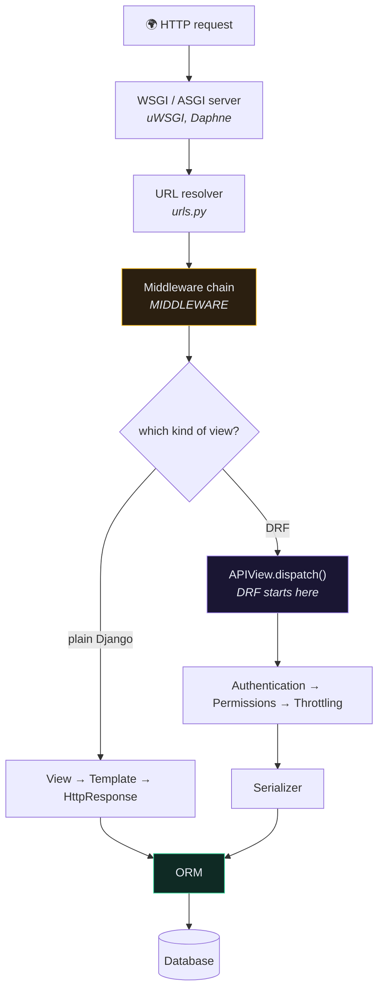

# 🧱 Django Core

> DRF is a layer **on top of** Django. The course teaches the layer; this section teaches what's underneath it.
>
> Written against **Django 6.1** (released 5 August 2026), from the official docs. Every note links back to the canonical page.

---

## 🤔 Why this section exists

Every one of these appears in the course notes as an assumption:

| The course says | It assumes you know |
| --- | --- |
| "add it to `INSTALLED_APPS`" | how settings are loaded and overridden |
| "`AuthenticationMiddleware` sets `request.user`" | what middleware is and when it runs |
| "`get_queryset()` filters by user" | how a QuerySet becomes SQL, and when |
| "the serializer validates it" | that Django has its own validation layer beneath |
| "`set_password` hashes it" | Django's auth system, hashers, and permissions |
| "throttling needs a shared cache" | the cache framework |
| "`DEBUG=False` in production" | what Django's security machinery actually does |

You can build the Recipe API without any of it. You cannot debug it.

---

## 📚 The notes

### Start here
- [[1.What's New in Django 6.1]] ⭐ — what changed on 5 Aug 2026, and what it means for this project

### The request path
- [[2.Settings and Configuration]] — how settings load, per-environment config, the ones that matter
- [[3.Middleware]] — the onion, the hooks, the order, writing your own

### The data layer
- [[4.QuerySets in Depth]] ⭐ — laziness, evaluation, `fetch_mode()`, and where SQL comes from
- [[5.Model Validation and Constraints]] — why database constraints beat serializer validation

### Everything else DRF sits on
- [[6.Forms and Validation]] — the layer serializers were modelled on
- [[7.The Auth System]] — users, hashers, permissions, groups, backends
- [[8.The Cache Framework]] — backends, the low-level API, per-view caching
- [[9.Security Features]] — CSRF, XSS, clickjacking, SQL injection, HTTPS
- [[10.Async Django]] — `async def` views, ASGI, `sync_to_async`, and the traps
- [[11.Email and Mailers]] — the new `MAILERS` setting, and the deprecated `EMAIL_*` block
- [[12.Management Commands]] — how `wait_for_db` works, and writing your own
- [[13.Internationalization]] — translation, locale, timezones

### The files that confuse everyone
- [[14.WSGI and ASGI]] ⭐ — why your project has both `wsgi.py` and `asgi.py`, and why WSGI *cannot* do WebSockets
- [[15.App Anatomy — Every File and What Belongs In It]] ⭐ — `signals.py`, `services.py`, `selectors.py`, `notifications.py`, `tasks.py`, `managers.py`: which filenames are load-bearing, which are just convention, and which you actually need

---

## 🗺️ Where Django ends and DRF begins

**Everything above `APIView.dispatch()` is plain Django.** That boundary is most of debugging:

- a `400` with `{"field": [...]}` → DRF serializer
- a `400 Bad Request` with no body → Django's `ALLOWED_HOSTS`
- a `403 CSRF Failed` → Django middleware, not DRF permissions
- a `500` before your view runs → middleware or settings

---

## 📖 Canonical sources

| Topic | Official docs |
| --- | --- |
| Everything | [docs.djangoproject.com/en/6.1](https://docs.djangoproject.com/en/6.1/) |
| Settings reference | [ref/settings](https://docs.djangoproject.com/en/6.1/ref/settings/) |
| QuerySet API | [ref/models/querysets](https://docs.djangoproject.com/en/6.1/ref/models/querysets/) |
| Middleware | [topics/http/middleware](https://docs.djangoproject.com/en/6.1/topics/http/middleware/) |
| Auth | [topics/auth](https://docs.djangoproject.com/en/6.1/topics/auth/) |
| Security | [topics/security](https://docs.djangoproject.com/en/6.1/topics/security/) |
| 6.1 release notes | [releases/6.1](https://docs.djangoproject.com/en/6.1/releases/6.1/) |

> [!TIP] Pin the version in the URL
> `docs.djangoproject.com/en/6.1/...` shows you 6.1. `/en/stable/` moves under you, and a Google result will happily hand you the 3.2 page. Check the version selector before you trust a snippet.

---

## 🔗 Related

- [[Noetix Home]] · [[Map of Content]]
- [[0.Reference Index]] — the cheat sheets
- [[0.Production Readiness Checklist]]
